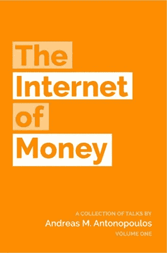
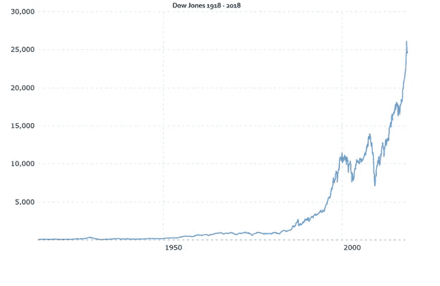

# 比特币不是“货币互联网”

> 原文：<https://medium.datadriveninvestor.com/bitcoin-is-not-the-internet-of-money-d0b84ca27ec7?source=collection_archive---------7----------------------->

No shade to Antonopoulos though, definitely pick up a copy.

我们目前正处于或接近熊市的底部，这又引发了一些围绕比特币本质的有趣讨论。现在我们已经回到了顽固分子和狂热者，真正的对话已经重新进入了神秘领域。

在抛物线式上涨的欢欣鼓舞期间，人们谈到比特币的效用，认为它是对腐败的金融体系不可避免的崩溃的对冲。*法定货币是骗局；随着时间的推移，它会失去价值！* *比特币是保留你的价值，拿回你个人主权的方法！*听着耳熟？

这其中有些是真的。我真的相信，在很多方面，比特币关乎个人主权，我希望**和你们所有人一起吸大麻，但我认为这种言论相当于技术书呆子，他们热爱自己的技术，但不明白它的用途。**

> [DDI 编辑推荐—区块链和比特币基础](http://go.datadriveninvestor.com/bcfundamental)

让我们花一点时间来思考比特币的技术，然后再来思考这项技术会激励什么样的行为。

比特币在区块链上运行——一个去中心化的不可变公共账本——它被设计成一种通货紧缩的“货币”公众舆论会指出，这是对中央银行和法定货币通胀性质的对冲。*“中央集权”的银行对我们的货币体系拥有太多的权力，他们正在使货币贬值，从而降低了任何一美元的购买力*。比特币公开是为了揭露和防止企业和影子银行家的黑幕交易*。它是不可信的，由加密保护，它是通货紧缩的(因为它是在数字稀缺的前提下设计的)，这导致它随着时间的推移保持其价值。*

从行为上来说，这将刺激*持有*(持有你的货币的加密俚语)并等待法定货币系统在超级比特币化过程中崩溃(当美元失败，一切都以比特币价值划界)。到那时，你用 X 美元购买的比特币将比你得到它的价格多 100-100 万倍，从而将财富从中央银行家手中重新分配给人民。所有的比特币持有者都将能够获得个人主权，从此过上幸福的生活。

我想这就够了。

如果比特币*就是 T1，那么让我们想想法定货币是什么。法定货币是其价值由发行它的政府支持的货币(例如，与金本位制相对)。这导致了量化宽松(向货币供应中引入新的货币以影响供求曲线)或美联储改变利率等人们认为不可接受的事情。*你怎么能凭空“印钱”呢！？*诸如此类的力量导致了法定货币的通货膨胀性质。*

为什么政府或央行会设计一种货币，让它随着时间的推移而贬值？

这是一个我认为密码圈里没有足够多的人问自己的问题。你自己也承认，这些实体是利己的。他们通过创造随着时间推移而贬值的货币得到了什么？你相信他们只在乎控制货币生产手段，却不在乎印出来的钱保值吗？我猜，在某种程度上，如果你能印出无限的钱，*剩下的只是细节*？

# 法定货币被设计成通货膨胀，因为法定货币被设计成被消费。

让它深入人心。

正如比特币的通缩和稀缺性质激励早期采用者持有他们的密码(你今天得到了一些，但如果你持有它，它的价值将在 5 年内翻一番)，法定货币随着时间的推移会失去价值，因为这激励你花钱(如果你知道 5 年后它的价值会远低于现在，为什么要持有它？).看，钱不是天生有价值的。金钱是交易的媒介。虽然金钱也是一种价值储存手段，但它不是一种很好的储存手段。我们的法定货币体系被设计成短期价值储存手段。它足够稳定，如果我今天从你这里购买一件商品或服务，你收到的钱将在不久的将来(1-2 年)保持其价值，直到你再次消费它。通货膨胀每年增长约 2%，因此在接下来的几年里，你拥有最初拥有的大部分购买力，但它确实下降了。

金钱的意义在于它被用作一种约定的交换媒介。它是一种基于商定的标准来衡量价值的手段(因为它的最终目的是充当*记账单位*)，并且它使用发布它的政府的可信度作为商品和服务交换的验证。

有没有办法让你的钱在菲亚特系统里保值增值？是的，是通过*资产*。如果你有一项资产，你保留或增加你的钱的价值。增长是央行行长/政府的期望结果。他们**希望**公民们注意到他们消费能力的下降，不仅仅是为了短期的快乐，而是将他们的钱投资到商业(一种资产)或商品(更多的资产)中，以创造更多的财富。如果你没注意到，**资产是通货紧缩的**。当前的法定货币体系非常倾向于购买资产。

事实上，如果你考虑一个假设的资产，假设这个资产只有一个能力，那就是随着时间的推移保持其内在价值。然后，考虑到它如何抵消通货膨胀，即使这种中性资产的美元价值也会随着时间的推移呈指数增长(因为通货膨胀呈指数增长)。现在，想象一个更有内在价值的东西，比如房地产。

This is the Dow Jones. This is what would have happened to your investment capital had you just bought and held this index…and it wasn’t even the best performing asset.

如果是这样的话，按照我们目前金融体系的逻辑，比特币不是货币，**比特币是资产**。

比特币是一种什么样的资产呢？很奇怪的一个。如果比特币真的是数字黄金或者像 Satoshi 写的“点对点电子现金系统”，那么比特币将是匿名的。这两者都是实物商品，本质上没有内在的分类账。为什么 Satoshi 要努力包含一个账本，但不仅仅是一个有趣的小工具，而是一个使用大量能量和热力学定律来确保其不变性的账本？拥有一种庞大、永久、透明的货币形式有什么意义？

原因是因为比特币的主要目的是透明和不变性，而不是作为现金或黄金。

尽管有些人可能很难承认，但比特币是一种糟糕的货币。它是有价值的，但不是钱。它太不稳定，而且降低了支出的积极性。许多顽固分子可能会回答说，“是的，但是，当每枚比特币价值 100 万美元时，每天 1000 美元的波动就不明显了。”也许吧，但是我们必须先到达那里，这需要一个公开采用的用例。

比特币的去中心化特性使其成为一种糟糕的货币；没有责任。如果我们想公开收养，当奶奶给她上大学的孙子转账时，如果钱不见了，我们需要有人向她抱怨。如果摩根大通电汇了 50 亿美元，然后它消失了，需要有一个实体来负责。出于这个原因，XRP 是一种明显更好的货币。它几乎是即时的，便宜的，而且它有 Ripple 这样一个实体可以与之交流的公司。

那比特币如果不是货币的话有什么价值呢？

# 我认为，话题应该从比特币是“货币互联网”转移到比特币是“财产互联网”

比特币为互联网的非零和性质增加了一种零和形式的资本。在互联网上创业、建立网站或渠道绝对不需要任何成本。有几乎无穷无尽的网站，我们每天增加更多；IBM 估计数据量为 2.5 万亿字节。这种信息的增加呈指数增长。互联网上超过 90%的信息是在过去 3 年中增加的。互联网上有价值的不是你占据的空间，而是你获得的关注。

互联网的*货币*是“注意力”，但就像法定货币一样，它转瞬即逝，因为它被激励为“被消费”总是有更多的方法来分散你的注意力，总是有一些新奇有趣的事情来花费你的注意力，但是你基本上只有有限的时间和能力来分散你的注意力。

虽然互联网的货币是注意力，但互联网的“财产”是通过比特币来维持的。从定义上来说，拥有所有权的财产是稀缺的。比特币的数字稀缺性是互联网上固有数字稀缺性的一个分形或缩影。这种数字稀缺性可能意味着你想卖掉你的博客，或者它可能意味着你通过智能合同下赌注，并想把你的业务或房地产转让给另一个实体，等等。比特币追踪并维护财产转移的公共记录，没有繁文缛节，没有边界，它是通过点对点和无信任的方式完成的。

这是一个用例。这就是为什么这是一场革命。