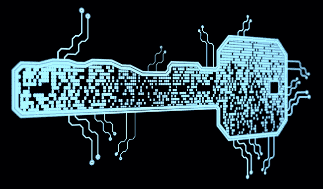
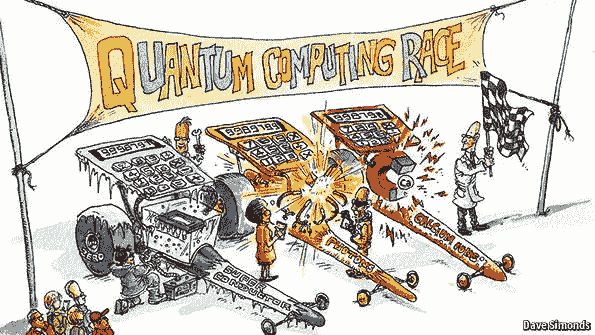

# 比特币刚刚通过了迄今为止最大的考验。

> 原文：<https://medium.datadriveninvestor.com/bitcoin-just-passed-its-biggest-test-to-date-eb308a8a5d82?source=collection_archive---------11----------------------->

## 量子计算的最新突破考验了投资者对加密货币的信心

“The bulk of Bitcoin’s attractiveness revolves around encrypted protection from hackers and large authoritative institutions. But for some reason, new technological advances which could compromise all cryptocurrency security have had minimal effects on Bitcoin’s price.”

比特币是一种去中心化的数字加密货币系统，许多人认为它是 21 世纪最具破坏性的金融发展，在其短暂的历史中，它面临并超越了许多挑战。以太坊(Ethereum)和 Monero 等大量替代加密货币的出现从比特币的成功中分一杯羹，但在定价、总发行量或受欢迎程度方面，没有一种能够取代原始货币。世界各地的可疑政府都在打击比特币交易，希望保持对各自经济的控制和权威，但比特币的日交易量仍保持在 30 万笔以上，并继续增长。尽管比特币的声誉和完整性因其被用于促进非法在线毒品交易而受损，但咖啡店和杂货店仍继续接受它作为一种有效的支付形式。谁能忘记比特币在 2018 年第一个月损失超过 60%的价值后被贴上“历史上最大的泡沫”的标签，而几个月后其价格又反弹回稳定水平。

名单还在继续，批评者也在继续谈论，但截至 2019 年 11 月 9 日，比特币的交易价格仍在每枚 8800 美元左右。替代货币也在坚守阵地，Litecoin、Ethereum、Ripple 和 Monero(Investopedia 称之为最重要的替代加密货币)都继续以稳定的价格交易，尽管价格比 2018 年崩盘前低得多。似乎对加密货币系统，尤其是比特币的普遍信任，已经足以掩盖其各自的一系列问题和反对者。

 [## 算法交易的机器学习|数据驱动的投资者

### 当你的一个朋友在脸书上传你的新海滩照，平台建议给你的脸加上标签，这是…

www.datadriveninvestor.com](https://www.datadriveninvestor.com/2019/01/30/machine-learning-for-stock-market-investing/) 

然而，两周前，比特币出现了新的敌人。理论上，这个敌人应该对比特币和加密货币的整个基础产生灾难性的影响(不，不是脸书·天秤)。这个对手是谷歌的新 Sycamore quantum 计算机，这种计算机能够解决一个非常繁琐和复杂的数学问题，这需要传统计算机大约 10，000 年才能解决(10，000 年是谷歌的数字，IBM 声称只需要 3 天)。一个拥有如此计算能力的系统可能会危及所有比特币交易的安全性和完整性，然而，比特币的价格似乎并不在乎。

Quantum computers? No problem for Bitcoin investors, apparently.

发生了什么事？比特币是如何在可能是迄今为止最大的一次考试中获得 1600 分的？

首先，这里有一些技术背景来帮助澄清整个情况。Sycamore 能够通过利用量子力学的概念来完成这一壮举，这一主题最好由其他更具知识性的来源来解释(特里·鲁道夫的 *Q 是针对量子的*对于初学者来说是一个很好的资源)。在不深究量子粒子物理学细节的情况下，主旨是量子力学领域的研究表明，由于量子自旋，某些粒子可以同时存在于两种状态。基于这些发现，研究人员假设，使用量子数字或量子位的计算机可能比使用传统二进制数字或位的普通计算机具有更大的计算能力。由于一个量子位可以同时存在于两种状态，流行科学的解释是每个 *n* 量子位可以携带 2 *ⁿ* 条信息，而 *n* 位只能携带 *n* 条信息。这将在理论上允许量子计算机在蛮力运算任务方面大大优于传统计算机，比如分解大规模整数。

科学家、工程师和商人很早就认识到了这些突破性假设的潜在应用，但直到谷歌在 2019 年万圣节前夕才成功地将理论转化为实践。这一假设被证明是正确的，因为 Sycamore 利用量子位的力量在极短的时间内完成了一次暴力数学运算。

谷歌的量子飞跃意义深远，但对加密货币持有者和投资者来说也可能是毁灭性的。如果你碰巧熟悉密码学和 Rivest–sha mir–ad leman(RSA)加密,“分解大量整数”的警告应该敲响了各种警钟。事实证明，现代加密系统的基础——确保加密货币用户及其支付的安全性和匿名性的系统——依赖于 RSA 加密。加密区块链上的每笔支付都使用 RSA 加密进行保护，因此只有发送方和接收方可以查看和访问支付内容。比特币和其他加密货币之所以如此受欢迎，很大一部分原因是能够即时在线支付，而不必担心你的购买被恶意黑客、银行家或政府跟踪。

RSA 加密技术之所以发展至今，是因为它依赖于公钥/私钥对，而公钥/私钥对是一个巨大数字的特定因子的衍生物。如果一个人破译了 RSA 密钥的神秘因素，那么他就可以解开一条加密的信息并获得其内容。由于这个问题的指数性质，传统的计算机要花很长时间才能找到一个巨大数字的所有因子。另一方面，由于前面提到的 *n* 对 2 *ⁿ* 属性，量子计算机可以在几分钟内找到因子。用通俗易懂的英语来说，这里引用微软研究总监 Krysta Svore 博士的话:

> *“RSA-2048 挑战问题用经典计算机需要 10 亿年。量子计算机可以在 100 秒内完成。”*

Recent advances in computing power have the potential to literally ‘break’ the blockchain.

更进一步说，现在量子计算机已经成为现实，比特币和其他加密货币可能很快变得像三条腿的高脚凳一样安全。考虑到这一点，以及这一发现是广为宣传的公共知识这一事实，为什么比特币和加密货币的价格没有因假定的大规模抛售而大幅下跌？

世界各地的密码爱好者一致认为，谷歌的 Sycamore 是一种令人难以置信的原始形式的量子计算机，旨在解决一个特定的问题——类似于只能将两者相加的计算器。黑客不仅无法获得量子计算机，而且在现实世界中也很可能无法破解 RSA 加密。以太坊的创始人 Vitalik Buterin 和早期比特币开发者 Peter Todd 都公开强调了这一反驳观点。

与此同时，世界各地的安全机构和私营公司都在争先恐后地实施防量子加密技术，这种技术甚至可以承受基于量子位的计算机惊人的运算能力。开发者表示，如果发现了一种新的量子验证系统，整个现有的比特币区块链理论上可以被修改，以满足新的安全需求。这不需要太多努力，但对比特币矿工来说成本很高，他们必须更新所有现有的硬件和软件。这种转变在实践中足够方便，但可能会对比特币的价格产生负面影响。不过现在，量子计算机和新的量子加密系统之间看起来像是一场时间赛跑。

比特币对量子进步的冷静和镇定的另一个可能解释是，比特币持有者没有注意到这一发展或其影响，因此没有理由恐慌。考虑到比特币的广泛覆盖以及比特币用户在科技领域的知识水平往往高于平均水平这一事实，这种解释更具投机性，可能性也更小。

Behind the race to create the first quantum computer, there is also a race to develop the first quantum-proof cryptography system.

尽管有所有这些细节和假设，但从该事件中得出的关键信息是，比特币，一种典型的波动性和不可预测的货币，如何应对潜在的毁灭性消息。这充分说明了当前对比特币的支持和信任，并表明比特币支持者的信念可能超越了对安全在线交易的简单需求。这一量子突破可能已经证明，比特币的真正价值远不止加密和新奇。

比特币和其他加密货币能否经受住计算进步的考验仍然是个谜，加密投资者将不得不决定他们是做多还是做空。不管是什么，最近的这些事件无可辩驳地证明了比特币等加密货币的力量和弹性。量子计算机或许能够破解最复杂的加密系统，但似乎仍然无法打破人们对比特币价值的普遍信心。

*本文及其原始版本的引文可见于 carpeventures.com***和 theeconreview.co**