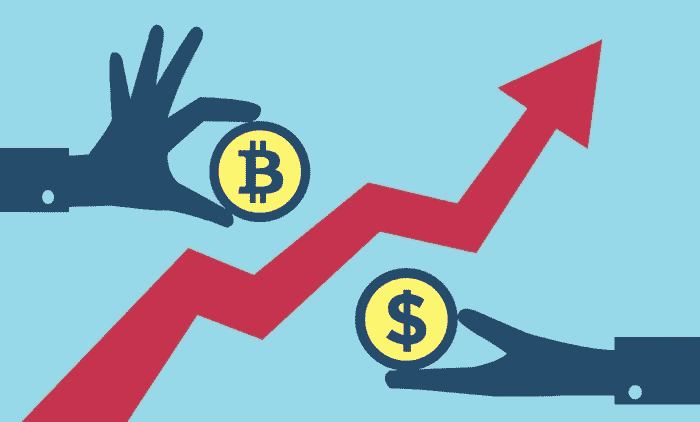
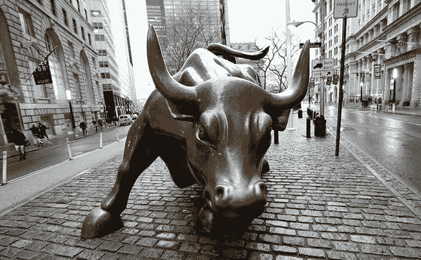

# 比特币价格分析——比特币即将繁荣！

> 原文：<https://medium.datadriveninvestor.com/bitcoin-price-analysis-bitcoins-about-to-go-boom-74ce974d8f53?source=collection_archive---------0----------------------->

一位知名加密货币分析师预测，比特币价格今年可能会飙升。据报道，数字资产投资基金 BKCM LLC 的首席执行官兼创始人布莱恩·凯利表示，比特币可能会在今年年底前创下历史新高，达到每枚令牌 25000 美元的价格。加密货币的成本在今年年初下降，从而使一些投资者担心他们资产的未来。金融机构和专家也抓住机会，就比特币未来的不可靠性发表意见。

然而，粉丝和投资者的担忧在本周初有所缓解，因为数字硬币的成本增加了约 13.5%。自那以后，比特币的价格一直保持在同一区间，其价值没有明显的上升或下降。

据信，这导致凯利预测加密货币的交易量及其成本可能会在 2018 年底前大幅增加。他在本周早些时候接受美国消费者新闻与商业频道采访时预测。同时，这位分析师并不是第一个预测比特币价格上涨的人。

包括 Thomas Lee 和 Tim Draper 在内的许多策略师都表示，加密货币的价格将在未来几年内飙升。在 Kelly 的采访中，他谈到了 draper 所做的预测，称这并非不切实际。

德雷珀预测，到 2022 年，BTC 代币的价格有可能达到 250，000 美元，在四年内增长约 3，000%。凯利支持这一预测，并补充说，由于比特币在过去几年中增长了 4000%，加密货币可能会在 2022 年达到这一纪录。

# 历史站在他一边吗？

如果加密货币爱好者还记得的话，德雷珀在 2014 年比特币价格约为 320 美元时预测，加密货币的成本将在 2017 年飙升至 1 万美元以上，这被证明是真的。布莱恩·凯利似乎不是唯一一个对比特币价格在今年年底前飙升抱有很高希望的人，因为加密货币对冲基金潘迪拉资本的管理层在 4 月份的新闻稿中透露，比特币的价格将在今年年底前达到最低点。

据报道，管理层补充说，声明发布时比特币的价格约为 6500 美元，可能是加密货币可能达到的最低成本，价格将在 2018 年底前大幅上涨至 2 万美元。

这不是潘迪拉资本的管理层第一次预测加密货币的价格。据报道，2017 年秋天，该公司首席执行官丹·莫尔黑德(Dan Morehead)预测，在创下新高之前，比特币的成本可能会下降约 50%。

这一预测部分成为过去，因为在过去的几个月里，数字硬币的价格急剧下降到 7000 美元以下，下降了约 65%。然而，比特币价格已经上涨，并在本周一直保持相同的区间。目前还不清楚这些预测是基于合理的数据还是只是胡乱猜测，但底线是它们被证明是真实的。莫尔黑德还在新闻简报中表示，这只是价格上涨的开始，因为机构资金的墙将有助于比特币价格的持续上涨。

# **华尔街终于开始注意到了**

本周早些时候的其他报道显示，许多不同的华尔街参与者冒险进入加密货币领域，其中一个是洛克菲勒的风险投资部门——与加密货币投资公司 Coinfund 合作的 Venrock。另据报道，高盛的高管已经离开公司，加入由迈克尔·诺沃格拉茨运营的加密货币商业银行。

此外，据报道，索罗斯管理基金正准备涉足加密货币交易。莫尔黑德补充说，目前比特币成本的上涨是一个罕见的购买信号，因为购买 7000 美元的东西并没有错，而之前这种东西的价格约为 2 万美元，预计短期内价格会更高。

这位首席执行官强烈认为比特币的成本即将上涨，他将新年后的下降归咎于代币价值产生的意外税收状况。这一税收立场观点对汤姆·李(Tom Lee)的观点表示赞赏，他表示税收可能是自 2018 年初以来加密货币市场普遍低迷的罪魁祸首。

许多加密货币分析师提交了不同的意见，阐述了他们认为加密货币市场下滑背后的原因，加密货币爱好者对加密货币市场的下滑并不重视，他们现在正期待着最近预测的结果。

没有任何保证说这些预测会变成真的，但是粉丝们希望会是真的。即使比特币的成本在过去几个月有所下降，加密货币仍然是数字货币领域最大的货币，正如上文所述，投资者正在快速涌入。此外，比特币在认知度和接受度方面正在滚雪球。比特币爱好者强烈认为，加密货币将变得更加突出。区块链市场的一名高管今年早些时候表示，BTC 的价格将很快飙升。

尽管分布式市场 Shopin 的首席执行官 Eran Eyal 没有明确说明价格上涨将于何时发生，但他在接受采访时指出，当前的[比特币分析](https://cryptoinvestinginsider.com/)显示价格可能会超过 10 万美元。这是一个重大的[比特币价格预测](https://cryptoinvestinginsider.com/)，因此，现在是投资加密货币的最佳时机。然而，许多投资者尚未从新年后的价格下跌中恢复过来。金融机构和专家对加密货币的负面态度也是许多其他有抱负的投资者不愿投资的一个因素。