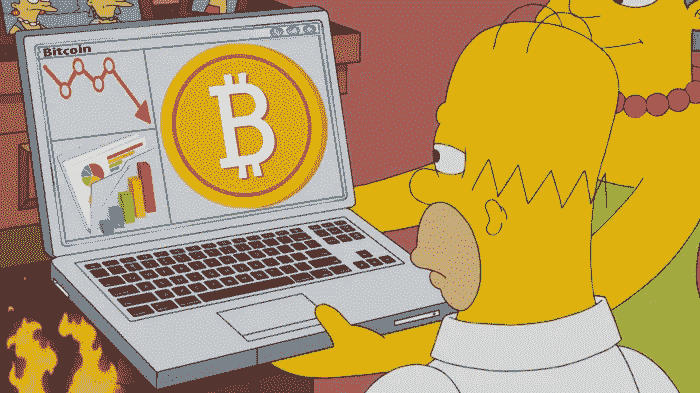

# 巴特·辛普森抬起头，比特币价格下滑

> 原文：<https://medium.datadriveninvestor.com/bitcoin-prices-slide-as-bart-simpson-rears-his-head-54872660e46f?source=collection_archive---------9----------------------->

有报道称，本周三比特币的价格已经跌至 11500 美元以下。这个图案是虚构人物巴特·辛普森的头像。主要的加密货币价格已经超过了 12000 美元，但仅仅几个小时后就突然下跌。当天下午，它涨到 12，145 美元，又跌到 11，438 美元。巴特不受欢迎的头像，它是以虚构人物巴特·辛普森的名字命名的。因此，它导致了密码市场的衰落。

加密产业不得不招致严重的市场抛售。据悉，新发表的研究证实，比特币和加密货币已经导致与标准普尔&500 指数形成了反向相关性。然而，人们也注意到，股票和密码市场现在都处于危险之中。比特币下跌了 0.55%。道琼斯工业平均指数当天下跌 0.53%，标准普尔指数下跌 0.31%。据悉，利润是在几小时后的一次恶性抛售中让出的。

 [## 总部位于瑞士的 ETP 进入加密交易市场|数据驱动的投资者

### 虽然金融市场几乎没有沉闷的时刻，特别是在引入…

www.datadriveninvestor.com](https://www.datadriveninvestor.com/2019/03/10/swiss-based-etp-enters-the-crypto-trading-market/) 

# 巴特的头部结构破坏了加密领域

[比特币](https://www.thecoinrepublic.com/is-this-a-possible-reasons-for-bitcoin-suddenly-soaring/)不得不遭受不受欢迎的巴特·辛普森技术模式的巨大损失。这种模式一直不受欢迎，因为价格飙升横向交易，然后突然走低到崩溃点，这是它的原始水平。扶手椅交易者将其命名为“Bart”地层，因为其线条图案让人想起类似的巴特·辛普森头像。

对于秘密交易者来说，这是一个非常罕见的机会，但每当它抬头时，那是因为有操纵者试图以散户交易者为代价来开拓市场。这种模式对密码市场非常有害，因此对市场的操作者是一种威胁。加密市场是在严密监视下运作的，因此，这种预兆很难察觉，幸运的是，这种情况非常罕见。

然而，与该行业相关的 stalwartz 正在想办法摆脱这种 havocs，记住不要给市场造成更多的损失或污染。还了解到，将采取预防措施，以便他们能够战胜各种潜在的威胁。据推测，技术方面的安全性将会得到进一步加强。

**新闻来源:**[the confiner](https://www.thecoinrepublic.com/bitcoin-prices-slide-as-bart-simpson-rears-his-head/)