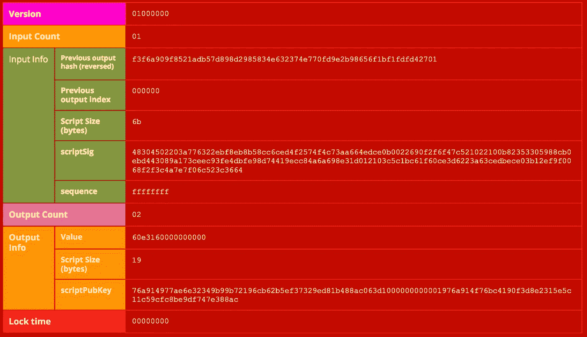

# 比特币原始交易明细

> 原文：<https://medium.datadriveninvestor.com/bitcoin-raw-transaction-breakdown-c0a5a3aa8688?source=collection_archive---------1----------------------->

如果你是区块链世界的新手，那么阅读我之前发布的文章对你来说将是一笔有价值的交易。 在这里，你可以获得一些关于区块链世界的基本知识和你必须知道的各种信息。

****<-区块链基础知识和重要术语。****

*[***https://bit.ly/2FzolZT***](https://bit.ly/2FzolZT)***<——区块链如何工作。****

*在本文中，我们将分解比特币原始交易，以便更好地理解交易如何工作以及比特币区块链中的所有内容。首先，您需要知道事务通过它们的*事务散列*存储在区块链上。存储在比特币区块链中的交易以双哈希形式存储。这意味着原始事务通过 SHA256 两次，以获得我们在区块链上看到的事务哈希。*

> *例如，具有以下哈希的事务:2621 c 2609d 114 f 652 dadf 6 FD 95820 c 021 da 1 cf 2d 0 AC 15 e 0361 FD 5d 136 e 30 a3 C4*
> 
> *比特币区块链中的交易以双哈希的形式存储:
> sha 256(sha 256(01000…)= 2621 c 2609d 114 f 652 dadf 6 FD 95820 c 021 da 1 cf 2d 0 AC 15 e 0361 FD 5d 136 e 30 a3 C4*

*要获取原始事务，可以使用这个 W**EB API:**[**https://bit.ly/2VV6y56**](https://bit.ly/2VV6y56)**。您只需要输入交易 id，就可以获得原始交易的详细信息。***

***或者***

***可以在比特币核心控制台使用***getraw transaction " txid "****命令。****

> ****给定的原始交易=*01000000001 F3 F6 a 909 f 8521 ADB 57d 898d 2985834 e 632374 e 770 FD 9 e 2 b 98656 f1 BF 1 FD 427010000006 b 48304502203 a 776322 ebf 8 EB 8 b 58 cc 6 ced 4 f 2574 f 4c 73 a 664 edce 0 b 000。***
> 
> ****我们能够看到更多关于交易数据模型的细节。****

******

***Raw Transaction Breakdown***

*****版本** —所有交易都包括比特币版本号的信息，因此我们知道该交易遵循哪些规则。***

*****输入计数** —这是该事务使用了多少输入。***

****输入信息中存储的数据:****

*   *****前一个输出散列** —所有输入引用回一个输出(UTXO)。这指回包含将在该输入中花费的 UTXO(未花费的事务输出)的事务。这个 UTXO 的哈希值以相反的顺序保存。***
*   *****先前输出索引** —交易可能有多个 UTXO，这些 UTXO 被它们的索引号引用。第一个索引是 0。***
*   *****解锁脚本大小** —这是解锁脚本的大小，以字节为单位。***
*   *****解锁脚本** —这是满足 UTXO 锁定脚本条件的解锁脚本的散列。***
*   *****序列号** —这是比特币不推荐使用的功能，目前默认设置为 ffffffff。***

*****输出计数** —它告诉我们该事务产生了多少输出。***

****输出信息中存储的数据:****

*   *****金额**—Satoshis(最小的比特币单位)输出的比特币金额。⁰⁸聪= 1 比特币。***
*   *****锁定脚本大小** —这是锁定脚本的大小，以字节为单位。***
*   *****锁定脚本** —这是锁定脚本的散列，指定了使用该输出必须满足的条件。***

*****锁定时间** —锁定时间字段指示交易可以被添加到区块链的最早时间或最早块。
如果锁定时间为非零值&小于 5 亿，则认为块高度和矿工必须等到达到该块高度后才能尝试将其添加到块中。如果 locktime 超过 5 亿，它将被读取为 UNIX 时间戳，这意味着自 1970 年 1 月 1 日以来的秒数。通常为 0，表示尽快确认。***

## ***感谢您的阅读！***

## ***表示点爱，如果觉得有帮助的话:)***

## ***来自 DDI 的相关故事:***

*** [## 为什么数据会改变投资管理

### 有人称之为“新石油”虽然它与黑金没有什么相似之处，但它的不断商品化…

medium.com](https://medium.com/datadriveninvestor/why-data-will-transform-investment-management-4a60966c1c81)  [## 投资算法快速指南

### 让我们想象一下 30 年前的股市…

medium.com](https://medium.com/datadriveninvestor/a-quick-guide-to-investment-algorithms-628450b9dc55)***