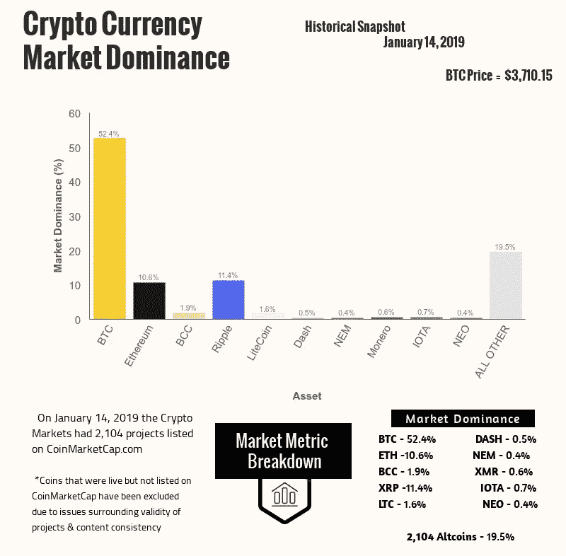

# 隐性显性稀释理论

> 原文：<https://medium.datadriveninvestor.com/bitcoin-vs-altcoin-8b047f3ff0b7?source=collection_archive---------7----------------------->

## 浅谈比特币与替代币的交集

在我们跳进那个隐藏的洞之前，问你一个问题:

你愿意:前 250 名中有 1 个比特币还是 1 个其他加密货币？

很好，现在坚持你的选择直到最后…

自从比特币在 2017 年受到关注以来，无数的经济模型和理论被设计出来，试图量化和评估加密货币。一些最受重视的研究已经归结为[网络价值交易(NVT)](https://coinmetrics.io/nvt/#assets=btc) &交换方程式(MV=PQ)。尽管如此，似乎我们越深入一个秘密的世界，我们就必须付出越多的努力来解密这个秘密经济的未知领域。

进入隐性优势稀释理论。

不久前，(2018 年 1 月 11 日)[圣路易斯美联储发布了一项研究，声称 Altcoins 的增加将降低比特币的价值。](https://cointelegraph.com/news/st-louis-federal-reserve-report-increased-supply-of-altcoins-will-decrease-btcs-value)

> "替代币(加密资产)供应的增加将迫使比特币贬值."

他们的观点是:随着新项目的引入，加密货币市场将通过稀释比特币的市场份额而激增……实际上是将比特币的市值锁定在当前水平附近。非常重要的一点是，要注意用来“证明”上述理论的指标……市场支配地位的历史表现。

[因此，根据圣路易斯联邦储备银行的个人研究:比特币的价值与其市场主导地位挂钩……](https://research.stlouisfed.org/publications/economic-synopses/2019/01/11/whither-the-price-of-bitcoin/)

> 加密之外的一个例子:

这相当于假设苹果将开始失去*价值*，因为特斯拉现在是一家太阳能电动汽车公司。

想象一下苹果公司价值 1000 亿特斯拉跳进美国股票市场，价值 100 亿。这个市场现在价值 1100 亿英镑。苹果现在占有 90.90%的市场份额，而不是之前的 100%。

假设苹果公司增值 50 亿美元，脸书公司现在首次公开募股 100 亿美元，加入股票市场。现在市场价值 1250 亿。有趣的是，即使市场主导地位被稀释，苹果仍然能够获得价值——市场主导地位下滑至 84%，但价值增加了 5%。

甚至可以说，随着市场的进一步包容，新公司的利润有可能溢出到苹果公司，只会进一步增加其价值。

在上一次加密爆炸期间，由于替代硬币的出现，市场主导地位持续波动。在上一次运行的最极端点，我们看到比特币的市场主导地位下降到 32.76%(2018 年 1 月 14 日)——此时其价值为 14，000 美元。以太坊占据了第二大市场份额(18.32%)，当时 ETH 的交易价格为 1325 美元。基本上，前 10 个项目总共占有 73.06%的市场，而所有其他 1381 个项目占有 23.94%的市场份额…

来，看一看:

January 14 2018

让过去的就让它过去吧——2018 年的市场已经过去，我们现在正在跋涉新的道路。

前 10 名现在占据了 80.5%的市场份额，而现在是 19.5%。

这似乎有悖常理，因为我们知道 BTC 的价格下跌了 71%,尽管其市场主导地位有所上升。其中实际上从 32.76%增长到 52.5%- *市场支配地位提高了 60.25 个百分点！*

但是等一下，当 BTC 重新获得市场主导地位时，CoinMarketCap 上的项目数量却在持续增长；事实上，它从 1391 增长到 2104。*项目原始金额增长 51.25%*(如果使用[***coinlib . io***](https://coinlib.io/)***的资源，实际增长从 1391 到 5522；*** 同比增长 297%)。*为了保持一致，我们将仅使用来自 CoinMarketCap 的指标。

根据加密优势稀释理论，随着替代加密资产数量的增长，比特币将失去其市场优势，并最终失去其在加密领域的影响力。这似乎并不准确；坦白说，这看起来完全不对。

> BTC 市场支配地位— —价值— —加密资产变化
> 
> 32.76% — — — — — — — — — — $14,000 — — — — — — — — 1,391
> 
> 51.25% — — — — — — — — — — $4,000 — — — — — — — — — 2,104

BTC 的市场主导地位应该会从 32.76%进一步下降到 20-25%之间。然而，正如我们所观察到的，市场的反应并非如此…

🎭背离，市场优势的增加，同时独特定位的减少🎭(成为 1391 中的 1 比成为 2104 中的 1 更具排他性。)

背离中的背离——第一个背离(如上)与我们在市场支配地位和资产价值之间发现的另一个背离相结合。

这种发散的重叠创建了度量波动之间的相关性的三维表示。(很抱歉，我不知道如何创建经济相互关系(这不是一个实际的词)方面的多维图形模型。)

本质上，我们看到项目的数量在增长，比特币的价格也在下跌。因此，我们开始将新的数字加密资产的引入与某种形式的贬值或稀释联系起来。

无非是:

1.  操纵群众(惊喜惊喜)
2.  信息不清晰
3.  金融和数学的社会无能

稍等一会儿…

我一点也不想贬低这个理论。事实上，我要感谢圣路易斯美联储银行的研究人员，他们揭示了普遍不被重视的加密指标。

然而，我要说的是，重要的是要强调圣路易斯联邦储备委员会提出的理论目前是危险的不完善…

一方面，它似乎不能解释上次抛物线增长的原因(altcoins/ico 的)。此外，它没有考虑在这种投机市场的熊市周期中发挥作用的宏观指标。

更重要的是，对于另一个松散相关的资产来说，没有办法真正地考虑一个项目是一个负担还是一个祝福。(在我看来)更有可能的是，一个对替代货币感兴趣的参与者仍然通过比特币进入(并将很可能存在)市场。

> ⚖真相时刻⚖
> 
> 大约:2018 年以后

你一开始就选了一个密码。你的选择是二元的:

到比特币还是不到比特币。

如果你选择了比特币之外的任何一种加密货币，我恳求你……改变主意。我选择了 BTC。

对于那些选择了比特币的人，我要祝贺你们……你们有足够的见识、足够的意识、足够的勇气去理解我们可能会走向何方，以及未来会如何。

🥂呆醒了我的朋友🥂

**P.S.** 答**最后一题给你；**

> 如果不是比特币，那是什么？