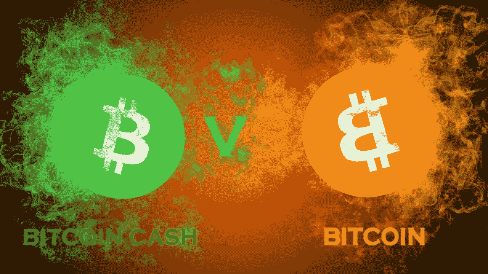
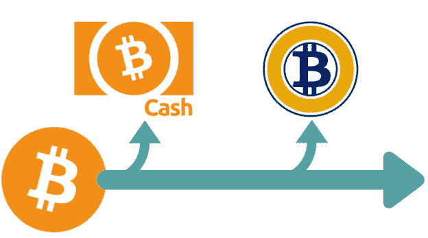
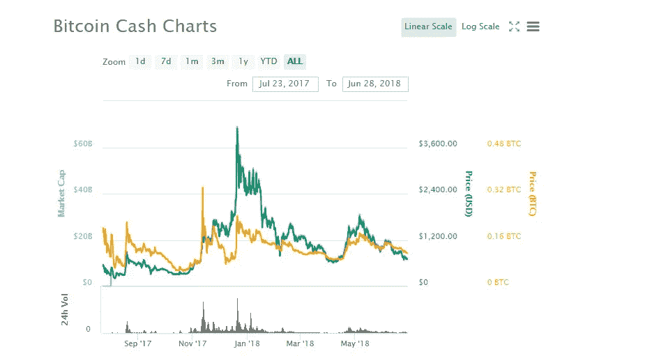

# 比特币现金 vs 比特币:一场迫在眉睫的战争？

> 原文：<https://medium.datadriveninvestor.com/bitcoin-vs-bitcoin-cash-an-impending-war-58d43960a953?source=collection_archive---------2----------------------->

有消息称，由开发人员、矿工和鲸鱼组成的比特币忠诚者团体 BitPico 计划通过 51%的攻击来攻击比特币现金(BCH)网络，这可能会在加密领域引发一场史诗般的战斗。

BitPico 最初于 6 月 22 日在 twitter 上宣布，他们打算利用压力攻击比特币现金网络，并打算随着时间的推移增加攻击。

BitPico 表示，攻击的原因是为了证明比特币现金是一个过于集中的区块链，以及它是否能够证明其关于去中心化的透明声明。所有分散式网络的主要焦点是它们应该足够强大以抵抗这种攻击。BitPico 认为比特币现金网络没有经过足够的测试来证实这一点，因此无法为投资者提供满意的信心。为了能够利用当前的熊市，积累比特币和比特币现金，以及其他许多硬币，读者可以[在 Huobi Pro 上注册并立即交易。](https://www.huobi.br.com/en-us/topic/invited/?invite_code=da523)

该组织认为，他们拥有实施这种规模的攻击所需的基础设施，当时他们控制了多达 30%的 hashrate，但这一大胆的说法尚未得到证实，BitPico 的最新威胁是否有正确的事实证据仍有待观察。比特皮科声称

> *‘已经开始攻击，预计在大约 6 周内会有 5000 个 Bcash 攻击节点，然后他们会多叉链’。*

关于 BCH 网络的脆弱性，他们指出:

> *“我们的 LevelDB 压力测试显示，复杂的 32 兆字节块上的比特币现金 UTXO 数据库需要高达 200 的 RAM 才能完全处理，如果该 RAM 不可用，UTXO 数据库将会损坏，如果 LevelDB 不释放内存，操作系统将变得无响应。”*

# 比特皮科历史

BitPico 在社区中赢得了宝贵的声誉，因为它能够针对各种平台执行压力测试。他们首选的攻击是实现过多的请求，通常称为拒绝服务攻击(DDoS)。该组织此前一直是比特币网络扩展解决方案 SegWit2x 的坚定支持者。尽管该项目的主要倡导者发表声明，宣布由于社区不和谐，对 fork 的支持已经减少，但这种支持仍在继续。该集团随后威胁要执行 SegWit2x 硬分叉；然而，这一点从未实现。

最近几个月，该组织一直保持沉默，但在 3 月份宣布他们已经开发出攻击闪电网络的框架后，他们再次引人注目。用户抱怨闪电节点崩溃，支付暂时停止。然而，必须提到的是，很难判断 BitPico 对攻击负有多大责任，其他方面又负有多大责任。

# 比特币 101

比特币的起源非常广泛，并被铭刻在开创性技术里程碑的历史中。由不知名的中本聪发明的这个匿名人或群体的身份已经成为科技领域最持久的谜团之一。比特币是作为电子现金的一种形式而产生的，是世界上第一种去中心化的数字货币。比特币是作为对一个称为采矿的过程的奖励，随后可用于支付某些服务和产品，或兑换成其他货币。自问世以来，该货币已经取得了许多重要成就，包括:

➡️Reaching 在 2017 年 12 月 17 日创下 19，783.06 美元的历史新高。

➡️Being 在微软、Expedia 和 Shopify 等主要零售商中引入了 as 支付方式。

# 比特币叉子

尽管比特币协议有许多积极因素，但仍有许多矿工认为该协议可以在几个非常重要的方面得到改进。然而，这种思路可能不会与比特币网络上对当前动态感到满意的其他矿工一致。因为这种行动将由想要改变规则的这部分大多数矿工采取。

这就是叉子发挥作用的地方。分叉意味着区块链中的任何分歧，无论是暂时的还是永久的。分叉代表比特币协议的变化，使之前的规则有效或无效。货叉可分为**硬货叉**或**软货叉。**

**硬分叉:**这是与区块链先前版本的永久分歧，任何旧软件都将与引入新网络的新软件升级不兼容。没有向后兼容性。继续使用较旧软件的节点将看到较新的事务现在无效。因此，为了让节点继续挖掘有效块，它们需要升级到新规则。以太坊进以太坊经典，比特币进比特币现金，都是硬分叉的好例子。

**软分叉:**尽管软件协议发生变化，但仍向后兼容时，发生软分叉。这意味着新规则仍然可以在协议内互操作。原链将继续遵守旧规则。只有矿工必须升级，用户和商家可以继续使用将接受较新块的旧节点。Segwit 是比特币软分叉的一个主要例子。

继 2017 年末和 2018 年初之后，以下比特币分叉已经发生或计划发生:

**比特币黄金(BTG)**

**比特大陆(BCX)**

**比特币热(BTH)**

**比特币世界(BTW)**

**比特币白银(BTCS)**

# 比特币和比特币现金的主要区别

尽管到目前为止已经出现了大量的比特币分叉(总共 95 个)，但所有分叉中最成功的是比特币现金。2017 年，比特币计算能力> 80%的大多数人投票通过了一项名为 SegWit 的新技术形式的软分叉。它于 2017 年 8 月 23 日被激活。SegWit 引入了“块权重”。这是包含和不包含签名的块大小的混合，因此减少了需要验证的数据。每个块的最大大小为 4mb。SegWit 不允许增加块大小限制，仍然是 1mb，但是它允许在 1mb 块内有更多的事务。

对 SegWit 的抵制是引入比特币现金的关键因素，比特币协议的一个硬分支选择实施更大的 8mb 块大小限制，而不是新的交易结构。比特币现金的推出是因为开发者和比特币矿工共同担心加密货币的未来及其有效扩展的能力。块大小的增加将大大加快验证过程。

比特币和比特币现金的其他主要区别包括:

当两个网络都充斥着交易时，➡️Bitcoin 现金将会有更低的费用。

➡️Many 人认为比特币已经不再是一种实用的加密货币，许多用户、商家和企业希望放弃比特币，寻求一种更快、更便宜的加密货币。

➡️But 比特币现金没有比特币那样的社区接受度，因此与比特币相比，支持比特币现金的钱包和交易所较少。

➡️Bitcoin 也有更大的安全性和稳定性，因为它拥有更大的矿业支持和基础设施。

# 比特币和比特币现金的未来

比特币现金分叉已经整整一年了，虽然基本上其他比特币分叉都是失败的，但可以说比特币现金取得了惊人的成功。截至目前，它是第四大加密货币，市值 120 亿美元。每个 BCH 的交易价格为 700.02 美元。此前，2017 年 12 月曾创下 4355.62 美元的历史新高。比特币现金协议目前正在计划或实施升级。这些人想延续 BCH 的成功，甚至有可能超越比特币本身，成为与比特币相关的主要加密货币。一些计划中的升级包括:

***增加块大小限制。*** 大小限制将从 8mb 增加到 32mb。这将继续提供廉价和更快的交易。

***进一步支持和兼容*** 。越来越多的交易所，如 Huobi Pro，正在支持 BCH 和常用的钱包，如 Trezor，Ledger 和 Jaxx。

***忠诚的共同体。*** 可以说，成功的加密货币最重要的方面之一是一个忠诚而热情的社区，尤其是在这个竞争异常激烈的行业。由于 BCH 交易的性质，这种货币培养了一批忠实的观众。

尽管比特币现金取得了成功，但不可否认的是，目前以及几乎可以肯定的是，在可预见的未来，比特币仍将是占主导地位的加密货币。虽然比特币现金确实有一些目前优于比特币的方面，如交易的便利性，但比特币将继续发展其实用性并保持其市场份额。SegWit 的实施取得了巨大成功，软分叉现在占所有比特币网络活动的 40%以上，显示出可扩展性问题中的积极情绪。SegWit 的成功使该协议能够在年初高效、快速地清理积压的交易，并持续降低了 15 分钟的平均确认时间。

比特币目前拥有最高的市值和哈希值，同时也很容易拥有最大的影响力。虽然它确实比 BCH 的交易更慢更贵，但这些可扩展性问题一直在解决，新的开发也在测试中，即闪电网络。但最重要的是，机构投资者仍然对比特币感兴趣，这只会有助于比特币继续增长，巩固其作为市场领导者的地位。

[火币 Pro 支持](https://www.huobi.br.com/en-us/topic/invited/?invite_code=da523)比特币和比特币现金的买卖，你所要做的就是[使用此链接](https://www.huobi.br.com/en-us/topic/invited/?invite_code=da523)注册并立即开始。目前，加密市场正在经历一次深度调整，我的观点仍然没有见底。注册 Huobi，积累 BTC 和 BCH，我相信 9 月/11 月之后可能会有一轮行情。

*如果你觉得这篇文章有用，并且想看我的其他作品，请一定鼓掌并关注我的* [*媒体*！](https://medium.com/@salmanmiah)😎