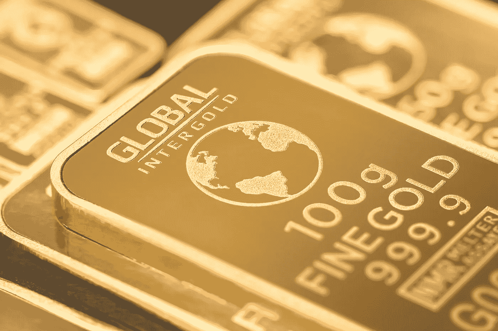

# 比特币 vs 黄金。太空、小行星和美国宇航局

> 原文：<https://medium.datadriveninvestor.com/bitcoin-vs-gold-6016bef863c5?source=collection_archive---------7----------------------->

比特币是更好的论据

Gold standard

一百年来，老一直是有价值的。它有真实的生活，日常的用例，它是稀缺的。

当你问任何黄金专家或持有者黄金的价值时，他们会告诉你，我们一直在使用它，一直重视它，历史有重演的习惯。

在我们的星球上，黄金是稀缺的。历史上我们已经并将继续将一些稀有金属与财富、珍宝和财富联系在一起。但是如果稀有金属不再稀有会发生什么？

 [## 害怕，非常害怕...为什么菲亚特害怕数字货币是正确的|数据驱动的投资者

### 本文的目的是为我们最近(以及即将到来的)欧盟 H2020 拨款中的一个部分提供额外的视角…

www.datadriveninvestor.com](https://www.datadriveninvestor.com/2019/03/04/be-afraid-be-very-afraid-why-fiat-is-right-to-fear-digital-currency/) 

> 进入太空，美国宇航局和小行星

外太空是一个很大的地方，无限。我们知道，就在我们的头顶上，有一个永无止境的宇宙，包含了我们可能需要的所有金属和材料。

在地球上，黄金是稀有的。在太空？有点不一样。

> 小行星 16 波西卡

有报道称，有一颗小行星，其含金量超乎你的想象，就在我们太空探索队能到达的地方。美国国家航空航天局表示，第一次接触估计将在 2022 年左右，小行星上发现的所有金属的价值被认为是相等的；

> $8,000,000,000,000,000,00

> 八千万亿美元。

我们中有人能欣赏这个数字吗？不要介意阅读永无止境的 0。附加的价值是，哦，这么大。

开采这些金属，不在当前的计划中，或者至少没有公之于众。但是，如果这在不到 10 年的时间里真的成为可能，它可能会彻底摧毁许多金属的价值，因为它们将变得如此普遍，以至于需求永远不会超过供应。

我们可以用黄金做任何事情。衣服、鞋子、家具，以至于无论你走到哪里，黄金都会像塑料一样随处可见。

很多不相信比特币的人，相信黄金。

他们从根本上受到我们在地球上所拥有的东西、历史以及人类如何与之互动的鼓舞。

如果它真的变得普通，它就失去了价值，失去了区别于其他金属的稀有性。想想钢或铜。正如我们所知，两者仍然保持价值，并且是创造和生活所需要的，然而价值是明显不同的。

# 稀缺

比特币是有限的。即使在太空中也找不到，除非我们的邻居创造了同样的货币，但我们不要忘乎所以。

> 比特币

比特币提供了一种新的全球货币方式，这是我们都需要的。这是一个开放的边境支付系统，比传统银行更安全、更便宜。处理时间和可能性远远超过我们目前使用的技术，而且这项技术还可以实现更多。

时间可以改变任何价值。今天有价值的东西，明天可能一文不值。

> 太空小行星的开采有可能吗？

随着技术的发展，我们作为一个种族的能力也在发展。唯一真正的问题是成本和效率。

无论如何，飞向太空、采矿然后带着金属返回地球都不会便宜。

目前，在不突破大气层的情况下到达我们星球的外围，起步费用高达 20 万美元。这是一个非常小的飞行器，承载不了太多重量。对于火箭和更大重量的运载能力；需要数亿美元，而这只是冰山一角。

> 作为参考，我们假设— 7 亿美元
> 
> 首次登月花费了 1500 亿美元

自从第一次登月以来，我们已经走过了漫长的道路。技术更好，更有效，也更便宜，但它仍然是有代价的，尤其是当我们在人类历史上第一次尝试这种技术的时候。

# 最后，让我们回到现实中来

> 我们会很快在太空开采黄金吗？

如果我们相信美国国家航空航天局和其他组织的计划，这可能是在我们的有生之年。从 10 年到 50 年不等。很快吗？我们会让你决定。

> 如果黄金失去价值，人们会转投比特币吗？

这是很有可能的，但还是那句话，一切都与时间有关。

黄金有价值，一直有，永远不会变。但是今天，这一价值是极其重要的。如果我们拥有更多，价值会减少吗？

是的。

价值的储存以及我们为确保财富安全而保存的东西都在不断变化。

也许是黄金时代的人们开始考虑改变的时候了。他们爱怎么说就怎么说；

> 比特币明天可能一文不值。

> 黄金不也是如此吗？

下面分享一下你的想法。

感谢阅读。

 [## UniDAX 官员

### 对于 BSC，如果您有任何问题，请检查组的内置顶部，或 pm admin。网址:www.unidax.com…

t.me](https://t.me/UniDAX_Offical)  [## 𝐔𝐧𝐢𝐃𝐀𝐗(@ unidax _ exchange)* insta gram 照片和视频

### 518 名关注者，34 名关注者，75 篇帖子——见来自𝐔𝐧𝐢𝐃𝐀𝐗的 Instagram 照片和视频(@unidax_exchange)

www.instagram.com](https://www.instagram.com/unidax_exchange/)  [## UniDAX Exchange(@ UniDAX _ Official)| Twitter

### UniDAX 交易所的最新推文(@Unidax_Official)。数字金融世界的通用交易所

twitter.com](https://twitter.com/Unidax_Official)