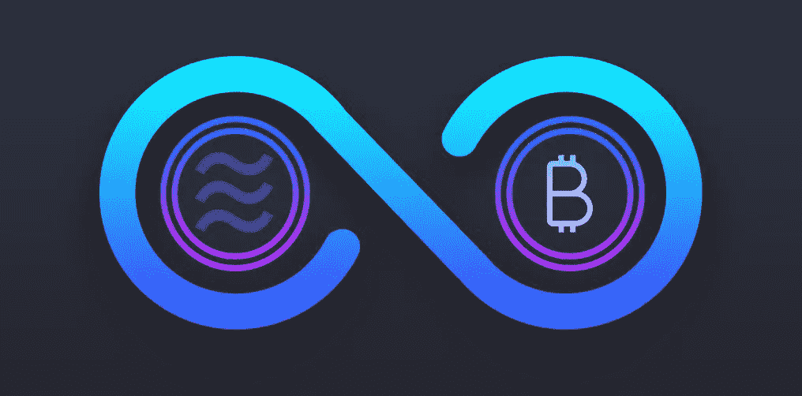

# 比特币的下跌被怀疑是由于脸书，天秤座可能会直接推动比特币的增长

> 原文：<https://medium.datadriveninvestor.com/bitcoins-fall-suspected-due-to-facebook-libra-could-directly-boost-bitcoin-s-growth-36bec787e84d?source=collection_archive---------12----------------------->

比特币最近的下跌对加密市场来说不是一个好兆头。现在的波动水平比以前低，甚至降到了 10，000 美元以下。在撰写本文时， [**比特币**](https://www.thecoinrepublic.com/bitcoin-accepted-3-million-on-valletta-palazzo-mansion-in-malta-which-is-on-sale/) 的交易价格仅为 9685 美元，而 6 月底时曾达到 13000 美元的高点。投资者很快将此事与 7 月 16 日和 17 日举行的脸书国会听证会联系起来。尽管许多人认为这可能只是一个巧合，但市场上的许多资深人士却不这么认为。

# **比特币与听证会的直接联系**

比特币的价格在某种程度上与决定加密货币**未来的事件有直接关系。过去，举行的听证会也直接影响了比特币的发展。首先，听证会前的几天对比特币不利，因为它表现出了看跌行为。此外，16 日的今天，它已经跌至一个月以来的最低点，为 9600 美元。虽然脸书的 [**天秤座**](https://www.thecoinrepublic.com/libra-to-bring-about-global-acceptance-of-cryptocurrencyall-you-need-to-know-about-libra-from-its-whitepaper/) 将比特币的涨势从 9800 美元推高至 13000 美元，但在听证会之前，它已经拉平了这一涨势。**

** [## 创新提醒:区块链 3.0、Terra 协议、ICO 门户和更多|数据驱动的投资者

### 尽管过去几个月加密货币的价格波动很小，但这项技术并没有停止发展…

www.datadriveninvestor.com](https://www.datadriveninvestor.com/2019/03/16/innovation-alert-blockchain-3-0-terra-protocol-an-ico-portal-more/) 

在过去，国会听证会已经影响了**BTC 的价格。去年 7 月，比特币的价格在五天内从 6820 美元跌至 6070 美元，导致一场关于加密未来的听证会。但是，当一个合适的结果出现时，由于听证会的有利结果，它回升到 7400 美元。这方面的更多例子包括同年 2 月和 2013 年 11 月的听证会。**

# ****关于听证会&比特币与其的关联****

**脸书的国会听证会已经开始讨论它的新项目 Libra。由于美国国会对加密货币**持怀疑态度，该密码预计将受到严格审查。Calibra 的脸书负责人 David Marcus 被要求于 16 日在参议院银行委员会和 17 日在众议院金融服务委员会向不同的立法者作证。听证会的影响将通过比特币价格的波动来体现。****

****这类委员会对天秤座的冷嘲热讽行为可能对比特币不利。听证会上做出的决定可能会给密码市场带来巨大的冲击。在这些听证会进行的同时，整个市场都感受到了焦虑。******