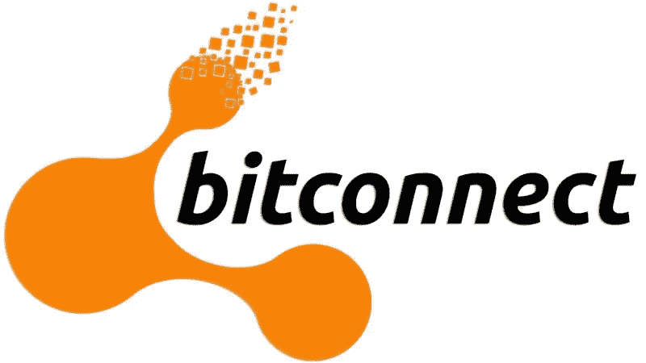

# Bitconnect 的庞氏骗局:加密货币世界最大的骗局。

> 原文：<https://medium.datadriveninvestor.com/bitconnects-ponzi-scheme-the-biggest-scam-in-the-cryptocurrency-world-2f2200a31392?source=collection_archive---------5----------------------->

你们中的许多人可能已经听说过加密货币世界中最大的骗局，无论是来自新闻媒体还是来自模因。那么，bitconnect 的整个概念是什么，他们是如何成功实施加密货币世界中最大的骗局的？

首先，当你打开网站时，我说的是在他们实施庞氏骗局之前，你可以看到许多语法错误和糟糕的英语，这表明不专业。大多数合法企业至少有一名员工在把所有东西放在网站上之前进行拼写检查，如果开发者不是以英语为母语的人。此外，他们太好了，不可能是真的；“10000 $+，他们声称你获得了 0.25%的保证日利息，也就是说每年 91.25%的保证回报。不仅如此，他们还声称你每年可以获得高达 480%的额外收入。除此之外，推荐系统会向你的推荐人支付每笔投资或再投资的 7%，他的推荐人获得 3%，他的推荐人获得 1%，以此类推，直到第 11 次推荐，加起来超过 12%。因此，如果你一年投资三次相同的金额，他们将支付你初始投资的 36%以上。

所有这些加起来保证每年 127.25%以上的保证无风险利息，甚至不包括再投资利息。世界上没有哪家合法企业能够无风险地向客户支付这一利率，再加上高达 480%的利率。也没有能保证利润的交易机器人”。

后来发生了什么，他们实施的庞氏骗局是什么，

庞氏骗局基本上是有人向投资者承诺非常高的利率和最小的风险，一旦他们说服人们投资他们的项目，他们就通过收购新投资者为老投资者创造回报来支付人们。因此，在获得了最大限度的投资后，公司倒闭了，成千上万的人失去了他们所有的资本和积蓄。

直到今天，bitconnect 计划是加密货币社区有史以来最大的计划，这不仅是技术的耻辱，也是人类的耻辱，因此，许多家庭失去了他们拥有的一切。在这一点上，我们所能做的就是充分利用这种情况，从过去的错误中吸取教训，投资加密货币，让世界变得更加美好。

*如果您想了解更多，请访问 BIDITEX 页面并提出您的问题，关注我们的* [*推特*](https://twitter.com/biditex_com) *，* [*脸书*](https://www.facebook.com/biditex/) *，* [*中型*](https://medium.com/@biditex) *，* [*电报*](https://t.me/biditex%20%28edited%29) *等。投标变更同***。**

****参考文献:****

**(52)、t、(68)、l、(58)、z、(78)、a、(44)、w、(61)、s、。。。(12)，第(未注明)页。BitConnect 骗局曝光。检索自*[*https://steemit . com/scam/@ the grinder/the-bit connect-scam-exposed*](https://steemit.com/scam/@thegrinder/the-bitconnect-scam-exposed)*