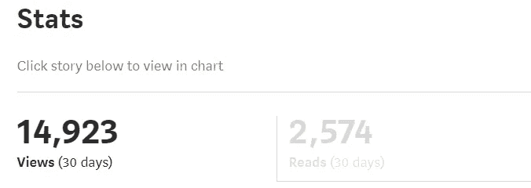
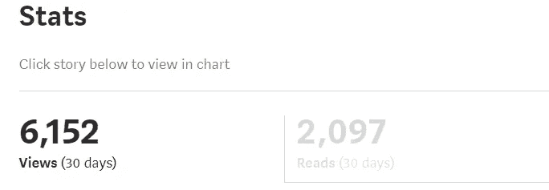

# 咬着喂食的手:窗户是不是在关上？

> 原文：<https://medium.datadriveninvestor.com/biting-the-hand-that-feeds-is-the-window-closing-on-medium-566da5b5a614?source=collection_archive---------5----------------------->

## 提醒所有媒体作者，我们是为了文字，而不是为了金钱。

Photo by [Jeff Hardi](https://unsplash.com/@jeffhardi?utm_source=medium&utm_medium=referral) on [Unsplash](https://unsplash.com?utm_source=medium&utm_medium=referral)

我从去年秋天开始使用 Medium 与这里的大多数其他人相比，根本没有多少时间。不过，这确实给了我足够的机会去写大约 175 篇已发表的文章和一些多余的草稿。有了这些，我发现自己已经跻身于每月收入超过 100 美元的作家行列——这个数字与其说是经济解放，不如说是象征性的。

我没有赚太多超过 100 美元的门槛，从来没有进入 4 位数的范畴，但是，说实话，事实上我有时会让我的口袋微笑。

然而，最近，Medium 的冗长景观开始显示出干旱的迹象。那些顶级作家(收入超过 100 美元)显然已经减少了。下面的数据在很大程度上反映了 Medium 在新的一年到来之际去年秋季的数据:

> 9.3% 2018 年 8 月
> 9.2% 2018 年 9 月
> 9.9% 2018 年 10 月
> 9.1% 2018 年 11 月
> 9.3% Dece **mb** er 2018

然后，新的监管和分发机制已经到位。这是否是人数减少的原因是我永远无法确认的，但我个人的统计数据(下文)似乎与此相关。

> 2019 年 1 月 8.1%
> 2019 年 2 月 9.0%
> 2019 年 3 月 7.5%
> 2019 年 4 月 7.1%

***前第一次策展改版:***

**

****后第二次策展改版:****

****

**会不会是新的一年带来了勒紧裤带、拧紧螺丝和帽子的需要？从几年前的普遍情绪来看，许多人会很快同意。**

**众所周知，2017 年对 Medium 来说是一个混乱的公关年，许多批评者认为付费墙计划是结束的开始:**

> **花哨的博客平台 Medium 一直在以每年 5000 万美元的速度烧钱，试图占领出版商的世界……但该网站尚未显示出一分钱的收入，并公开谴责使用广告来资助自己，它有点陷入困境。— [英国注册局](https://www.theregister.co.uk/2017/03/24/medium_five_bucks_a_month_for_nothing/)**

> **灵媒放弃了他们的使命。现在，在 Medium 的忠实读者和该平台所能提供的最佳服务之间，存在一堵付费墙。这是一个巨大的失望。— [福布斯](https://www.forbes.com/sites/theodorecasey/2017/08/14/why-medium-doesnt-matter-anymore/#3207f0d449ad)**

> **但是，如果我写一篇 1500 字的文章挣 8 美元，也许我只是个差劲的作家，不配得到 Medium 的各种“喜欢”，即所谓的*掌声。或者也许我写的东西不太适合 Medium 的观众，或者 Medium 有比我意识到的更深层次的问题。——[媒体自己的成员，迈克尔·斯潘塞](https://medium.com/@Michael_Spencer/medium-paywall-failure-here-is-why-5650edd9827d)***

**因此，人们预计，让其成员创建和消费自己的内容网络的财务激励将不得不受到更严格的监管和限制，以便 Medium 能够带着足够雄厚的资金走出这一有趣的社会实验的火焰。**

**[2019 年尼曼实验室的一篇文章](https://www.niemanlab.org/2019/03/the-long-complicated-and-extremely-frustrating-history-of-medium-2012-present/)记录了 Medium 的前七年[绝对值得一看]，描述该网站“经历了无数次转变”，成为“关于互联网出版可能会是什么样子的无休止的思想实验”。由于 Medium 距离实施付费墙的日子不远了，而且再过两年就要度过第一个十年，所以水还是一如既往的浑浊，未来一片混乱。**

> **“介快七岁了。它已经筹集了 1.32 亿美元的风险资金，但还没有盈利”——劳拉·哈扎德·欧文**

**换句话说，个体作家的盈利之窗可能会像近十年前打开时一样迅速关闭。不过，没有具体的收入数据，很难有效地预测任何事情。**

> **像任何市场一样，我们首先要播种。通常情况下，在你有足够的需求之前，你需要播种供应，这样人们就会有所收获。”— Ev 威廉姆斯**

**不要误解我。Medium 是个好地方。自从半年前加入以来，我已经月复一月地进入了前 7%的作家行列，这帮助我通过一个舒适的(但显然不可持续的)边际来补充我自己的收入。**

**另一个好处是，我在这一年的时间里写下的文字本身就是一种投资——它们是可循环利用的，有见地的，回顾起来是有益的。**

**总而言之，我得到了报酬，做了我喜欢做的事情。尽管如此，当我进入一个舒适的状态和一个有动力的日常工作时，地板开始从我脚下崩塌。可能我的内容只是变得无聊或者重复了；也许我失去了那种魅力。**

**或者，我不应该开始怀疑我自己的能力，因为毫无疑问，我已经注意到我的写作自去年秋天以来有了很大的进步。**

**我的理论？Medium 不断改进的发行方法有效地将一些作家排除在个人盈利范围之外。我可能太天真了，现在才意识到这一点——也许这是一种普遍理解的情绪。我不知道，因为我自己从未付费成为灵媒会员。因此，我只能看到一些我的同行发表的文章。所以，不可否认，我有点落伍了。**

**尽管如此，我还是学到了关于媒介的一些重要的东西:如果你是来赚钱的，你可能会成功，尽管每天都要花费大量的时间和努力来积累数字，这些时间可能更适合用来追求更有成效的努力，因为这种投入与其说是为了沉迷于爱好，不如说是为了追求薪水。**

**问题变成了:这种需求，花费大量的努力和精力来引导你的媒体博客的流量——嗯，它减少了仅仅作为消遣而写作的时间。它将笔或键盘的特权操作转化为利润风险。不是品尝柠檬水，而是毫无敬畏地榨出每一滴柠檬。**

**Medium 和现在的各大平台一样，都是关于内容的——最大化和培养内容。虽然我是第一个承认控制论世界最终是一个有媒体比没有媒体更好的地方，但现在比以往任何时候都更重要的是提醒所有作家，我们是为了文字而不是金钱。**

**[**读下去:回荡文字**](https://writingcooperative.com/reverberating-words-e62490731cec)**

****

**“We write to taste life twice, in the moment and in retrospect.”**

****来源:****

**[https://www . nieman lab . org/2019/03/the-long-complex-and-very-floating-history-of-medium-2012-present/](https://www.niemanlab.org/2019/03/the-long-complicated-and-extremely-frustrating-history-of-medium-2012-present/)**

**[https://www . Forbes . com/sites/Theodore Casey/2017/08/14/why-medium-not-matter-more/# 3207 f0d 449 ad](https://www.forbes.com/sites/theodorecasey/2017/08/14/why-medium-doesnt-matter-anymore/#3207f0d449ad)**

**[https://www . the register . co . uk/2017/03/24/medium _ five _ bucks _ a _ month _ for _ nothing/](https://www.theregister.co.uk/2017/03/24/medium_five_bucks_a_month_for_nothing/)**

** [## Medium 的付费墙正在失败，原因如下

### “媒体现在将根据作者获得的掌声数量来支付报酬”——哦，还有什么可能出错呢！

medium.com](https://medium.com/@Michael_Spencer/medium-paywall-failure-here-is-why-5650edd9827d)**