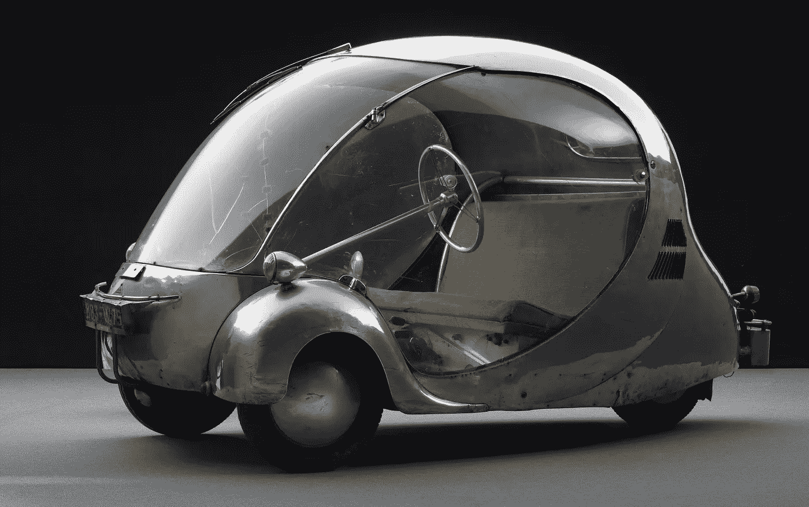

# 奇怪的汽车

> 原文：<https://medium.datadriveninvestor.com/bizarre-cars-f0c549f25cbc?source=collection_archive---------10----------------------->

当代汽车设计之路一直以古怪的想法为标志，其中一些最古怪的想法将于 5 月 21 日在亚特兰大高等艺术博物馆展出。

一个名为“梦想汽车:创新的设计，富有远见的想法”的展览将展示来自欧洲和美国的 17 辆具有未来感的概念车。

 [## 在自动驾驶汽车发生事故的情况下，谁应该承担法律责任？-数据驱动型投资者

### 我仍然认为自动驾驶汽车是一种奢侈品，而不是必需品…

www.datadriveninvestor.com](https://www.datadriveninvestor.com/2018/11/02/who-is-legally-accountable-in-the-case-of-an-autonomous-vehicle-accident/) 

这些是你见过的最独特、最奇怪的交通工具。

该展览包括保罗·阿尔岑斯(Paul Arzens)1942 年的 L'Oeuf électrique，这是一款泡沫状的“电动鸡蛋”汽车，由铝制成，配有单踏板和方向盘，看起来像是现代电动智能汽车的前身。

该展览还包括威廉·斯托特(William Stout)的 1936 年 Scarab，它被认为是当代小型货车的祖先，通用汽车(General Motors)的 1953 年火箭形状的 Firebird I XP-21 和宝马(BMW)的 2001 年 GINA Light Visionary 模型，它覆盖着织物。

“实验、概念或‘梦想’汽车长期以来一直是一种动态工具，允许设计师展示和展示前瞻性的汽车设计思想，”该展会的声明说。“概念车不是公众通常可以购买的车辆，而是创新的试验场，这些创新可能会在几年甚至几十年后的汽车生产中得到体现。”

“这个展览探索了激发未来可能性和进步想法的开创性设计，”声明说。