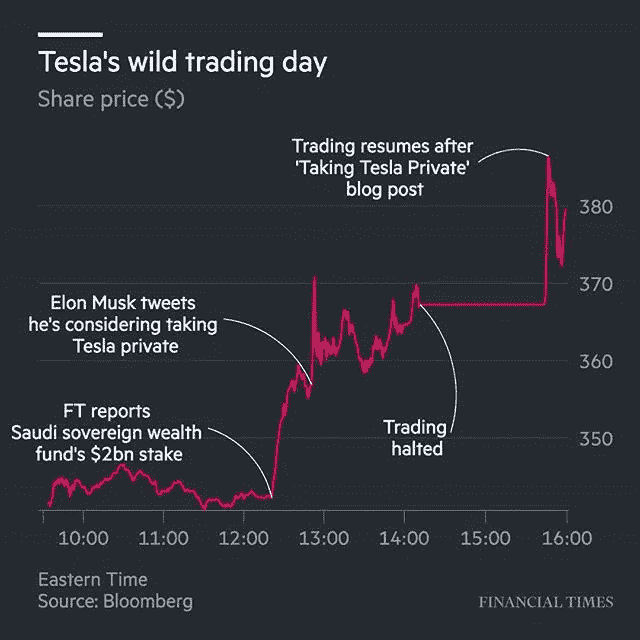

# BKTK — #FundingSecured…？

> 原文：<https://medium.datadriveninvestor.com/bktk-fundingsecured-661656ab83c0?source=collection_archive---------8----------------------->

所以昨天对特斯拉来说是可笑的一天，即使以他们自己可笑的标准来看。

这张图片(来自英国《金融时报》的 instagram 页面,直到今天早上我才知道这是一个东西)很好地总结了这一点:

*   英国《金融时报》披露，沙特主权财富基金投资了特斯拉(但只是通过在公开市场购买，因为特斯拉拒绝上市新股，尽管它们每天都要烧掉数百万股……)。
*   这推动了股价上涨，然后马斯克在推特上表示，他希望将特斯拉私有化(股价几乎没有变化，这表明市场一开始并没有认真对待他)。
*   然后，他们停止交易，发布了一篇没有融资细节的博客文章，重新开始交易 15 分钟，股价上涨到 380 美元以上。

像往常一样，[马特·莱文](https://www.bloomberg.com/view/articles/2018-08-08/elon-musk-has-some-fun-with-tesla)比我更受欢迎，还有[怀疑的《金融时报》记者](https://ftalphaville.ft.com/marketslive/2018-08-08/)。

在我写这篇文章的时候，特斯拉的股价已经回落到 370 美元，表明大约有 50%的交易实际发生。

事实上，在英国《金融时报》最初独家报道沙特阿拉伯人之后，马斯克如此迅速地发布了推特，以至于他想将其私人化，这意味着他将他们视为敌人而不是朋友。这是另一个危险信号，少数几个有可能以疯狂的估值收购一家性感公司几十亿美元的实体之一被拒绝这样做。

今天下午有报道称，软银认为其估值过高(尽管自 2000 年以来，软银单枪匹马扭曲科技初创公司估值的行为比其他任何人都多)，这可能会排除另一个(直到现在)几乎不在乎价格的财大气粗的投资者。

如果马斯克计划不持有多数股权，那么至少需要少数投资者每人投入数十亿美元来为此融资。但没有沙特，也没有软银。
空头们今天拿#fundingsecured 寻开心，但与以往一样，如果马斯克真的从帽子里变出什么东西，他可能会在未来几天/几周/几个月让他们收回自己的话，对于一个关系如此密切的人来说，这种风险总是存在的。(拉里·佩奇的几十亿，贝佐斯的几十亿，也许苹果做了战略投资，很快你就在说真金白银了！)

但是现在，看起来对于一个没有买家的收购，股票上涨了 50 美元，最大下跌将是 50 美元，以另一种方式达到 420 美元的目标价格。如果没有达成交易，该股肯定会跌破周一的交易价格，原因是收购失败会引发恶意，以及对现金余额下降的更严格审查。虽然短期来看很痛苦，但这次收购是否给了卖空者一个上限，使其在知道你的下跌空间被限制在每股 50 美元的情况下更有吸引力？

你可以期待这个故事马上会有任何转机，但是看起来非常有趣。这可能只是本世纪的虚张声势，或者也许他真的策划了历史上最大的一次收购，事先没有一个谣言泄露。在这种情况下，我们将愉快地收回我们的话，并祝愿他们作为一家私营公司好运。
冒着与我们[之前的空头推荐](http://www.bktk.xyz/posts/pros-and-cons-of-tesla)(每股 317 美元)产生确认偏差的风险，昨天#fundingsecured tweets 的脆弱和仓促性质，鼓励我进一步推荐 a(有风险！)卖空特斯拉。

[推特](https://twitter.com/share?ref_src=twsrc%5Etfw)

*原载于*[*www . bktk . XYZ*](http://www.bktk.xyz/posts/fundingsecured)*。*