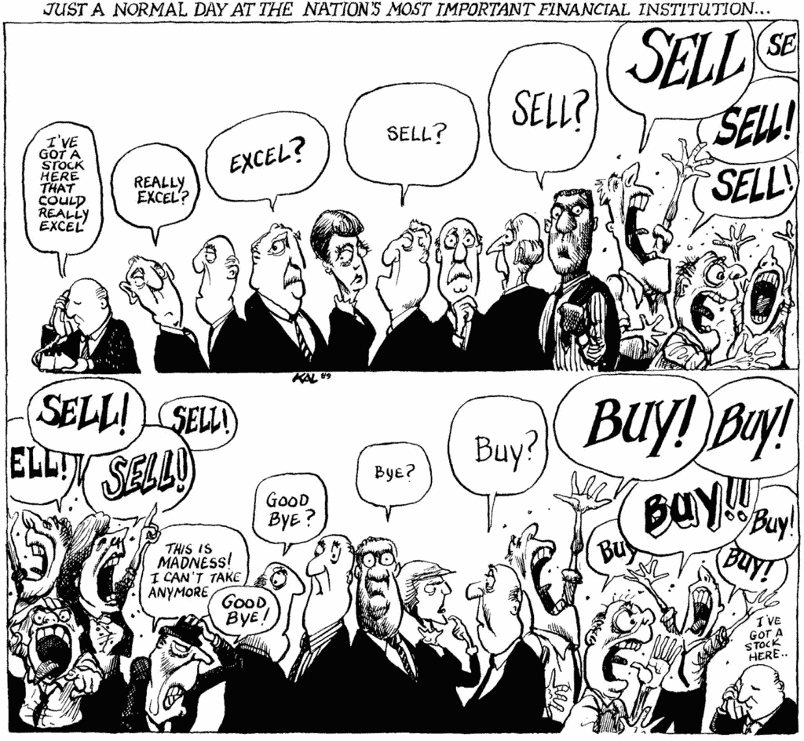

# BKTK——市场出了什么问题？

> 原文：<https://medium.datadriveninvestor.com/bktk-what-has-the-market-has-got-wrong-f433d4e89220?source=collection_archive---------10----------------------->

在进行任何积极的投资时，促使投资者做出决定的一个问题应该是，市场对这只股票有什么误解？

很容易看到巨大的利润或收入增长，因此认为该公司是一个很好的购买，但这已经反映在价格中。上周，脸书宣布收入同比增长 45%，市值损失 1200 亿美元。(《战略邮报》很好地总结了这一点)——市场只是向前看。结果从来不是好或坏，而是比预期的更好或更坏。

因此，当你想买卖一家公司时，你必须有一个假设，即市场对该股票的定价不正确。也许你认为竞争对手的产品不会像市场一样对公司产生如此大的影响。最近一个很好的例子是，当脸书宣布他们的约会应用程序(剑桥分析公司(Cambridge Analytica)还记忆犹新)时，IAC(Tinder 的所有者)的股价下跌了 15%——对我来说，这是一个明显的买入 IAC 的机会，因为抛售似乎反应过度了。六周后，它们的价格又回到了脸书约会应用发布前的水平。

但是你关于市场出了什么问题的个人理论需要被证明。仅仅说你不喜欢一家公司并不足以成为做空它的理由。理想情况下，理论也应该有一个时间范围，给你另一个硬性规定，如果投资失败，你就退出。这是这个博客存在的原因之一，展示我们对为什么一支特定股票有吸引力的理论，并有这个公共记录来回顾过去，看看它是对还是错。

因此，在 8 月 1 日特斯拉 Q2 2018 年财报发布之前，这就是我想做空它们的原因:
该公司现金不足，在我看来，2018 年可能需要融资。在反复承诺他们不需要这么做之后，这一声明应该会让股价大幅下跌。比之前[的文章](http://www.bktk.xyz/posts/pros-and-cons-of-tesla)中讨论的有更多的细微差别，但那只是一句话的总结。

那么，什么能证明这是错的呢？特斯拉可能会宣布增加 Q2 的现金流，表明他们今年不需要筹集外部资金。这肯定会让股价大幅上涨(因为这不是目前的预期)。或者，在几个月后，特斯拉宣布他们正在筹集更多的资金，正如我所预测的那样，但股票并没有像我想象的那样暴跌。如果是这样的话，那么我的假设是错误的，我应该卖出，不考虑当时的股价。我有一个理论，它被证明是不正确的，所以现在我需要退出。

每天/每周/每月，你都应该试着检验你的假设，你认为市场低估(或高估)了什么，并试图证明或反驳这一点。在这样做的时候，很容易遇到[确认偏差](https://en.wikipedia.org/wiki/Confirmation_bias)，但是希望有足够的自律和意识，有一个原创的想法会让你对自己诚实。

最后，如果你不认为市场对这只股票有什么问题，那就不要去管它(或者在被动指数中买入，不要去管它)。这应该是 80-90%时间的默认状态，你只是试图找到市场似乎犯了错误的异常情况。

对我来说，这就是当今积极投资的本质。纯粹的套利机会已经过去很久了——HFT 花费数十亿美元将交易速度提高百万分之一秒，只为了一点点优势。相比之下，巴菲特在 1950 年代购买的是现金高于市值的公司！如今，作为一名散户投资者，你不得不冒险尝试获得额外回报，为此，你需要一个能被证明和反驳的理论，来解释市场出了什么问题。没有理论，这只是纯粹的赌博。至少通过一个假设，你可以试着从你(不可避免的)错误中学习，并希望随着时间的推移变得更好。

[推特](https://twitter.com/share?ref_src=twsrc%5Etfw)

*原载于*[*www . bktk . XYZ*](http://www.bktk.xyz/posts/what-has-the-market-has-got-wrong)*。*