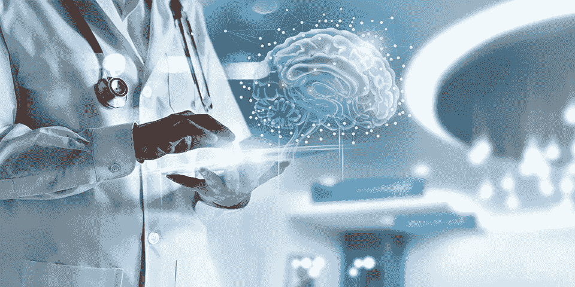
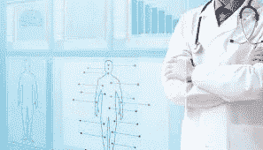
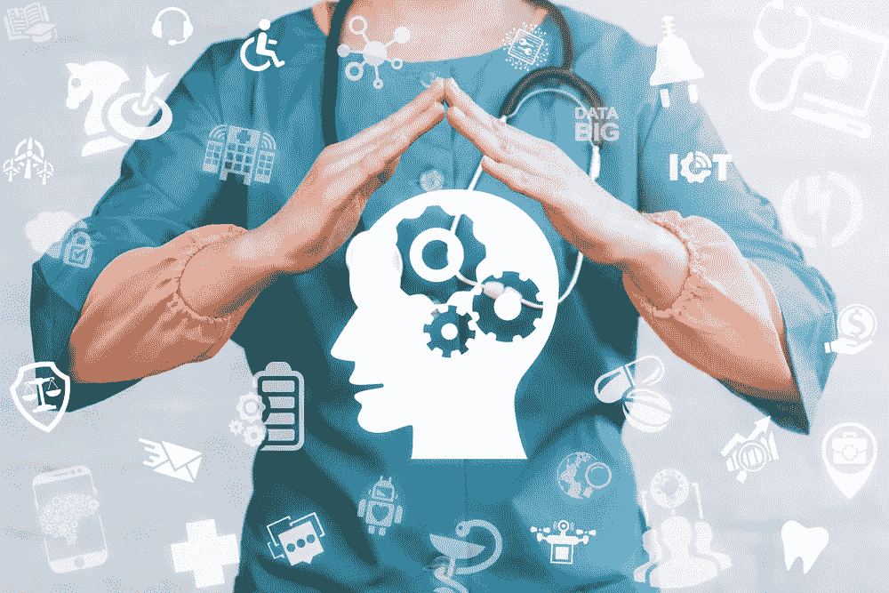

# 黑盒健康和人工智能在医疗保健中的应用

> 原文：<https://medium.datadriveninvestor.com/black-box-health-and-ais-applications-in-healthcare-e7a0461248c1?source=collection_archive---------3----------------------->

迄今为止，人工智能最大的危险是人们过早地断定他们理解它

——埃利泽·尤科夫斯基

**我有一个关于未来的愿景**，我想与你分享。你以前可能听说过黑匣子，因为它们被用在飞机和其他交通工具上，用来监控使用过程中发生的一切。当一架飞机坠毁时，调查人员寻找黑匣子，以便他们能够确定发生了什么。类似的技术为远程信息处理设备提供动力，这些设备可以安装在汽车上，用于了解汽车的行驶情况。一些汽车保险公司现在根据从远程信息处理设备接收到的数据来确定客户的保费。

再来看看[最近的狮航空难为例](http://cnn.it/lionaircrashblackbox)。JT610 航班是一架波音 737 飞机，于 2018 年 10 月底坠毁，机上 1899 人全部遇难。飞机从雷达上消失四天后，黑匣子被找到，然后潜水员将注意力转移到寻找驾驶舱语音记录器上。黑匣子如此重要，以至于 Lion Group 的总经理丹尼尔·普图特·昆科罗·阿迪(Daniel Putut Kuncoro Adi)上尉拒绝对坠机事件提供任何可能的解释，直到黑匣子的数据被访问和分析，这一过程可能需要三个月或更长时间才能完成。

尽管这些事件很悲惨，但它们也是不可避免的。首先，黑匣子的全部意义在于记录灾难发生时发生的一切。在我对未来的设想中，我们都有自己的黑匣子。

A Black Box

想象一下，如果每个人都有一个自己的黑匣子。它生成的数据将输入我们的医疗保健系统，并产生关于我们每个人以及全球人口整体健康的更全面的数据。然后，当患者生病、出现不良反应，甚至因为疾病或治疗过程而死亡时，我们将能够查看他们的个人黑匣子，并确定是什么导致了这种情况。

我在医学领域的大部分关注点都围绕着个性化医疗保健的概念，在这个概念中，我们每个人都会在一生中收到定制的建议，这些建议基于从可穿戴设备收集的数据、我们的病史以及其他类似患者的治疗计划和结果。

这种我们每个人都有一个存储我们所有数据的“黑匣子”的想法可能由区块链等新技术带来，这些新技术有能力为分散的系统提供动力，将数据返回给患者自己，而不是任何拥有数据的电子健康记录(EHR)公司。为了让医疗保健的未来成为现实，我们需要访问更多的数据，我们需要这些数据能够完全互操作。一个基于区块链的黑匣子系统可能是我们一直在寻找的解决方案。

# 人工智能在医疗保健中的应用

医疗保健行业如此庞大和复杂，人工智能的潜在应用几乎是无限的。我们谈论的是从更好的诊断到改进的工作流程和资源节约的方方面面。这在当今世界尤为重要，因为我们的全球医疗体系已经不堪重负，而且资金不足。我们面临的许多问题都可以解决，只要我们能够将我们可以访问的数据汇集在一起，并用人工智能和机器学习来分析它们。

问题是，我们的大部分数据都存储在孤岛中，这意味着我们只处理和理解了一小部分我们可能会看到的数据。更糟糕的是，按照我们现在的速度，我们积累和存储数据的能力比我们分析数据的能力增长得更快。我们需要一个解决方案，尽快。这就是人工智能的用武之地。

Philips Healthcare 负责健康信息的首席医疗官 Roy Smythe MD[解释道](http://philips.to/datainsightsquote)“医疗保健提供者拥有令人难以置信的数据，但很少有洞察力。临床医生真正想要的是洞察力，告诉他们真正需要知道什么。例如，在 2000 名糖尿病患者中，哪 10 人需要进行不同的干预？这些是他们需要的洞察力。”

Smythe 提出，人工智能可以在医疗保健行业中有四种主要用途:

*****提高运营效率和性能:**人工智能能够处理人类无法处理的海量数据，帮助医疗保健专业人员优化性能、提高生产率和改善资源利用，从而节省时间和金钱。

*****辅助临床决策支持:**由于其处理这些海量数据的能力，我们可以使用人工智能来查看人口健康数据，以建立一个更完整的画面，为任何给定的患者做出最佳医疗决策。

*****实现人口健康管理:**在最后一点的基础上，人工智能将使我们能够利用预测分析和机器学习的混合来降低公共健康风险，节省医疗成本，并最终采取预防措施，防患于未然。

*****将医疗保健数据还给患者:**互操作数据的时代是时候结束了，权力应该回到患者手中。今天的患者已经开始期望能够完全控制他们的数据的更加个性化的服务类型，但是在处理和处理数据的方式方面，医疗保健行业已经落后于其他行业。

# 医疗保健机会

当我们谈论人工智能在医疗保健中的机会时，我们主要谈论的是创新的新系统，这些系统旨在增强我们训练有素的临床医生已经在做的艰苦工作。他们可以通过帮助文书工作来减轻负担，同时允许人类员工基于历史数据和预测分析的混合来做出决策。

它能够做到这一点，因为人工智能是解析海量数据以识别迄今为止被忽视的模式和潜在见解的完美技术。我谈了很多关于人工智能如何通过简化工作流程让医生的生活更轻松，但人工智能也可以帮助病人过上更好、更快乐的生活。它甚至有助于预防性医疗保健，这是关于在疾病成为问题之前将它们消灭在萌芽状态。

更好的是，因为人工智能可以大规模处理数据，所以在识别疾病的能力方面，它可以胜过医生。即使是世界上最好的医生也只能在一天内评估有限数量的患者和患者扫描。诚然，人工智能也是有限的，但这种限制比人类高得多，软件和硬件都在以比我们人类更快的速度继续进化，我们人类在大约 31.5 万年前到达了我们当前的进化阶段【智人】。

人工智能还可以帮助我们解决其他问题，例如偏远或贫困地区缺乏专业医生。突然间，人工智能可以帮助我们扩大人类医生的服务范围，而不仅仅是他们为当地服务的能力。

Optolexia 为我们提供了这种技术的一个实例，他开发了一种阅读障碍筛查工具，使用笔记本电脑、平板电脑或台式电脑连接眼球跟踪器来检测幼儿的阅读障碍。当患者阅读屏幕上的文本时，眼球跟踪器向他们的面部投射红外图案，然后捕捉并分析角膜表面的反射。有了这些数据，该工具然后应用基于云的机器学习算法来确定患者患有阅读障碍的可能性。

这种创新医学方法的一个特别令人兴奋的领域是建立超精确工具的概念，这种工具可以自动检测罕见疾病。如果默认应用这些算法，它们可以帮助检测大多数医生没有受过训练或没有意识到的所有种类的疾病，并且它们可以简单地通过处理任何扫描等来实现这一点。添加到病人的档案里。但前提是我们能够增强互操作性并开放我们的医疗记录。

# 人工智能在医疗保健中的其他用途

我们已经谈到了人工智能在医疗保健行业的许多不同应用，但还会有更多的应用。对我来说，人工智能最不受重视的用途之一是它简化我们消费的内容的潜力，特别是我们阅读的研究。

我花了很多时间从事临床试验，所以我更习惯于系统的审查过程和研究在发表前必须经过的指导方针。尽管如此，每天都有一些新的信息出现，医生很难跟上最新的想法。当你考虑到他们一天中的大部分时间都在努力处理文书工作时，这一点尤其正确。当人们压力太大时，阅读研究往往是第一件要做的事情。

好消息是，这是人工智能可以帮助的其他事情，事实上，我们开始看到不同的基于人工智能的平台的激增，这些平台旨在过滤掉不相关的信息，只为我们提供我们感兴趣的信息。这有点像让人类医生手动阅读每一篇评论，然后只分享最相关的评论，只不过人工智能软件可以在几分钟内完成这项工作，甚至可以实时运行。

我的另一个兴趣是个性化医疗的概念，在这个概念中，每一个病人都会得到一个对他们来说独一无二的治疗计划。当然，如果人类要创建每一个护理计划，这将需要大量的工作，但人工智能可以在瞬间大量创建这些计划，然后将它们提供给医生批准。更好的是，人工智能可以分析存储在患者记录中的每一个数据点，从他们的实验室结果和病史到他们的症状和任何遗传风险因素。然后，它可以与数据库中的其他患者进行交叉检查，看看哪些治疗计划对类似的人最有效。

当你在现代医院安排手术时，通常需要十几个或更多的人在同一时间同一地点。在医疗保健行业，排班可能是一个真正的问题，尤其是当你处理倒班工人和意外紧急情况时，可能会迫使重新安排。但人工智能也可以在这方面帮助我们，当需要重新分配资源或重新安排运营时，它可以从本质上识别阻力最小的路径。通过智能使用人工智能和智能人类输入的混合，我们可以重新思考我们安排日常和紧急工作的方式，并消除一些浪费我们时间的低效问题。

# 现代化

如果不说别的，人工智能就是现代化，通过技术的智能应用，采用现有的工作方式并重新思考它们。一个很好的例子是人工智能被用来重新思考患者沟通的方式，最终提供更多支持和改善结果。

Equadex 已经通过使用一种人工智能工具来促进自闭症谱系中不会说话或有语言困难并难以与朋友和家人沟通的人之间的对话。如果没有人工智能，默认的方法是要求家人与服务员会面，服务员会用一个携带象形图卡的物理活页夹来鼓励交流。Equadex 开发的应用程序解决方案 Helpitco 包含一个完整的象形图数据库，用户可以将口头文本转换为一系列图像。他们还计划扩展这项技术来帮助不会说话的儿童和患有其他潜在疾病如阿尔茨海默氏病的成人。

人工智能还支持聊天机器人，这是一种有效的自动化、现代化版本的支持，可以作为简单问题的第一接触点。甚至语音助手也可以在未来的医院中占有一席之地，在建筑物周围提供路标，甚至只是帮助外科医生在漫长的手术过程中播放音乐和获取信息。

然后是制造业的好处，制药公司也不例外。基于云的系统可以提供实时和预测性的分析，跟踪生产的各个方面，并且可以通过任何连接互联网的设备进行访问。许多这些系统还使用人工智能来推动主动建议，这些建议旨在简化供应链和生产流程，最终有助于进一步提高效率。

然后是维护和修理。即使有世界上所有的清单，人类也会犯错，经常忘记进行日常维护(或者根本没有时间)。电梯制造商蒂森克虏伯(ThyssenKrupp)甚至正在使用人工智能开发数百种错误代码，告诉维护团队在任何给定的电梯上需要进行哪些工作。同样的技术可以用于更大的多层医院，但同样的概念也可以在其他地方实施。

也许最重要的是，人工智能非常擅长过滤海量数据，以确定任何给定用例的最相关信息。制药公司可以利用这一点，以及社交网络上发布的大量聊天记录，来监控他们的药物在获得 FDA 批准并上市销售后的表现。任何不良反应都可以记录下来，药物可以不断进行评估，以监测其随时间推移的效力。

医疗保健的未来正在到来。

# 想了解更多？

在我的书《医疗保健的未来:人类和机器合作获得更好的结果》中，我更多地讨论了自然语言处理及其对医疗保健行业的影响。点击此处为自己购买一份。