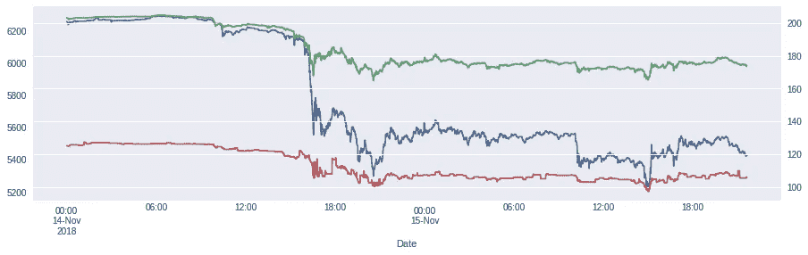
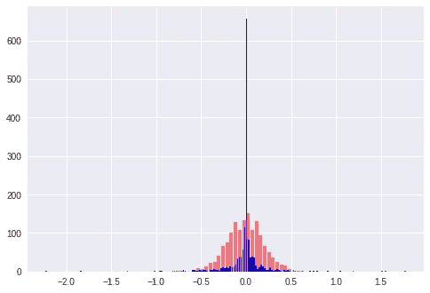
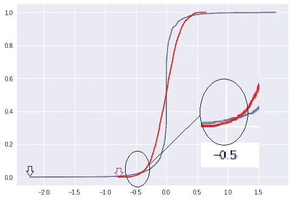
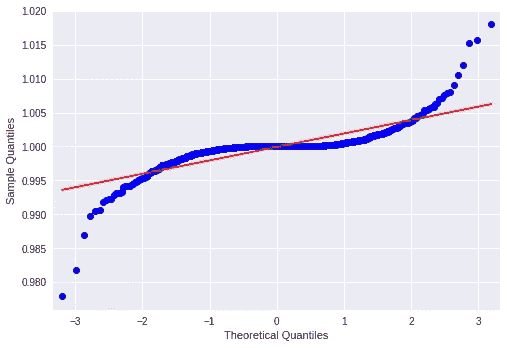

# 黑色隐形天鹅

> 原文：<https://medium.datadriveninvestor.com/black-crypto-swans-9df6edfbd200?source=collection_archive---------8----------------------->

*本文是 Jarvis 项目的 Gerardo Lemus 与* [*Quanto*](https://www.quanto.company) *和*[*Kumar sup piah*](https://www.linkedin.com/in/kumar-suppiah/)*合著的系列文章的第一篇。Jarvis 项目是一家由 Quanto 支持的预注册隐形模式数字资产交易初创公司。Gerardo 做了大量的工作，而 Kumar 试图用少量的幽默将它分解成外行人的术语。我们的合著文章由每位作者发表，您可以在此处* *找到转载的* [*。*](https://medium.com/@kumar.v.suppiah/black-crypto-swans-96b041dd10ef)

纳西姆·塔勒布(Nassim Taleb)在金融领域推广了'[黑天鹅'](https://en.wikipedia.org/wiki/The_Black_Swan:_The_Impact_of_the_Highly_Improbable)的观点(可惜与娜塔莉·波特曼的电影无关)。这些鸟是一个简单理论(“所有的天鹅都是白色的”)是错误的活生生的证据；塔勒布高兴地用这个绰号来表示模型是错误的证据。

金融界喜欢假设收益的正态性(或对数的正态性)来计算风险，这主要是因为数学很好，而且有可能推导出简洁优雅的公式(尤其是封闭式公式)。定量研究人员很想找到像牛顿和爱因斯坦的物理方程一样的漂亮方程。

金融危机粉碎了这样的观念:股票回报(以及其他资产类别的回报)并不遵循“完美”的随机游走。使用黑天鹅类比，股票回报正态分布的理论被反驳，因为自 1950 年以来[已经出现了 50 只黑天鹅](https://seekingalpha.com/article/3959933-predicting-stock-market-returns-lose-normal-switch-laplace)，而正常模型预测每 6900 年才出现一只。(说说讨厌的不速之客！)

> [DDI 编辑推荐—认证加密货币交易商](http://go.datadriveninvestor.com/cryptotrader/matf)

加密货币(以下亲切地称为 cryptos，也包括那些特别注重语义的人的代币)的波动性比股票高得多，使用常见的标准差公式计算，其波动性在 [2 到](https://medium.com/@petervijn/volatility-of-bitcoin-litecoin-ether-and-dash-in-comparison-with-some-us-large-cap-stocks-d6aaeb88dc3e)4 倍之间。

# 避免“黑天鹅”(或者在你最意想不到的时候突然破产)

保证金交易(在上市衍生产品的交易所)允许你利用你的头寸(例如，[读这个](https:)，*，但是*如果你的资金跌破[最低水平](https://www.bitmex.com/app/riskLimits)，就有被强行平仓的风险。因此，对无意中越线的危险有良好的估计是非常重要的。

通常情况下(如上面的链接)，当您的资金保证金价值相对于原始价值减半时(在 BitMex 中称为“基础初始保证金”),就会触发清算。

信封背面的计算得出您的资产在利润方面可以移动的百分比变化:

(Crypto_now / Crypto_initial) ≤ (2 毛利百分比)/ 2

如果你的杠杆是 100 倍，你的保证金百分比是 1%；代入公式((20.01)/2 = 0.995→100%—99.5% = 0.5%)意味着 0.5%的不利收益抹平你的头寸(如果你做多，下跌 0.5%，如果你做空，收益 0.5%)。

这种迁移多久会发生一次？

有些人倾向于使用 z = loss/STD(你的预期损失有多少标准差)值的 z 得分表来计算概率；标准偏差函数在 Excel 中很容易找到，标准化的表格也很容易找到。

这种天真的过程是危险的——加密回报远不像白天鹅那样正常，不是来自黑天鹅，而是来自火鸡！(是的，我们在这里故意夸大其词，以达到戏剧性的效果)

下面我们将演示正确的方法来验证加密返回是否确实正常。

# 首先，下载每分钟的数据:

Minute by minute data for Bitcoin (blue), Ethereum (green) and Zcash (red)

(所有代码都可以在我的[谷歌合作页面](http://Black Crypto-Swans)中找到——或者如果你在床上懒洋洋地阅读这篇文章，你也可以一直滚动到这篇文章的结尾。)

让我们计算一下回报。因为密码有一个零下限(密码的价格不能是负的)，通常最好假设收益是对数正态的。尽管如此，在我们处理的水平(分钟时间范围)上，[简单回报和对数回报](https://fintechprofessor.com/tag/log-returns-vs-simple-returns/)非常相似，所以为了避免过于复杂，我将保持相同的数值限制(0.5%)。在上面提到的代码中，您可以更改一个标志来查看形状是如何变化的。

# 我们看到的那些异常回报是…

下面我用 qq 图直观地验证了正态性假设。qq 图显示了理论分位数与经验分位数的对比。如果正态假设是正确的，经验线将与直线重合。

在跳到 qq 图之前，让我们先看看回报的直方图和累积分布函数。

请看第一张直方图:

Bitcoin 1 minute return histogram. y-axis is the count, x-axis the return in % (e.g., -2 represents -2%)

*   红色图显示了正态分布的对称形状，这是通过盲目计算原始数据的标准偏差并模拟正态分布的过程得出的。看看尾部:亏损超过 0.5%的例子很少
*   蓝色的图显示了收益的实际分布。在 0 时有一个巨大的峰值，但更令人担忧的是，有更多的例子表明，损失不仅高于 0.5%，甚至有一个案例接近 2.5%——记住，我们正在查看每分钟的*回报。*

如果你的保证金系统不是全自动的，你没有粘在屏幕上(即使你粘在屏幕上，我们也感到抱歉，因为你可能没有离开 cryptos 神奇世界的生活)，100 倍的杠杆就是噩梦——事实上，有几十个博客[警告反对](https://hackernoon.com/why-you-shoud-never-trade-100x-at-bitmex-the-liquidation-price-vs-bankruptcy-price-606ccd4b7528)它。

qq 图是观察非正态性的一种更简单的方式。在开始之前，让我们看看累积分布函数(CDF——看起来像 S 线的函数)。

CDF plot. y-axis represents probabilites, x-axis returns (in %). Notice that at -0.5% the blue plot is above the red plot, indicating a higher probability of a return being less that -0.5%.

同样，蓝色代表实际回报，红色代表理论上的正态分布。

x 轴是对数收益，这次 y 轴代表收益低于 x 点的累积概率。

您可以使用 **cdf** 来估计损失的概率:只需在 y 轴上找到与您想要避免的损失相对应的概率值。要计算其他杠杆单位的概率，你需要做的就是看图表。

注意:在-0.5%时，蓝线上的损失概率*明显高于红线上的损失概率*；但更令人担忧的是，蓝色的最大损失为-2.5%(而红色/正态图模拟的数字接近-0.7%——低估了风险几乎 3.5 倍！).

你可能会问，其他模型是否更适合厚尾。有可能使用其他模型，但是:

*   与基于模型的系统相比，以数据为中心的系统的优势在于您不需要适应不同的模型，
*   然而，以数据为中心的系统的缺点是，它们需要大量的数据和强大的计算能力(这对于当今廉价的数据存储和按需计算能力来说并不是一个障碍)，
*   而且对两者来说:记住*过去的表现是* **而不是** *未来结果的指标*

如果你理解 cdf 图，现在你可以很快理解 qq 图:通过改变维度，使对应于正态分布的 S 曲线变成一条直线，你可以直观地看到实际回报与正态假设相差多少。在这种情况下，**一整批**。(我们再怎么强调这一点也不为过)

QQ plot of 1 minute returns.

在 google 联合实验室表中，我们运行了 1 分钟、5 分钟和 30 分钟回报的 qq 图。它们中的每一个都不同于直线，就像天鹅不同于猪一样(即使猪涂了口红)。

# 密码爱好者是喜欢冒险的瘾君子

上面的分析希望能教育那些认为自己是密码交易者的人，让他们知道密码是多么的危险和不稳定。(如果你想去 HODL，显然你打错电话了，我们联系不上你。)

风险最小化要求:

*   对风险状况有很好的理解；正常的回报假设可能是致命的
*   动态主动管理，因为损失会很快累积；在几分钟甚至更短时间内
*   积极管理外汇保证金；你可能需要一个“未雨绸缪”的缓冲，以避免被追加保证金。
*   当交易保证金时，理解对你不利的尾部期权(许多密码交易者抱怨他们在交易所获利时被平仓。)

现在你应该能够扩展你的方法来更好地管理你的清算风险，如果你交易的是杠杆衍生品，或者你交易的是现货加密产品。你可以决定可接受的损失/清算概率，改变范围(更短、更长)等。

或者你可以将你的密码变现为菲亚特，提取你的菲亚特余额，注销你的交易所账户，打电话给你的股票经纪人，讨论你更健康的投资组合结构。波动对你的心脏更健康。(我们不是医学专业人士，但我们认为这是一些可靠的医学建议)

代码:

编辑披露:编辑有时会发布有用资源的链接。如果你发现它们有用并购买，我们会赚很多钱。不，我不是说要把我的薯条做大。我说的是超大披萨上的意大利香肠。感谢您一直以来的支持，我们将继续为 p̶e̶p̶p̶e̶r̶o̶n̶i̶出版而努力。