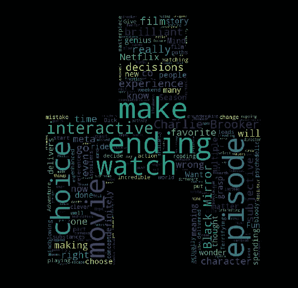
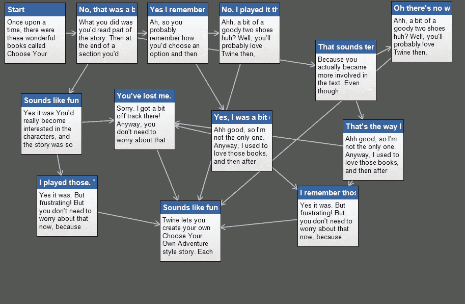
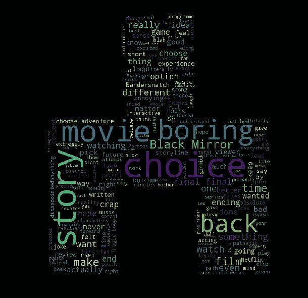
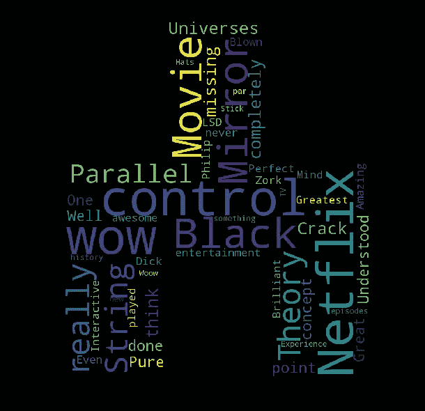
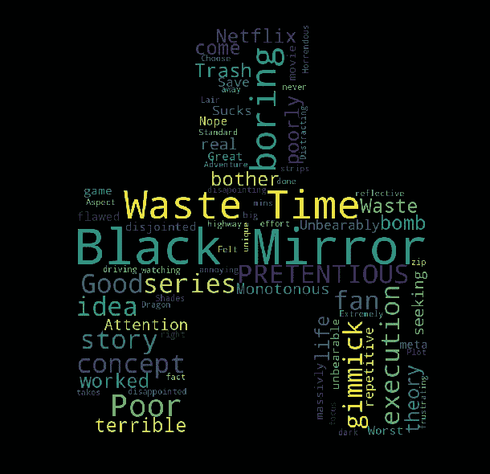
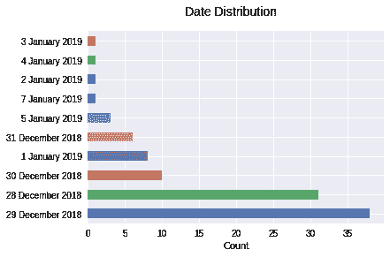

# 黑镜乐队:数据挖掘你的决策

> 原文：<https://medium.datadriveninvestor.com/black-mirror-bandersnatch-data-mining-your-decisions-afad5ea71158?source=collection_archive---------1----------------------->

Wordcloud visualization of user reviews based on good ratings

在看了很多脸书的朋友对黑镜新推出的互动节目《Bandersnatch》的评论后，我决定昨晚去看。这不是第一次看黑镜，事实上，我很喜欢它！这让我想起了我最喜欢的一部老电视剧:*阴阳魔界*。我看那集还是会害怕:*《两万英尺的噩梦》*，小妖精在飞机机翼上的时候！(不过，这部电影中的小妖精比老电视剧中的那个更恐怖)。

我不想剧透 *Bandersnatch* ，所以我不会告诉你结局和我的经历。

关于这部电影的一些有趣的事实:

*   花了一年多的时间来计划
*   剧本长达 157 页！(黑镜剧本通常在 65 页左右)
*   拍摄超过 35 天
*   你可以探索超过一万亿种排列，但只有五种可能的主要结局
*   剧本是用麻绳制作的

# 捻

这非常有趣，脚本是使用 Twine 编写的，Twine 是一种用于交互式小说的开源工具，已被用于创建和原型制作视频游戏，但这可能是它在传统游戏之外最高调的格式使用。

Twine Story Architecture.

如果你访问官方网站，你可以读到你不需要写任何代码来用 Twine 创建一个简单的故事，但是当你准备好了，你可以用变量、条件逻辑、图像、CSS 和 JavaScript 来扩展你的故事。这个工具是完全开源的，所以你可以在任何地方展示你的作品，甚至是为了商业目的。

你可以自己去看看！

 [## Twine /一个开源工具，用于讲述互动的非线性故事

### 您不需要编写任何代码来用 Twine 创建一个简单的故事，但是您可以用变量扩展您的故事…

twinery.org](http://twinery.org/) 

# 跟随故事和数据挖掘您的决策

故事讲的是 80 后程序员 Stefan 将奇幻小说*《banders natch】*改编成电子游戏。它有五种可能的主要结局，取决于你在互动节目中做出的选择。

如果你已经看过了，你会发现在某个时候，主角斯特凡意识到有人在控制他的决定。

当我在节目中做决定时，有些决定是琐碎的，有些在斯特凡的生活中变得越来越可怕，我认为网飞从所有网飞用户中挖掘数据是多么聪明的决定，比如选择糖霜或糖泡芙作为早餐以及其他相当可怕的事情！

**收集这类数据有重要目的吗？**

网飞获得了另一种有趣的方式来收集用户数据，通过这个互动节目，邀请你做出无数的决定，这可以作为另一种方法来监控我们，试图了解我们的观看习惯。对于网飞是一家真正的大数据公司，我并不感到惊讶。大数据分析是推荐引擎的纯金，这在亚马逊、Pinterest 和百思买等公司非常受欢迎。

那么，网飞是如何处理从“Bandersnatch”收集的用户数据的呢？

只要想想所有的可能性…从选择谷物之类的产品到沿着故事选择你令人毛骨悚然的决定，我担心的是最后一点，哈哈哈。网飞可以利用和了解更多关于我们和我们的偏好。

# 玩弄数据！

我收集了不同电影评论网站的数据，发现了黑镜*【banders natch】*的评论。玩了一下数据，用了我最喜欢的数据可视化 Python 库: **wordcloud。我还用了《白熊》第一集的符号，让它看起来更恐怖！得到了这些有趣的结果:**

Good Reviews

在这里，我把用户评论分为好的和坏的评论。小于 3 是差评，大于等于 9 是好评。你可以在 wordcloud 看到评论中使用最多的单词，大词是最受欢迎的。这只是一个情感分析来分析人们对电视节目的反应。

Bad Reviews

我还对标题进行了情感分析。用户很有创意！

Titles from positive reviews

Titles from negative reviews

当然还有日期！你可以看到大多数人马上给出了他们的评论！该剧于 2018 年 12 月 28 日上映。

Reviews Date

**结论**

这个来自网飞的新想法让我大吃一惊，但也让我思考这背后的数据挖掘。我们会在社交媒体上看到更多的产品添加吗？*糖霜还是糖泡芙？*

让我知道你的想法！

 [## 软件工程师

### 在世界上最大的职业社区 LinkedIn 上查看 Viridiana Romero 的个人资料。Viridiana 有 8 份工作列在…

www.linkedin.com](https://www.linkedin.com/in/viridianaromero/)