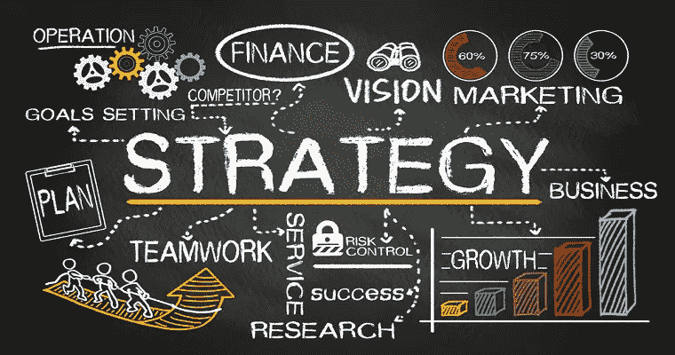
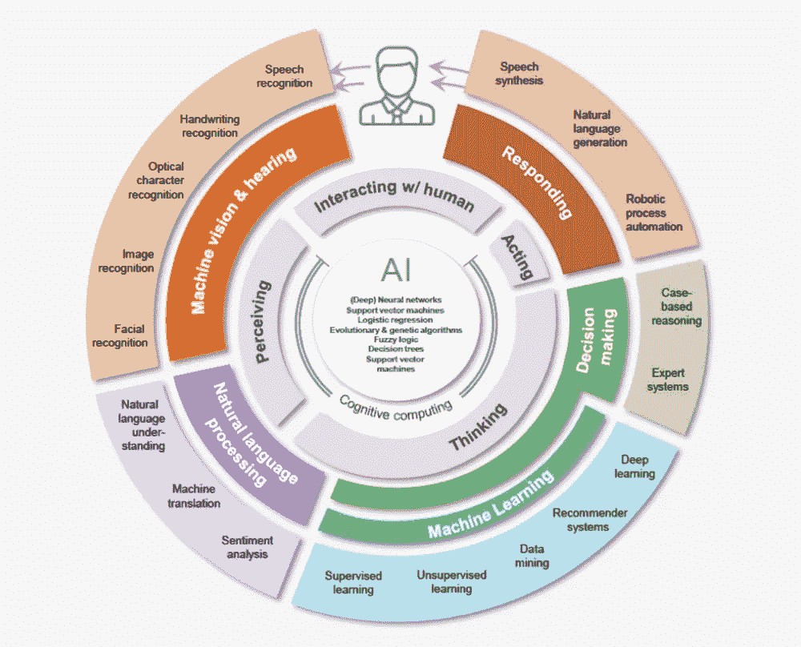
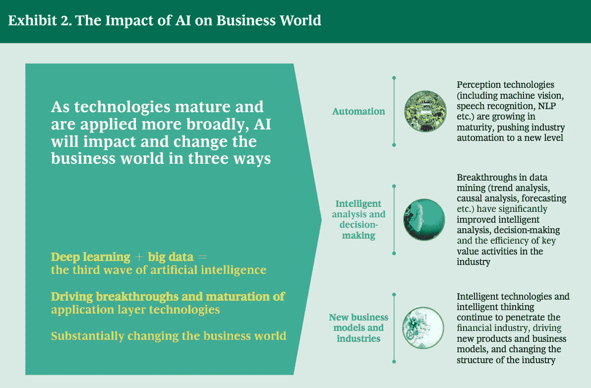
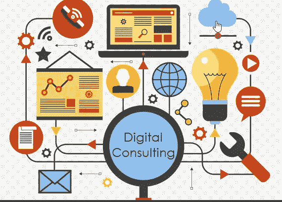
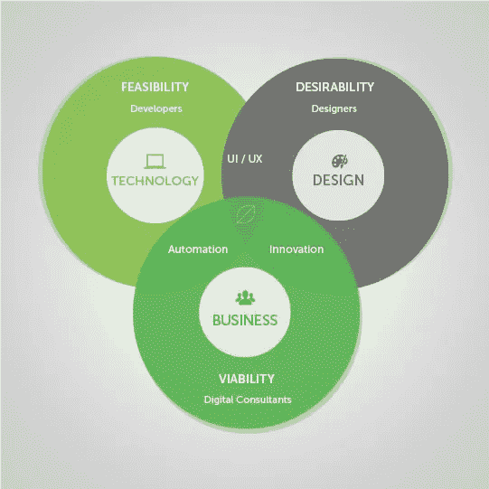
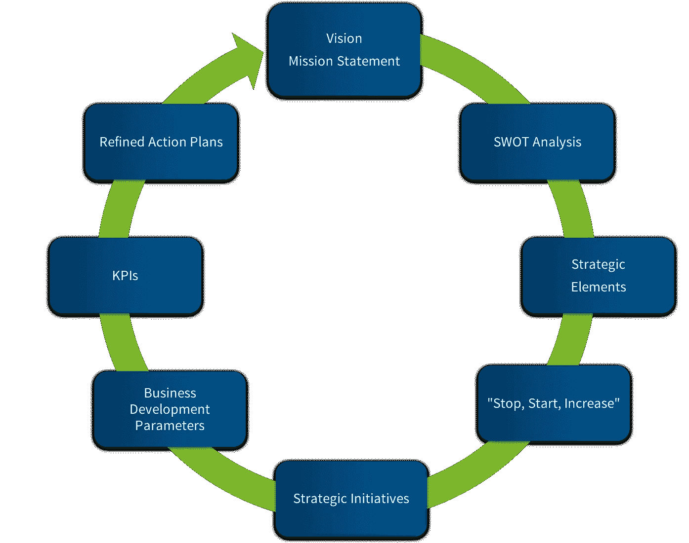

# 黑镜—数字咨询在此

> 原文：<https://medium.datadriveninvestor.com/black-mirror-digital-consulting-is-future-here-93275ec3af38?source=collection_archive---------3----------------------->

从战略被认为是将军的特权的时代，到不断增长的美国的企业将几乎所有战略问题交给咨询公司，这些咨询公司从哈佛等顶级机构聘请 MBA 来收集和分析数据集并提出解决方案的时代，我们已经到达了一个大型咨询公司的传统现金牛已经大幅萎缩的阶段。与战略咨询相关的工作现在仅占其收入的 20 %左右，而几十年前这一比例高达 70%。

总的来说，战略是从实验中建立起来的。虽然产品化是大多数咨询公司的口头禅，但现实是基于快速迭代实验的定制。让这些快速迭代周期更加有效是目前数字战略的最新发展。这是因为确定性仍然很低。

随着技术让事情变得更简单&先进的分析工具现在很容易获得，公司不再需要为一切谈论战略的事情聘请顾问。传统咨询公司也发现很难与那些利用基于数据的分析的当前进步的初创公司和继续充斥市场的前咨询公司竞争。他们正在快速放弃充满机会的中间地带，转向与行业精英——财富 100 强公司和世界各地的政府合作的高利润任务。

全球各地的公司必须不断适应以保持竞争力。这种现象一直很普遍，并且在过去的几十年里随着技术的革新而成倍加速。这就要求公司内部不断增加重新评估和变革的需求，为了满足这一需求，数字顾问提供他们的服务来帮助公司保持相关性。

我们脚下燃烧的桥梁促使我们做出一个重大且通常快速的行动。对于咨询界来说，这样一个时刻已经到来。

1.  人工智能增强的平台正在使应用开发、业务流程工程和客户管理成为商业人士现在可以自己做的所有事情——转变技术咨询的角色。
2.  新的工作方式让企业中的每个人(以及来自 IT 部门的每个人)都可以获得人类洞察力、思维能力和快速创新，从而模糊角色并提供组织适应性，以适应数字世界的需求。

仅这两个驱动因素就足以迫使观点发生改变。

# 什么是数字顾问？

数字顾问是在网络营销方面拥有高技能和训练的专业人士，为公司寻找和应用特别适合公司需求的数字营销策略。数字顾问负责企业的所有数字需求。因此，他们必须拥有广泛的数字知识，并在每个领域都有能力提出有效的战略。这个头衔包括搜索引擎优化(SEO)、在线广告、网页设计和社交媒体方面的全面能力。总的来说，数字顾问的目标是利用他们扩展的知识在网上成功做生意。数字顾问可以作为个体承包商工作，也可以在咨询公司工作(埃里克·里特尔，2016)。

# 咨询公司的转变

埃森哲、德勤、波士顿咨询集团、毕马威或麦肯锡公司等咨询行业的领导者正在引领咨询行业的数字化转型。这些公司很快理解了数字咨询的必要性，并将其业务模式转向更具创新性的方法。特别是在数字战略专业化、招聘数字专家以及增加数字培训和方法的预算分配方面，以便在快速变化的数字环境中保持相关性。

事实上，如今数字化转型是咨询公司服务的核心，就像波士顿咨询集团(BCG)在其网站上所说的那样，“利用数字技术不仅仅是好的业务，它对于保持相关性和盈利性至关重要。在这一领域落后的公司面临着被新进入者和商业模式所取代的风险，这些新进入者和商业模式准备用创新的产品和服务来扰乱市场。”

# 为什么需要数字顾问？

众所周知，如今，随着技术的不断进步，在线业务不仅是公司的资产，而且是不可或缺的，拥有最高效的数字战略是主要的竞争优势。事实上，消费者现在花在网上的时间比以往任何时候都多，2018 年 1 月，77%的美国人声称每天都会上网，其中包括 26%的人声称几乎经常上网(皮尤研究中心，2018 年)。数字顾问可以帮助各种形式和规模的企业找到适合他们的战略。对于新企业、想要扩张的企业、想要改进短期或长期战略的企业，或者无法获得足够的技能和知识来满足其数字营销需求的企业来说，建立在线战略非常有用。数字战略是许多需要大量专业知识的公司的支柱，聘请数字顾问是一种有效的解决方案，因为它为公司带来了具有外部视角的专家。

# 数字咨询流程

数字顾问的工作根据他们工作的公司的需求有很大的不同，然而，每个案例的整体流程和工作结构是相似的。首先，数字顾问必须对公司进行审计，会见公司代表以评估公司的需求，并收集对战略制定至关重要的数据和信息。然后，实际制定符合公司概况的数字战略:价值观、目标市场、预算、规模、领导风格、成熟度……一切都必须考虑在内，战略必须对公司可行，并有调整的时间表。之后，该战略必须得到公司的批准，可以根据公司的要求进行更改和重新评估。最终战略由顾问或公司自己发起，这取决于他们的偏好。最后，对咨询师来说，对他们实施的策略的结果进行分析是有好处的，如果需要的话，它允许对策略进行优化，并为新的案例提供未来的参考。

从许多方面来看，该行业都姗姗来迟。数字已经对媒体、零售、旅游、公用事业甚至政府造成了破坏。现在，咨询业务有机会按下重置键。

我相信这意味着成为真正的数字化。数字优先。因为所有的商业都在数字化。商业正在改变/已经改变了它对价值、对客户、对体验、对响应(对市场掌控)的思考方式。

这意味着咨询必须确定自己在数字世界中有意义的明确价值主张——了解自己在不再是供应链或价值链，而是生态系统中的位置。

*   这意味着将战略定位设定为一个价值假设，以客户洞察力为核心，通过快速迭代进行测试。
*   这意味着采用新的工作方式，并使之成为从推销到交付的工作方式——强调客户导向的设计、敏捷性和市场响应能力
*   这意味着改变 KPI，以交付组织绩效与个人绩效所需的开放、协作、建立信任的行为。
*   这意味着以创造性和可扩展的方式解决数字能力和容量不足的问题。
*   这意味着建立法律和商业框架，以支持快速合作模式和价值导向的计费模式
*   它意味着围绕产品/服务设计、开发和生命周期管理进行组织
*   这意味着正面解决不确定性——从最少的可行组织开始，向外扩展快速响应的产品和服务

简而言之，使用数字化咨询正迅速成为公司的必做之事，无论其成熟度如何，咨询公司和咨询机构都在朝着更加数字化的模式发展。尽管数字变化和颠覆的步伐一直在加快，数字顾问也越来越难以掌握每一种新趋势和技能来保持相关性。

毫无疑问，当这种规模的破坏到来时，渐进式变革只会推迟不可避免的事情。

来源:

Aethon 演示。麦肯锡。斯派德·库贝。谷歌图片。

作者:Phani Marupaka |[LinkedIn](https://www.linkedin.com/in/phani-marupaka)|[Twitter](https://twitter.com/phani_teja)是一位在咨询、技术、聊天机器人和未来空间方面经验丰富的作家。探索更多文章的媒体简介。

## 来自 DDI 的相关故事:

 [## 为什么数据将改变投资管理——数据驱动的投资者

### 有人称之为“新石油”虽然它与黑金没有什么相似之处，但它的不断商品化…

www.datadriveninvestor.com](https://www.datadriveninvestor.com/2019/01/25/why-data-will-transform-investment-management/)