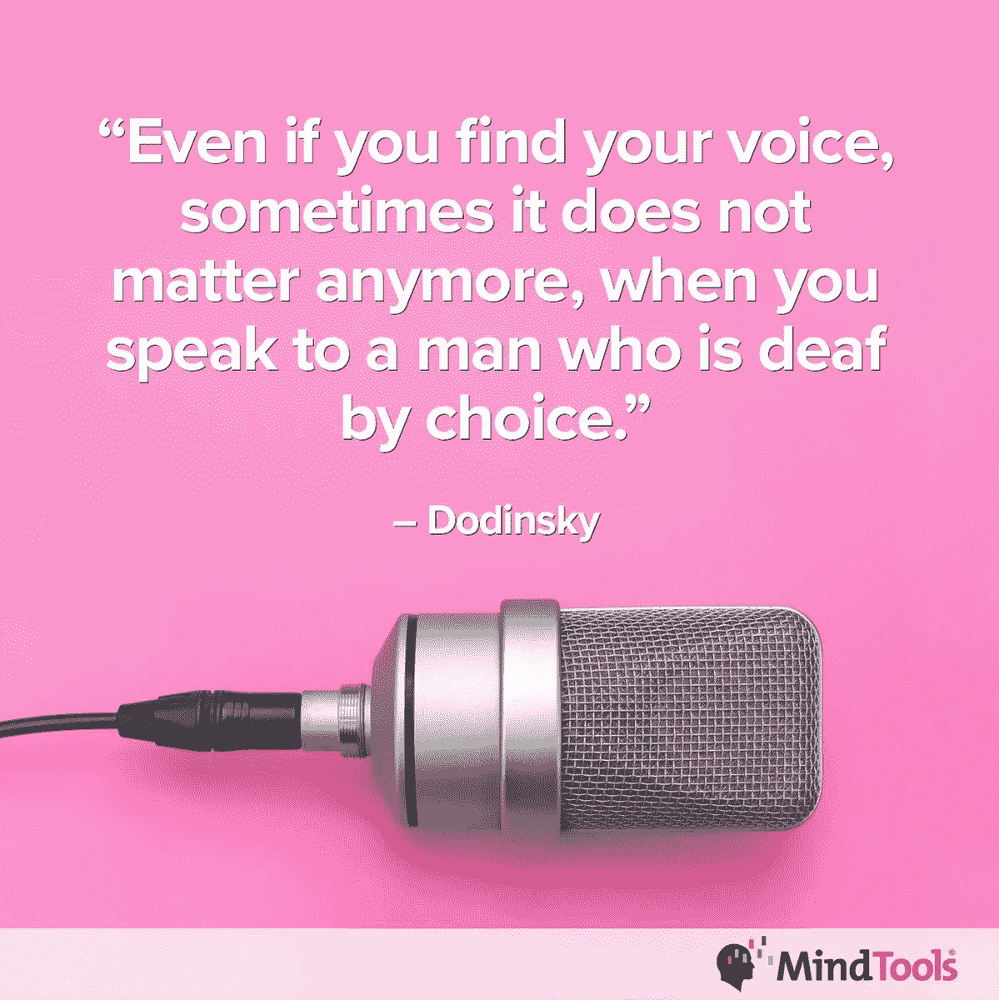
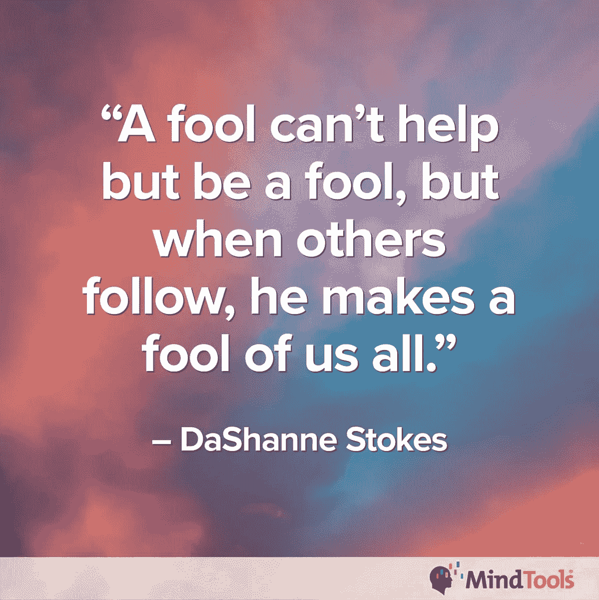
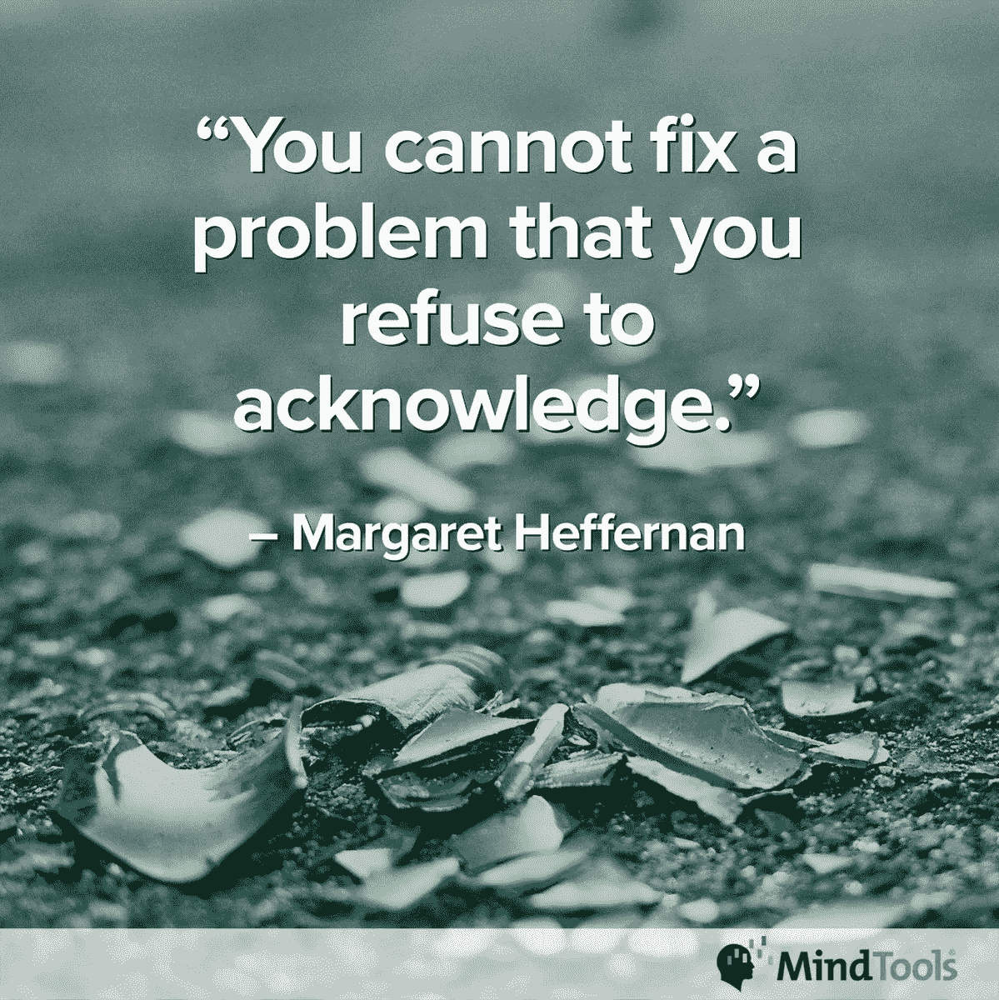
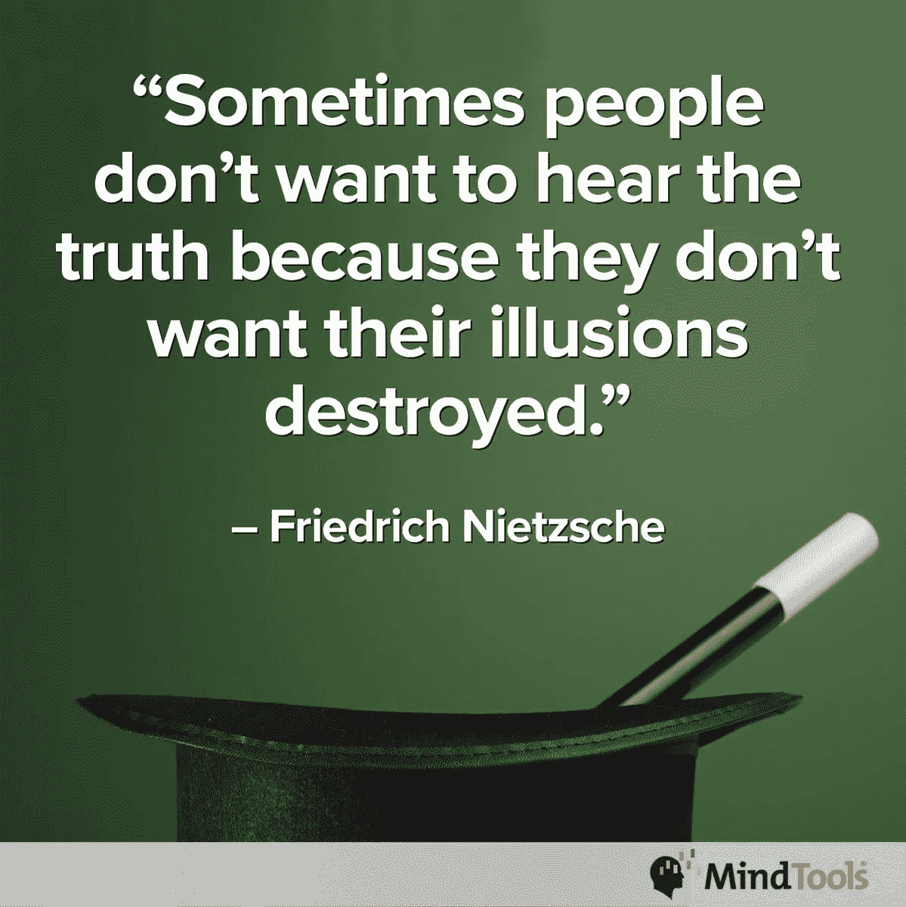

# 盲目的眼睛会造成不好的景象

> 原文：<https://medium.datadriveninvestor.com/blind-eyes-make-for-bad-sights-7021ef107737?source=collection_archive---------0----------------------->

## 转移视线是不对的，最终会让错误变得更糟

睁一只眼闭一只眼不仅避免了问题，还默许了冒犯。故意视而不见是忽略错误的一个方便的借口，即使它使错误变得更糟。

[米基·汤普森](https://twitter.com/Midgie_MT)目睹了故意视而不见的行为。她是 [MindTools](https://www.mindtools.com/) 的社区参与促进者，该网站帮助人们“发展卓越的领导、管理和个人效率技能”

“故意的漠不关心和做作的无知是处理事情的好方法，”汤普森说。“这类似于一个谎言，当故意不说某事时，这不是一个谎言，而只是一个‘遗漏的错误’。

“这不是看不到一些明显的东西，也不是对需要解决的事情不采取行动，”她说。“当我们继续前进时，即使我们知道结果会是什么，你也必须问为什么。”

 [## 谁在外面？企业家需要知道

### 通过拥有你的声音来拥有你的力量

medium.com](https://medium.com/datadriveninvestor/whos-out-there-entrepreneurs-need-to-know-cb7fb4349d6c) 

回避不会解决问题，即使汤普森承认我们看到我们想看到的。

“我们的个人过滤器会‘删除’那些不符合我们对世界的看法和我们看待事物的方式的东西，”她说。“有多少次人们感到无能为力所以什么都不做，而不是说些什么？

她说:“我宁愿说点什么但没什么，也不愿什么都不说却很重要。”

# **士气受挫**

职场上故意视而不见的例子很多。忽视那些偷懒的人会打击那些努力工作的人的士气。

根据 MindTools 网站的说法，故意视而不见还包括当你知道性别歧视、种族歧视或任何其他类型的歧视在你的工作场所发生时假装它们没有发生。

MindTools 指出:“在商业中，有许多领导者忽视日益恶化的问题的例子:从危险的工作条件和不安全的设备，到有缺陷的流程和腐败。”。“明知同事对他人进行性骚扰，却选择‘不知道’，这是另一个故意视而不见的例子。”

MindTools 引用了一篇研究 [10 个致命领导缺陷](https://www.mindtools.com/pages/article/zenger-and-folkman.htm?utm_source=social&utm_medium=organic&utm_campaign=tweetchat)的文章，因为“意识到常见的领导错误很重要，这样你才能避免它们。”

# **不总是好笑**

汤普森说故意视而不见包括幽默。

她说:“性别歧视的‘笑话’在男更衣室可能没问题，但在工作场所就不合适了。”“它们让女人不舒服。”

 [## 一个声音打破了骚扰者的束缚

### 拒绝保持沉默打破了一长串的虐待

medium.com](https://medium.com/datadriveninvestor/one-voice-breaks-harassers-stranglehold-1f4680c6053d) 

领导者创造并培养企业文化。是瞎子领瞎子。

“人们需要为自己的行为和周围发生的事情负责，”汤普森说。“警告信号可能包括不恰当的评论和无人发言。

“他们没有采取坚定的立场来解决不平等等问题，”她说。

据 MindTools 称，忽视员工对不安全工作条件等问题的担忧、观察或不满的领导者，会培养和维持一种故意视而不见的文化。

“如果一家公司有一种‘以人为本’的文化，他们可能会忽视事情进展不顺利的明显迹象，”该网站称。

“故意视而不见的警告信号可能包括员工消极、员工主动脱离、恐惧、焦虑、异常高的压力水平以及人们感到绝望或无助，”MindTools 指出。

无知很容易。参与其中需要付出努力，而这“不是我工作的一部分”

汤普森说:“当人们只是‘视而不见’而不是说出来时，无知会变得更容易。”“有时，找到自己的声音并大声说出来需要勇气。

她说:“令人难过的是，恐惧往往比直言不讳和纠正错误更强大。”

 [## 在冲突爆发前将其扼杀

### 小问题任其发展会导致不必要的问题

medium.com](https://medium.com/datadriveninvestor/snuff-out-conflicts-before-they-explode-d4b4f876aaca) 

根据 MindTools 的说法，我们的大脑不断过滤我们的经历，决定注意什么，忽略什么。选择熟悉的信息更容易:这是阻力最小的途径，它让我们感到安全。

“害怕冲突和逃避团队责任是团队中的两种功能障碍，可能导致故意视而不见，”该网站称。它引用了[帕特里克·兰西奥尼](https://en.wikipedia.org/wiki/Patrick_Lencioni)的[一个团队](https://www.mindtools.com/pages/article/five-dysfunctions.htm?utm_source=social&utm_medium=organic&utm_campaign=tweetchat)的五大机能障碍。

MindTools 指出:“承认事情不对劲需要一个人采取行动。”“许多人发现故意视而不见更容易，因为这样他们就不必在这个问题上做任何事情。

“有时错位的忠诚感会导致故意视而不见，”该网站继续说道。“如果人们敢于打破常规，他们就会被贴上麻烦制造者的标签。人们宁愿选择视而不见，也不愿冒被排斥的风险。”

# **关怀的眼神**

当人们关心时，他们会看到。

汤普森说:“对世界的认识超越了他们自己，再加上敢于直言的勇气，使得一些人比其他人说得更多。”

据 MindTools 称，有些人“看”得更清楚是因为他们愿意挑战现状。自我意识水平较高的人也可能“看”得更好，因为他们意识到人类倾向于看到我们想看到的东西。

为了防止我们自己故意视而不见，问问你自己:这个世界真的像我看到的那样吗？我是认真对待人们说的话，还是把它当作只是说说而已？

“确保你拥抱多样性，并与其他文化、肤色、社区和组织的人交往，”MindTools 说。

“在工作场所，让几个团队解决一个问题传达了一个明确的信息，即不止一个解决方案，”该网站称。“如果你抑制住‘取悦老板’或遵从现成结果的欲望，也会有所帮助。”

 [## 一次，两次，三次一个领导

### 伟大的领导者有同理心和善良——并倾听

medium.com](https://medium.com/datadriveninvestor/once-twice-three-times-a-leader-ab554765231c) 

汤普森建议不要认为权威是理所当然的。

“保持警惕，总是质疑现状，”她说。“同理心很重要，尤其是当我们目睹了一些事情，并在别人没有说出来的时候说出来。”

MindTools 建议养成“在生活的各个方面培养个人责任感”的习惯，引用他们的文章“[培养个人责任感](https://www.mindtools.com/pages/article/developing-personal-accountability.htm?utm_source=social&utm_medium=organic&utm_campaign=tweetchat)”

# **没事就是有事**

每个人都在对抗故意视而不见中发挥作用。坐以待毙，等待他人采取行动，这种无所作为的行为是对犯罪行为的宽恕。

MindTools 指出，领导者“可以从挑战中受益匪浅，但权力和等级制度造成的鸿沟意味着这种情况不会经常发生。他们需要积极创造公开批评的机会。

“我们需要抵制取悦他人的冲动，”该网站继续说道。“大多数人不喜欢冲突，但这是防止故意视而不见过程中必要的一部分。”

 [## 平等的胜利在于早该获得的机会

### 决心生活在自由和公平的社会中

medium.com](https://medium.com/datadriveninvestor/triumph-of-equality-lies-in-overdue-access-to-opportunity-939ab5103c96) 

汤普森说一切都应该公开。

“变得更加透明，以确保平等，”她说。“确保做同样工作的人，无论级别高低，都获得相同的小时数报酬。

“然而，这又是恐惧因素在起作用，”汤普森说。"我们不应该害怕因直言不讳而遭到报复或承担后果。"

为了帮助一个看起来对工作中的事情“视而不见”的同事，问问同事他们是否看到了你所看到的。不要要求行动。你可能对现实有不同的看法，但如果你不问，你就不会知道。

“用好奇的提问来帮助他们看到不同的观点，”汤普森说。“采取因人而异的方法。我们有时会忘记自己。”

MindTools 建议培养对这个问题的意识。

该网站称，“开始对话时，先问同事们是否也看到了你看到的东西，然后向他们描述你看到的东西。”“让你的同事意识到看不到问题的可能后果。这可能会帮助他们看到并采取行动。”

该网站还有一篇文章，名为“让人们对自己的行为负责”，文章指出，工作场所的人们必须对自己的行为负责，或者对自己的不作为负责。

# **不孤单**

拥抱那些揭露工作中故意视而不见的人。让他们知道他们并不孤单，并提供支持。

“让他们知道他们做了正确的事情，并祝贺他们敢于直言的勇气，”汤普森说。“支持就是支持，不管是私下的还是公开的。如果有人公开反驳他们私下说的话，我会觉得被出卖了。

“感到安全地交谈是非常重要的，”她说。“支持别人你说的话和你说话的方式。无论他们是否在场，都要支持他们。要可敬，要坚持真理。”

MindTools 指出，办公室应该有安全的谈话场所。

该网站称，“让别人知道他们可以和你交谈，而不用担心被评判、背叛或被说闲话”。

秘密地呼唤故意失明，而不是用扩音器。你不想一下子发现你是那个别人故意视而不见的人。

“根据情况，我可能会以不同的方式处理事情，”汤普森说。“在社交场合，直接和对方说话。在工作环境中，与我的经理交谈。

她说:“我也会试着换位思考——一旦我克服了伤害和愤怒——这个人更需要‘取悦他人’，而不是成为一个真正的朋友和支持者。”。“有时情况需要微妙的外交手段。然而，这些问题仍然需要解决。”

# **参与**

MindTools 建议，当你看到一个问题得不到解决时，要承担责任。

该网站称，“站起来参与进来”。“如果你不这样做，你就要分担任何负面后果的罪责。

“我们需要融入我们周围的世界，并努力去理解它，”MindTools 说。“如果我们回避，我们星球面临的问题就不会得到解决。”

该网站有一篇关于“ [5 个为什么](https://www.mindtools.com/pages/article/newTMC_5W.htm)”的文章来深入挖掘问题，还有一篇关于理解[问题和举报风险](https://www.mindtools.com/pages/article/newCDV_53.htm?utm_source=social&utm_medium=organic&utm_campaign=tweetchat)的文章。

**关于作者**

吉姆·卡扎曼是拉戈金融服务公司的经理，曾在空军和联邦政府的公共事务部门工作。你可以在[推特](https://twitter.com/JKatzaman)、[脸书](https://www.facebook.com/jim.katzaman)和[领英](https://www.linkedin.com/in/jim-katzaman-33641b21/)上和他联系。