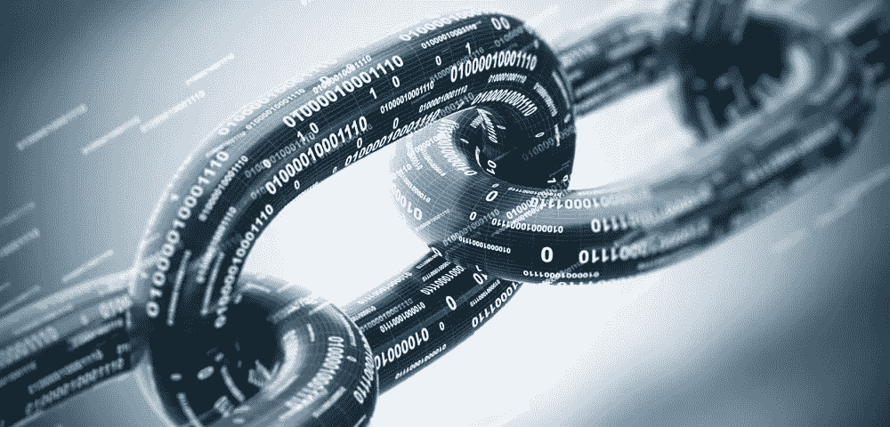

# 被区块链蒙蔽了双眼

> 原文：<https://medium.datadriveninvestor.com/blinded-by-blockchain-6460afa7565?source=collection_archive---------1----------------------->

## 中间人到中间件——一个关于信任的小故事

随着区块链技术进入社交领域(更具体地说，是作为加密货币的应用)，一系列改变生活的承诺诞生了；金融主权和个人自由，经济安全和全球稳定，所有这些都通过分权来满足。

一期；首先，这些承诺来自那些在这个领域没有任何承诺的人。

 [## 创新警报:区块链 3.0、Terra 协议、ICO 门户和更多数据驱动的投资者

### 尽管过去几个月加密货币的价格波动很小，但这项技术并没有停止发展…

www.datadriveninvestor.com](https://www.datadriveninvestor.com/2019/03/16/innovation-alert-blockchain-3-0-terra-protocol-an-ico-portal-more/) 

这些承诺迫使人们期望区块链成为某种金融救世主；达到目的的手段。希望他们最终能够彼此直接进行经济活动，而不是通过其他人！这一优势将带来从节约成本到隐私和安全性的诸多好处。

在疯狂地试图主宰这个日益崛起的伪政治/伪经济空间的过程中，一群自封的“专业人士”开始利用区块链的好名声来建立自己的滑溜溜的剧目。不幸的是，在他们愚蠢的狂热中，许多人被冲昏了头脑，开始承诺区块链“是什么”和“将会做什么”；而事实上它不是也不需要。

> 区块链消除了交易中任何和所有[自利]方的中介，但仍然允许这些交易发生…

> 区块链不会移除额外的当事人……区块链取代了他们。

> 区块链是信任从中间*人* →到中间*物*的转移

为了更加清晰，我们必须将“区块链”还原到它最原始的样子。

数据库结构。

这种数据库结构称为 ***分类账。*** 本分类账作为通用的“真相来源”
本“真相来源”用于验证和确认任何【适当的】陈述。
现在将事件追加到该分类账中，以备将来参考。

这创造了 DEFI(分散金融)的架构。自动化整个中间人流程的架构。

> 我们不会在这里探索区块链是如何工作的技术奇迹，但一个简单的解释是:
> 
> 不可变—仅附加—链式—竞争性去中心化
> (以比特币为例)

在社会的当前标准下，所有发生的数字金融活动都要对照由银行等营利机构拥有和维护的账本进行检查和验证。(不，我不反对机构，我相信资本主义和开放金融可以共存)。

所以现在，如果你或你认识的人去做 ***任何数字金融交易*** 更新的系统将是每个人在交易之间的系统，即:

银行→信用卡公司→国税局→支付提供商→支付处理商→商家--最后是你自己的…

区块链结构能够处理所有这些中介所做的“工作”，以更低的成本完成，并保护它免受悲伤/恶意的个体行为者的攻击。

不管你想如何表述它，或者生活在什么样的乌托邦思想中会很好:理论和实践是两种截然不同的生物。

将各方从交易中移除是不切实际的(至少是不必要的)。在从事大规模经济活动时，强烈建议并公开让中立的第三方保证遵守任何协议条款。

想象一下，区块链是所有交易活动的中立(对结果不感兴趣)第三方。(第三方是具有共同目标的自私的第三方的合作)这也恰好是用于验证和确认的事实的来源。

区块链承诺以非常特定的方式存储数据。在一个分布式/去中心化的生态系统中，不能执行虚构的交易(其中 99.999%)。它有望像被广泛采用的那样对黑客攻击和破坏具有弹性。当量子计算充斥市场时，它没有任何承诺。

让我们来玩一个快速游戏:

**你宁愿:**

把你所有的钱都给一个陌生人，让他们在你下次需要钱的时候在同一个地方见你

***或***

把你所有的钱都给一台被设计成能按照你的要求工作的机器？

**你愿意:**

信任你的政客？

***或***

你的政治家信任你吗？