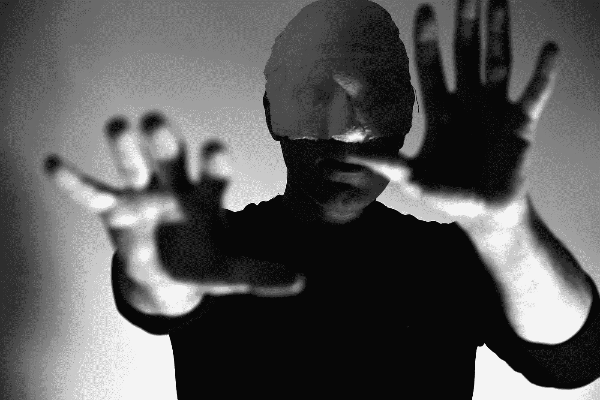

# 失明

> 原文：<https://medium.datadriveninvestor.com/blindness-5a0a4fdb154e?source=collection_archive---------15----------------------->

## 人类的新失明是什么？

Blindness by Mahsa Rezaie

萨拉马戈以一段令人震惊的铭文开始了《失明》的第一章:

> “如果你能看见，就去看看。如果你能看，观察”

失明是关于人类无法观察新的现代世界。在前现代时代，人们闭着眼睛在光明中行走，现在我们睁着眼睛走进黑暗。在前现代性时代，我们生活在光明的幻觉中！想象一下，小小的蜡烛只能照亮他们周围的一小块地方，这就是宗教和传统习俗如何照亮黑暗，给我们带来启发的错觉。

宗教声称它知道一切，在这个光明的世界上没有什么是未知的。但是现代社会开始接受无知，我们生活在黑暗中。然而，穿越黑暗并接受它，已经被一些波斯文学中的神秘主义者所建议，例如在《哈菲兹的诗人》或《红色智慧》中的著名文章。但是抛开这些例外，前现代世界是我们有这种虚幻信念的时代，我们知道而我们不知道。

 [## 哲学、象形文字和技术——数据驱动的投资者

### 在发现罗塞塔石碑之前，象形文字已经被视为信息，即使它们的语义…

www.datadriveninvestor.com](https://www.datadriveninvestor.com/2018/10/16/philosophy-hieroglyphics-and-technology/) 

从个人角度来说，放弃宗教信仰，接受无知，伴随的是恐惧和空虚。现代性更强调个体性，给个体留下孤独和盲目的复杂感觉。然而，知识试图填补这个空白。理解世界上的秘密减少了神秘，感知取代了神话。看起来，用这种感知取代这种对存在的科学描述，取代非科学的宗教宇宙观，即使不能帮助人类摆脱焦虑的感觉，也有助于感觉被照亮。

Fear by Mahsa Rezaie

但是萨拉马戈在他的小说中描述的失明是不同的！这不是人类由于不知道而导致的盲目，这是人类在新世界中观察的错觉。信息和所有科学发现对人类的狂轰滥炸让我们再次失明，因为我们无法观察！Saramgo 将其定义为白色失明，即在你的眼前一切都是白色和明亮的！世界上有许多秘密是科学没有也可能永远不会发现的。我们无法将我们的科学发现结合起来，对存在有一个清晰的理解，并赋予它意义。科学告诉我们“如何做”,但它不能确定“为什么”。

后现代性始于接受这种新的盲目，这种新的无知，尽管我们应该小心不要失去我们在现代性中的成就！理性、批判性思维和接受我们的无知是现代性的重要遗产。现代性无法提供所有的答案，也无法满足人类对意义的需求，这促使我们重新思考传统信仰，回到前现代性的智慧之源。这就是为什么佛教和其他宗教如基督教和伊斯兰教现在在许多发达国家更受欢迎的原因。正如 Dariush Shayegan 解释的那样，这种对精神需求的意义和实现的寻求可能会导致危险的幻觉主义。因此，在后现代时代，当知识分子试图击败存在意义的湮灭时，他们必须用理性反击对抗，用过去的幻想和迷信取代我们当前对存在的理解。

我们现在和未来应该关注的最重要的问题是，我们如何避免制造弗兰肯斯坦的怪物，这些怪物是通过把不一致的信仰放在一起而产生的，这些信仰是由某种法西斯主义保持在一起的。我们的失明可能会被治愈，但治愈需要我们正确使用我们在所有时代发现的所有智慧来源。我们需要理性和灵性一样多；我们需要科学，就像我们需要神秘主义和诺斯替主义一样。我们需要学习如何在这些独立的世界之间移动，并获得每个空间中的智慧。我们需要小心如何避免新的盲目:对意义的错觉！