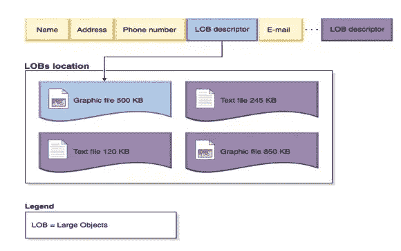
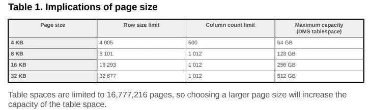
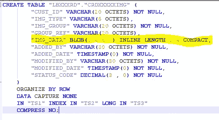

# DB2 中 BLOB 存储的原理

> 原文：<https://medium.datadriveninvestor.com/blob-storage-in-db2-3f0a571747ab?source=collection_archive---------0----------------------->

**简介** : *现实世界中我们有结构化数据和非结构化数据。通常我们将非结构化数据(图像、文件、mp3、视频)称为大型对象。大型对象可以以 BLOB 格式保存在 RDBMS 中。大多数关系数据库如 oracle、db2、postgress 都支持这一点。这有一个缺点，我将在下面详细讨论它的行为和限制。这是 RDBMS 世界中的大数据处理。*

首先让我简单介绍一下 DB2 中的 Blobs。

BLOB 是二进制大对象的缩写，二进制大对象可以是许多东西，例如文档、语音数据、图片或混合媒体。BLOB 的独特之处在于 BLOB 数据不存储在一行中。它存储在表的外部，指针给出了对象的位置。查看下图…

Image taken from IBM : [https://www.ibm.com/support/knowledgecenter/en/SSEPGG_11.1.0/com.ibm.db2.luw.admin.dbobj.doc/doc/c0054525.html](https://www.ibm.com/support/knowledgecenter/en/SSEPGG_11.1.0/com.ibm.db2.luw.admin.dbobj.doc/doc/c0054525.html)

让我们暂时放下上面所说的…让我们讨论一些理论…

DB2 中有 5 种类型的表空间。

**编目 TBS** (每个数据库只有一个编目表空间，它是在发出 CREATE DATABASE 命令时创建的。DB2 命名为 SYSCATSPACE，即目录表空间)，

**常规 TBS** (常规表空间存储所有永久数据，包括常规表和索引。它还可以保存大型数据，如 lob(大型对象),除非它们被显式存储在大型表空间中。)

**大 TBS** (大表空间像常规表空间一样存储所有永久数据，包括 lob。这个表空间类型必须是 DMS，这是默认类型。在大型表空间中创建的表可能比常规表空间中的表更大。大型表每个数据页可以支持 255 行以上，从而提高数据页的空间利用率。)

**系统临时表空间**(系统临时表空间存储 SQL 操作(如排序、重组表、创建索引和连接表)所需的内部临时数据)

**用户临时 TBS** (一个用户临时表空间存储声明的全局临时表。)

因为我们在这里关注的是 lob，所以我们只关注常规和大型表空间。

什么是集装箱？在创建过程中，容器被链接到一个表空间，这基本上将磁盘存储链接到表空间。每个表空间都有一个或多个容器。可以在表空间中添加或删除容器，并且可以修改它们的大小。简单地说，它是服务器中保存链接表空间的数据文件的路径。

我们可以创建不同页面大小的表空间。页面大小定义了用于表空间的页面的**大小。支持的大小包括 4K、8K、16K 和 32K。不带后缀 K 的整数的有效值为 4 096、8 192、16 384 或 32 768。(*顺便提一下，表空间和缓冲池的页面大小必须相同*)**

在定义表空间时，根据表 1 中显示的限制，页大小限制了可以放在表空间中的表的行长度和列数。

Ref IBM site : [https://www.ibm.com/developerworks/data/library/techarticle/0212wieser/0212wieser-pdf.pdf](https://www.ibm.com/developerworks/data/library/techarticle/0212wieser/0212wieser-pdf.pdf)

让我们深入挖掘上面的细节。您可以看到，基于页面大小，行大小和列数是有限制的。谁控制页面行为？是操作系统吗？。与 Hadoop 的 HDFS 类似，页面大小与安装 DB2 的操作系统中的某种文件系统相关。

当您在表空间之上创建一个表时，它的页面大小在逻辑上与该表相关联。这意味着如果我们在一个页面大小为 4k 的表空间上创建一个表，这个表在一行中最多可以有 4005 个字节(基于表 1)。换句话说，您的表可以有 10 个 varchar 列，每个列的长度为 40。(即使输入单个字符，varchar 也会填充列的总长度，但 varchar2 不会)。

每种数据类型都有一个默认的空间使用方式，我们可以使用下面的 SQL 来检查每一列占用的空间。

***从表名中选择 bigint(length(COL_NAME)作为 Size _ KB***

到目前为止，您应该明白，当我们觉得 LOB 行的长度将超过基本表空间或常规表空间时，我们会使用 BLOB。为了更好地理解，让我们检查一个带有 BLOB 列的表的实际 DDL。

我们已经在 TS1 常规表空间中创建了一个带有 blob 列的表，lob 列将位于 TS3 长表空间中。在处理 BLOB 列时，我遇到了以下一组基本规则。(我花了大约 4 个小时的阅读准备相同的:)

1.  当在 db2 表中定义 BLOB 列时，必须同时定义一个大的表空间。 **LOB 对象数据**将保存在大表空间中。 **LOB 对象信息**仍然会保存在基表的常规表空间中。

*补充说明:如果有两个 BLOB 列，理想情况下需要两个大的表空间。*

2.基表将有一个到大型表空间中的 LOB 数据的逻辑链接。这被称为 LOB 信息，它将驻留在常规表空间中。

**LOB 对象信息类似于定位 LOB 数据的链接。**

3.如果 LOB 列被定义为 BLOB **INLINE** ，那么 LOB 数据的某一部分被存储在常规表空间中。我们可以以 KB 为单位指定限制。

(你可以从这个链接阅读 LOB 内联理论: [clickme](https://www.ibm.com/support/knowledgecenter/en/SSEPGG_11.1.0/com.ibm.db2.luw.admin.dbobj.doc/doc/c0054525.html) )

回到上表中 DDL 的上下文，我们可以看到，内联*(“IMG _ 数据”BLOB(1048576)内联长度 164 COMPACT )* 的限制是 164kb。**这意味着一定比例的 LOB 数据保存在常规表空间中。**我们可以使用下面的 sql 来检查哪些行是内嵌的，哪些行不是。

*select ADMIN _ IS _ INLINED(img _ data)as x from crdxxxxxximg order by x desc；*

—注意:1 表示其内联

*顺便说一句，使用紧凑关键字并不意味着列处于压缩状态。你可以稍后在谷歌上搜索。*

假设您有一个存储组，名为 SG1，TS1 和 TS2 都在其中。SG1 已满，您决定将 CRDXXXIMG 表移动到一个新的存储组，因为它有 900GB。

我们可以理解，如果您面临存储问题，那么您需要将 TS1 和 TS3 移到一个新的存储组中。仅仅移动 TS3 不会得到预期的空间缩减结果，因为一些 BLOB 数据是内联的，并且驻留在常规的表空间中。

请留言评论！谢谢大家！

**接下来:*我将讨论如何压缩数据和最小化 BLOBs 中的性能问题。***

***我还将讨论在同一个应用中并行使用 BigSql 和 db2 sql 的可能性，DB2 Sql 是一个构建在 Hadoop 文件系统/Hive 之上的 SQL 引擎。但是我的问题是如何最小化存储？如果我不关心性能，只关心磁盘存储空间，我真的想浪费时间将 DB2 表中的 BLOB 对象迁移到 Hadoop 文件系统吗？***

**参考**

分析学博士(2019)。*在 DB2 10* 中使用深度压缩优化存储。[在线]Ibm.com。可从以下网址获取:[https://www . IBM . com/developer works/data/library/tech article/DM-1205 db 210 compression/index . html](https://www.ibm.com/developerworks/data/library/techarticle/dm-1205db210compression/index.html)【2019 年 3 月 27 日获取】。

Ibm.com(2019)。IBM 知识中心。[在线]可从以下网址获取:[https://www . IBM . com/support/knowledge center/en/SSE pgg _ 11 . 1 . 0/com . IBM . DB2 . luw . admin . db obj . doc/doc/c 0054525 . html](https://www.ibm.com/support/knowledgecenter/en/SSEPGG_11.1.0/com.ibm.db2.luw.admin.dbobj.doc/doc/c0054525.html)【2019 年 3 月 27 日获取】。

Ibm.com。(2019). *IBM 知识中心*。[在线]请访问:[https://www . IBM . com/support/knowledge center/en/SSE pek _ 11 . 0 . 0/perf/src/TPC/db2z _ decide 2 compressdata . html](https://www.ibm.com/support/knowledgecenter/en/SSEPEK_11.0.0/perf/src/tpc/db2z_decide2compressdata.html)[2019 年 3 月 27 日访问]。

克拉菲克，M. (2019)。*Blob 的攻击！*(事务处理环境中的 Blobs)。[在线] DataGeek.blog .可在:[https://data geek . blog/2013/04/26/attack-of-the-blob-blobs-in-a-transaction-processing-environment/？未批准= 125432&moderation-hash = 0 a 7 f 7 FD 431 EB 569214d 7685 AC 14 e 23d 8 # comment-125432](https://datageek.blog/2013/04/26/attack-of-the-blob-blobs-in-a-transaction-processing-environment/?unapproved=125432&moderation-hash=0a7f7fd431eb569214d7685ac14e23d8#comment-125432)【2019 年 3 月 27 日访问】。