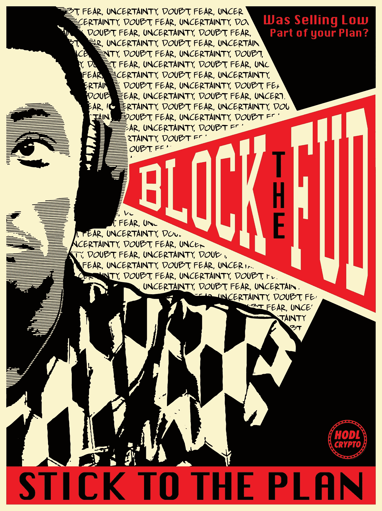
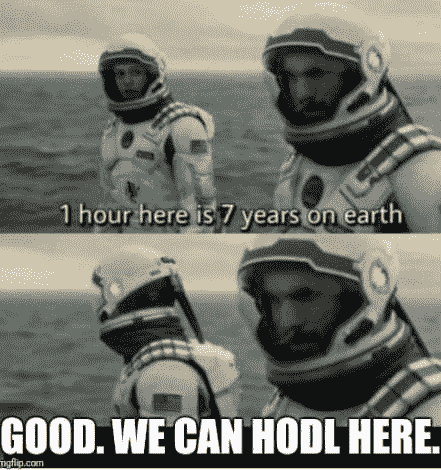

# 封锁 FUD 和 HODL 的下行加密市场

> 原文：<https://medium.datadriveninvestor.com/block-the-fud-and-hodl-in-a-down-crypto-market-d87b97a42938?source=collection_archive---------2----------------------->

**投资和交易加密货币几乎完全是投机性的**,因为这项技术仍然非常年轻，而且**没有被广泛接受的可靠估值指标**来评估作为投资的硬币。

因此，对一些人来说，这是高度心理化和情绪化的 T4。由于这些原因，**高波动性和恐惧-贪婪循环继续驱使投资者决定**买入&卖出，说得轻一点，这违背了他们的最大利益。

为了保护你的投资，倾听**恐惧、不确定和怀疑(FUD)** 是人的天性。事实上，你关注 FUD 是一种保护机制。为了在加密领域取得长期成功，你需要学会在下跌的加密市场中阻止 FUD 和 HODL。

# FUD 以各种形式出现，对一些人的影响比其他人更大；硬币和它们的投资者。

# 加密 FUD 的主要示例(宏观级别):

*   一般来说，政府对密码管制和禁令
*   交易所黑客和交易所的其他“灾难”
*   负面主流媒体报道

# 加密 FUD 的次要示例(特定):

*   错过目标/路线图目标和截止日期
*   失败的伙伴关系
*   虚假谣言和虚假信息
*   对开发团队和创始人的负面评价
*   误导性技术分析

虽然技术分析确实是加密投资和交易中的一个有价值的工具，但如果有重大的负面消息，FUD 因素将会发挥作用，超过交易员正在寻找的任何 T/A 指标，所有的价格分析都将成为大规模抛售的窗口。

如果你发现自己处于这些情况中的一种，拿着一枚价格暴跌的硬币，几乎总是最好的持有，等待波动平息。最终，价格将会巩固，你将有更好的机会做出更符合你最初投资计划的理性决定。

# 永远要有一个计划，并坚持下去

你应该对你的投资组合总的来说有一个计划和目标，以及每个位置在整个投资组合中扮演什么角色。

你的计划不需要严格到足以阻止任何适应新的市场条件和利用它们的灵活性，但它应该**涵盖你何时获利的基础**，无论是基于价值还是基于时间范围。

有这样一个计划将防止你在 FUD 开始时做出糟糕的短期决定。通过坚持你的计划，你**只做出理性的决定，并耐心等待**更长远的里程碑。

# 我们可以在这里 HODL——给短期思考者的提示

经验丰富的投资者往往比新手更好地应对波动。如果你在处理短期波动方面有问题，你可能需要努力欺骗自己考虑长远。

# “我们可以在这里 HODL”迷因

如果你发挥你的想象力，如果你能**跳过无数天冲动地检查**共同市场资本和证券投资组合，并找到**巨大的收益，而不花费任何精神或情感能量**决定是否恐慌性抛售，你会有怎样的不同感受？

*说到底，霍德林是一个随着时间的流逝而变得更加容易的决定。急躁是导致人们搞砸并屈服于 FUD 的原因。*

# 低价出售是你计划的一部分吗？

我有一个私人朋友，他最近向我咨询出售他们的加密资产，或者更准确地说，出售他们最初投资之外的所有剩余资本。

这个人来找我寻求建议，是基于他们认为这是一件理性的事情。以下是对话的要点:

> ***hodl:*** *为什么要卖？*
> 
> ***朋友:*** *嗯..我还没准备好经历一场持续多年的熊市*
> 
> ***hodl:*** *现在是非常不好卖的时候。你真的相信我们会看到一个持续多年的熊市吗？*
> 
> ***朋友:*** *我不知道，我一直在听【ABC..XYZ·FUD]你认为呢？*
> 
> 绝对不会，在我的可能性范围内，我们不可能看到一个持续多年的秘密熊市。
> 
> ***朋友:*** *嗯，你打算怎么办？*
> 
> ***hodl:*** *我无意在 2020 年前“套现”我持有的任何股份。现在，我将审视一下事情，并做出一些决定。你有套现的计划吗？*
> 
> ***朋友:*** *不完全是，但你比我更相信这一点，我只是不确定我认为这将走向何方。*
> 
> ***hodl:*** *事实是，我们都应该在 12 月份获利，但没有人这样做。我们都遭受了近期偏见，并陷入了贪婪和炒作。你打算低价出售吗？*
> 
> ***朋友:*** *Lol，当然不是。*
> 
> ***hodl:*** *然后你应该挺过去，决定你愿意处理什么程度的风险和敞口。等待这个熊市周期结束，如果你仍然觉得过度暴露，很明显你现在就是这样，那就取出一些。*

# 这个故事的寓意

永远要有一个期待的计划和目标。在这样的时候，我们真的需要能够“把我们的眼睛放在奖励上”，不要屈服于恐慌和 FUD。

恐慌性抛售和恐慌性抛售的考虑是因为你认为你的情况可能不会改善或进一步发展。因此，你在撤退。

不要退缩——这场战斗还远未结束，crypto 将会获胜。我鼓励任何阅读这篇文章的人忽略 FUD，尽管你可能正在经历恐惧。

[hodl 艺术商店的印花、配饰和服装设计](https://hodl.threadless.com/designs/block-the-fud/home/framed-fine-art-print?color=black)

封锁 FUD

**H** 老 **O** n **F** 或 **D** 耳 **L** ife

*原载于 2018 年 4 月 2 日 hodlcrypto.org**的* [*。*](https://hodlcrypto.org/2018/04/02/block-the-fud-and-hodl-in-a-down-crypto-market/)