# 【区块链评论】Fetch。艾:下一个登月计划？投机评级:B

> 原文：<https://medium.datadriveninvestor.com/blockark-review-fetch-ai-next-skyrocket-to-the-moon-speculative-rating-b-2c55a97a0835?source=collection_archive---------5----------------------->

BTT 在掌声和欢呼声中涨到了 10 倍。所以问题是，是捡回来。AI (FET)，LaunchPad 的下一个项目，值得全押？

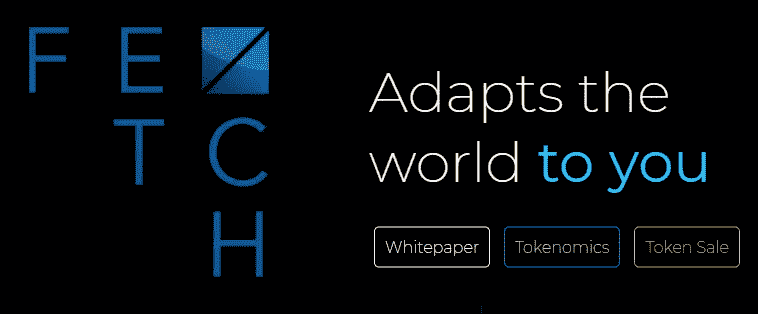

与常规评论相反，在 2018 年扭曲的熊市之后，我们打算从不同的角度探索这个项目。

讲个笑话，在我做 crypto 投资的初期，我参加了一个路演。我发现每个人都喜欢问别人三个问题“有配额吗？比例是多少？什么时候打交易所？”当时我很认真的问了项目组很多问题。后来，我发现这三个问题的意思是:不能理解这三个问题的人是真正的书呆子。

# **价格！价格！永远价格！**

一坨价格合理的屎也能卖的很好。3 倍于劳斯莱斯的价格，骗不了有钱人。

当我查看 FET 的历史数据时，我发现 FET 的定价非常混乱。我们将数据整理如下。

1.  每轮融资金额和价格信息均有官方披露。

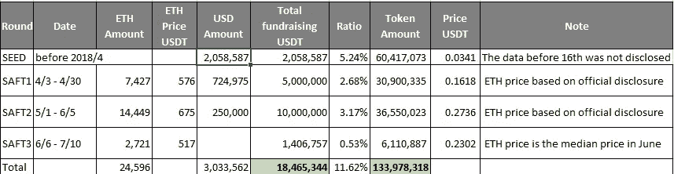

2.来自币安 Launchpad 的众筹信息(如未注明，以美元计)。

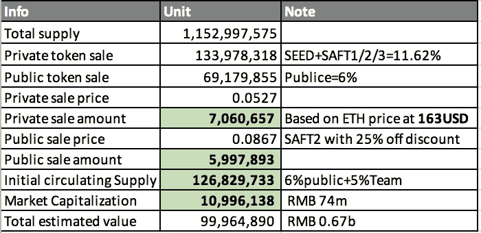

我们发现了两件有趣的事情:

a.根据表 1 的计算，ETH 价格为 500-700 美元，筹资金额为 1800 万美元。

根据表 2 的计算，ETH 价格为 163 美元，筹资金额为 700 万美元。

b.种子轮应该是一些重要的投资、领投机构。AI 不能让他们输。

同样，种子轮的信息直到 16 日才被披露。在披露之前，ETH 的估值为 247 美元。消息披露后，ETH 的估价为 163 美元，与拍卖价格相符。艾队这边卖掉了自己的 ETH。

SAFT1/2/3 回合面临巨大的法定货币损失，SAFT2 的投资者损失最大。

a 说起来毫无意义。毕竟是加密货币市场雪崩带来的估值问题。

我们可以看到，私募基金对投资者来说是一个非常不友好的项目。ETH 投资于 500-600 美元的私募股权基金，秋季后将根据 ETH 进行定价。此外，在 500-600 美元筹集资金的 ETH 当时没有套现，而是在 165 美元套现，这不是很明智。毕竟项目组的筹款对象是 USD，不是 ETH。

一轮种子投资如何获得 SAFT2 价格的 1/9？

更让私募投资者难受的是，伴随着公募代币的发售，再加上团队 5%的提成，这在一定程度上会导致巨大的抛售压力。

然后项目可能会牺牲一些时间来获得更多的空间。从表面上看，私募投资者似乎不会亏钱。但是 3 个月锁定期后价格可能不会好看。

# **竞争对手分析**

根据新披露的信息，我们来对比一下 AI 项目。就类别而言，我们更愿意将其定义为大数据项目(绿色的项目在币安上市)，因此将这些项目放在一起进行比较。

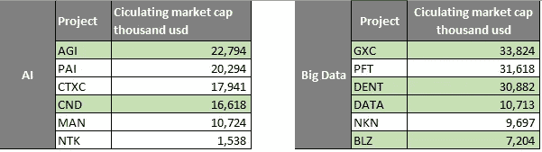

Past AI and Big Data projects

看来市场对大数据和 AI 项目并不买账。天花板很明显。如果把初始发行量作为之前计算的 7400 万，上限就是 2 亿，大致是 3 倍。这个价格恰好也是 SAFT2 的成本。如果按照总市值 6.7 亿来算，对不起，我们负担不起。

随着 BTT 的成功，FET 目前的市场态度非常乐观。但是从项目的估值来看，我们似乎应该保持一点理智。

***是取货。AI 工作？***

拿来用。AI，已经有一段时间了，看路线图的进度比看白皮书更合适。

1.  看一看 Fetch。Ai 的 twitter feed，一直保持更新，即使是在 2018 年下半年的熊市。2018 年 10 月，招聘仍在进行。

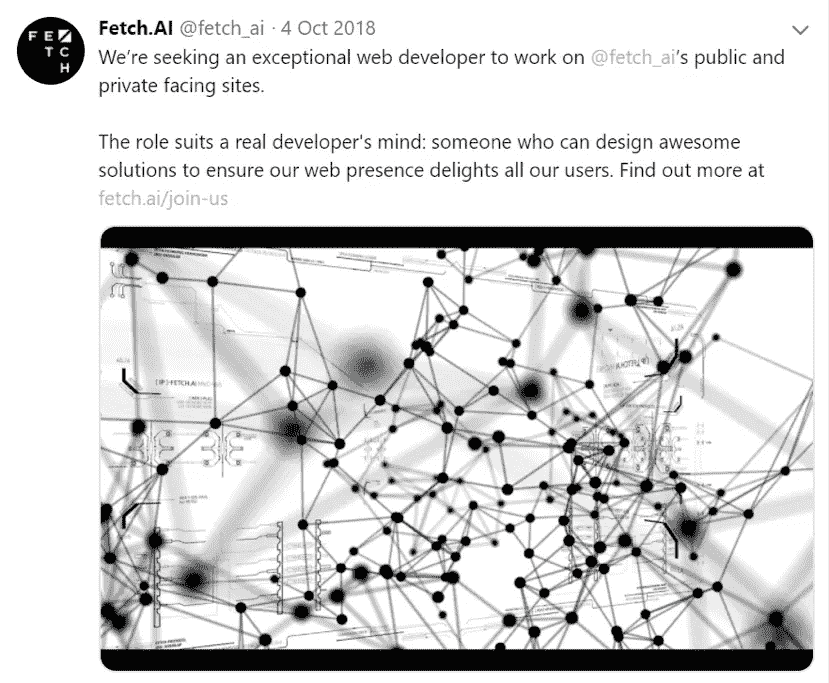

与 ClusterMarket 的合作关系于 9 月份公布。

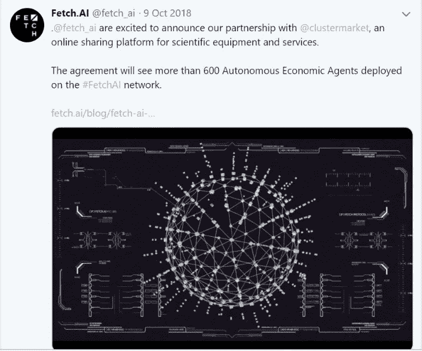

当然，大多数推文都是关于聚会和讨论的。大多数推特互动在 3(转发/评论)以内。坦白地说，对于大多数项目来说，这很正常。

2.Github 的公共存储库不经常更新，没有太大的参考价值。官方公告主要是在私有代码库更新中。从二月份开始，它将主要在公共代码库中更新。但截至发稿时，仍未执行。

该团队在 2018 年 9 月披露了一个内部测试网络。测试网络将于 2019 年 2 月底开放，仅限受邀者。

测试网络将于 4 月正式开通。主网络的推出原定从 Q2 2019 年推迟至 2019 年第四季度。

3.10 月官方微信账号停止更新。应该是外包团队。他们不知道如何回答中国电报组的人的问题。

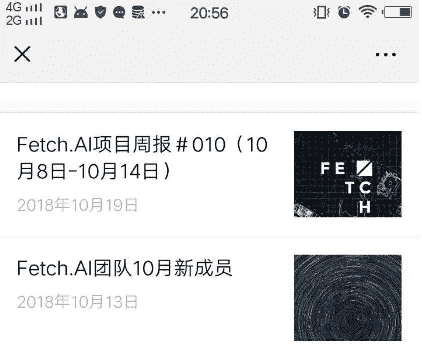

4.电报中的主要谈话是关于 ETH 价格的下跌。但是团队没有给出 FET 的官方价格。然后就是币安和 KYC 了。

**总的来说，从获取的信息来看。艾，我们可以看到:**

**1。尚未透露任何重大成果。**

**2。** **看起来像是一个做实际工作的团队。**

**3。** **社区(telegram，twitter)活动不好。**

# 什么是 Fetch。Ai？

说了这么多，我们还得谈谈 Fetch。艾。毕竟我们不玩骗局。

简单来说，取。Ai 使用 AI 技术将你、IOT 设备或公司虚拟化到其网络中，成为 AEA(自主经济代理)。然后 AEA 将出售数据本身。换句话说，这是一个自动化的数据交易网络。

FET 有两个技术亮点:

1.  AEA 自治经济代理:AEE 层中的代理是真正的硬件实体，不需要任何外部操作来运行。每个代理对应一个钱包地址，用于接收和发送提取令牌。代理有很多种。比如硬件设备中的控制器(在自动驾驶汽车中，代理是告诉汽车如何驾驶的设备)。买方代理向 OEF 层发出购买数据请求后，OEF 层将购买请求传递给拥有该数据的卖方代理。卖方代理同意并发送数据，由 OEF 层转发给买方。

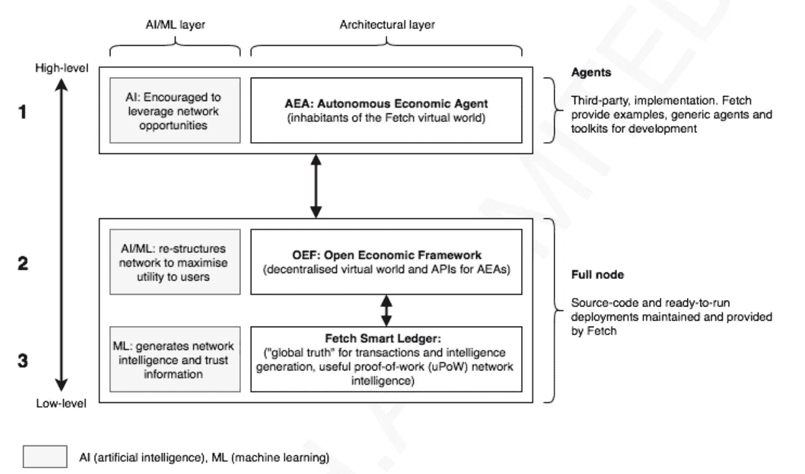

2.独特 UPOW(有用的工作证明)共识算法:基本上，我们有一个公共权力链。然后结合分片的技术把数据打包在这个公链上。DAG 系统用于每个分片。这个设计的目的是通过 DAG 来识别有价值的交易，节省一些在网络中做 AI 训练的计算能力。

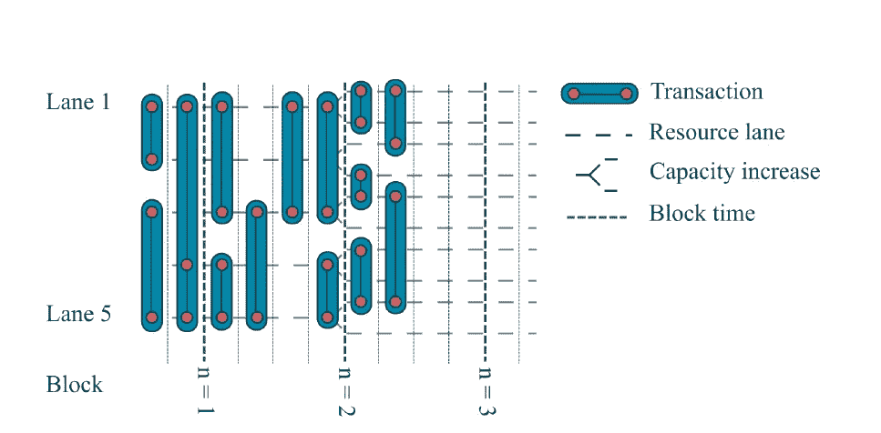

事实上，到目前为止，已经有一些项目提到了对共识机制的改进。但基本上，这都是关于功率/位置/DPOS 的改进。所以我们不会当真。

不过，这并没有多大帮助。我记得当我读 NKN 白皮书时，有一个原始细胞的概念。但是原始细胞机器如何帮助区块链更好地工作并没有详细解释。解释原始细胞的原理浪费了大量的篇幅。这一点在电报界受到了质疑。但这并不能阻止 NKN 的高开盘价。

PAI 是一个垃圾，但这并不能阻止 PAI 向公众开放时的泵送。

从技术数据中获取。Ai 有完整的技术方案。黄皮书中也解释了相应的技术文档。

我看不出这有什么大问题，数百万其他投资者也是如此。而是一个做人工智能和大数据这样花费巨大的事情的公司。手头没有 10 亿美元现金，我以为他们只是虚张声势。

***团队***

取货的最大亮点。Ai 项目是 Deepmind 的光环。首席执行官胡马云·谢赫是 Deepmind 的早期投资者。首席技术官托比·辛普森(Toby Simpson)曾是 DeepMind 的软件设计主管(两年)。

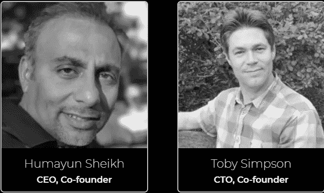

不得不提 Deepmind，该公司的 Alphago 击败了韩国围棋冠军 lee sedol。算了吧，围棋的规则很简单。他们也打败了星际争霸 2 中的职业玩家。这太神奇了。毕竟逻辑流程的复杂程度完全不在一个层次上。

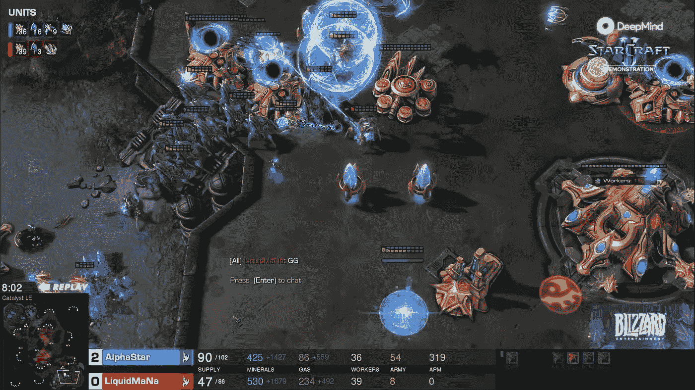

顺便说一下，Deepmind 在 2017 年亏损了 3.68 亿美元。你可以感觉到人工智能在烧多少钱。该团队有超过 10 名研究人员在人工智能/人工智能/DLT 和计算机科学领域。

总的来说，这是一个很好的团队，但它并不像看起来那么强大。

***合作***

1.欧洲区块链联盟:涟漪，NEM，获取。艾和卡尔达诺。好还是不好？看看同行项目。

2.人工智能创新网络(“AIIN”)/华威商学院联合创始人:人工智能开发者团队的协作平台。

3.GE 医疗保健和 ClusterMarket 部署了 Fetch。人工智能节点。

4.MOBI 联盟成员:该组织约有 80 名成员。有些来自知名或熟悉的公司:宝马、福特、通用、雷诺、埃森哲和 IBM。

从目前 Fetch 建立的合作情况来看。艾，作为第二个币安发射台项目是名副其实的。这样的成绩，基于目前的团队，是非常突出的。

**FET 令牌 **

FET 令牌的总供应量为 1，152，997，575。

令牌分配

代币可用作抵押品或公用设施:

1.作为节点的抵押品，类似于 POS 的概念。

2.作为 FET 链的通用许可使用，类似于 ETH。

令牌分配中有不同的锁定期。但我们没必要为此担心。这些都不重要。任何一个新项目的黄金炒作周期都是在项目启动的第一个月内。

# **结论**

一般来说，我们认为 Fetch。AI 有一个很好的团队。虽然项目里程碑被推迟，但总体上取得了实质性进展。他们只是没有很好地对待私募投资者。从估值角度，我们认为有 2-3 倍的抽水空间(不是投资建议)。但这在很大程度上是由于币安发射台的影响。

这是一个壮举，币安重新激活了自己的 ICO 产业。它从市场上得到的这种待遇只有币安才有。关于 Fetch 的疑惑。艾的估值并没有挫伤一般投资者的热情。这是市场对币安踏实工作的馈赠。

从 Fetch 的出色表现来看。AI 商务合作，币安 Lauchpad 再次向市场展示了他们的选择标准。

**总的来说，在短期投机市场，我们给它的评级是 B。**

**我们还没有长期投资评级。随着他们变得更加成熟，我们将在未来对项目进行更全面的分析。**

***投机评级标准:***

A+:风险较低的投机回报潜力巨大。

答:潜在投资回报很大，风险可控。

b:潜在投资回报适中，有一定风险。

c:投资回报潜力小，风险高。

d:风险很大，涉嫌诈骗。

你也可以在 [*币安信息*](https://info.binance.com/cn/rate/detail/2598) 上找到这篇评论的中文版。

翻译:库戈德。

*BlockArk 是一家专注于研究和整合营销的全球性区块链集团，创始成员来自埃森哲、普华永道和币安等顶级公司。关注我们的* [*Twitter*](https://twitter.com/Block_Ark) *。*