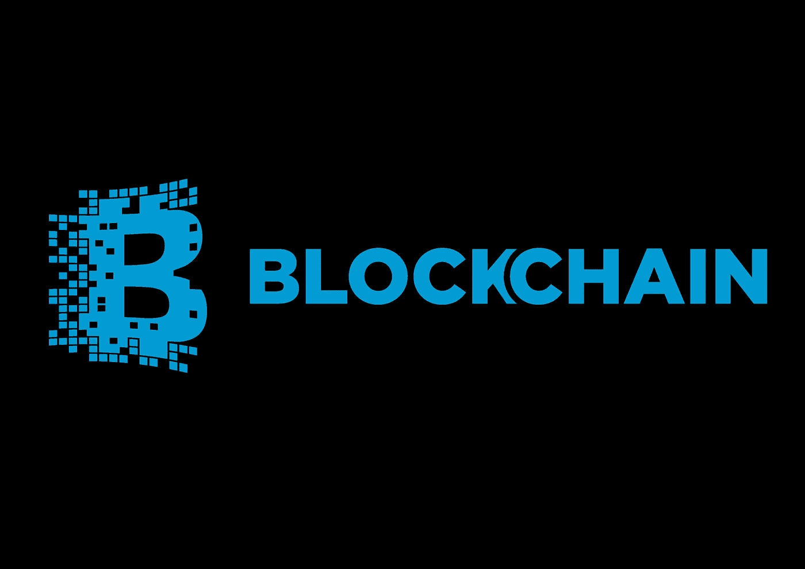

# 区块链→ Á之谜|第一个剧本

> 原文：<https://medium.datadriveninvestor.com/blockchain-%C3%A1-myst%C3%AAry-7dded78740c?source=collection_archive---------33----------------------->

由于区块链在全球的广泛存在，每个人都害怕阅读区块链。我们大多数人都避开了这个话题，因为它看起来更面向技术&不容易理解。但是在这里，我试图为我所有的观众简明扼要地总结这个概念。

B lockchain 是块链，其中数字信息(块)存储在公共数据库(链)中。

初步看来，我们认为这是一项新技术，但是**没有**！区块链最初是在 1991 年由两位研究人员 Stuart 和 W. Scott 提出的，他们想创造一种文档不能被篡改的技术。为什么它会出名？因为它在比特币中的应用/大部分用途。
我们知道比特币是由技术人员在一个安全的网络(区块链)上交易的，这个网络无法被黑客攻击。

> 区块链由多个积木串成。目标是允许在网络上记录和分发数字信息(分散但可信)。网络中验证数据的部分，称为“节点”。

**技术细节**

我们必须记住下面提到的所有*术语*(以购物为例)，因为当你开始阅读区块链相关新闻时，这些术语会被引用:

*Block* ~当你在网上进行交易时，与交易相关的每一个细节，即日期、时间、金额，都存储在一个 Block 中。

*链* ~每个块引用前一个块，形成一个链。

*节点* ~网络的一部分，用于验证数据。

*Hash* ~该信息被加密并存储为称为 Hash 的唯一的数字和字母串。

> 每个事务按照它们发生的顺序输入，生成的每个散列不仅取决于事务，还取决于前一个事务的散列。
> 节点检查散列以验证交易，并且一旦大多数节点批准它，就生成块。

你还记得我们把资金从一个银行账户转到另一个银行账户的那些日子吗？因为银行的验证过程很长，所以执行起来需要几天时间。还有，那个时候所有的信息都集中起来&好黑。嗯，要解决所有这些繁琐的行动，我们需要一些更安全、更快速&和更低成本的东西(这是区块链的主要目标)。

区块链的范围可以适应很多变化，可以迎合很多行业。如果全球投资银行(前 5 名)开始考虑部署，那么它可以很容易地在任何地方实现。

最近，福布斯发表了一篇文章，值得在这里补充一些注意点:

1.  一些公司正致力于开发用于加密的区块链技术(个人信息可以存储在这里)
2.  我们以印度的 Aadhar 数据库&美国的 Real ID 为例——两家都被黑过一次(原因集中式数据库)。
3.  维护区块链的数据库是每个国家政府的责任，因为它不能存储在开发这项技术的公司。
4.  为了实现这一点，政府必须通过让参与技术发展的少数人访问数据库来获得所有权。

> 回答“为什么黑客攻击区块链会遇到困难”？每个人都会有一个钱包&黑客无法破解数百万个加密钱包。

到目前为止，这是它，但在下一部分，我将涵盖物联网(物联网)的区块链技术及其优缺点。

如果你有机会喜欢这个话题&理解这个话题的重要性以及它在这个世界上的存在，请继续关注我。我的目标是学习每一个最新的话题&以一种概括的方式呈现在你面前，以便更好地了解你自己。

%%%

一如既往的优雅

[贾丁·梅塔(√ame)](https://medium.com/u/901a2223b5da?source=post_page-----7dded78740c--------------------------------)

%%%