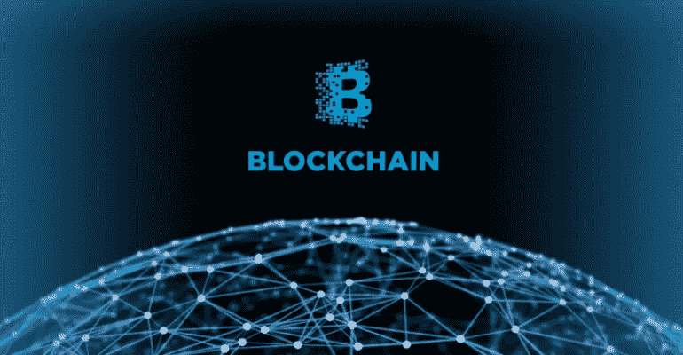
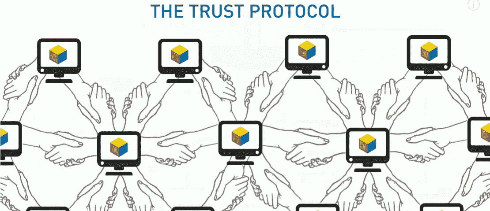

# 区块链→ Á之谜|第二个剧本

> 原文：<https://medium.datadriveninvestor.com/blockchain-%C3%A1-myst%C3%AAry-second-script-f2b1d7639b5e?source=collection_archive---------20----------------------->

现在不要脸红，因为你已经阅读了我的第一个脚本，讨论了为什么人们害怕阅读任何区块链相关的东西&由 [Forbes](https://medium.com/u/3126f7dd42c1?source=post_page-----f2b1d7639b5e--------------------------------) 提出的精彩观点。在这个脚本&中，正如之前所承诺的，我将更进一步了解它。

Google images

## 从技术领域可用的三种区块链开始:

1.  **公共区块链(如比特币)**
    被认为是去中心化和安全的，但如何？任何地方的任何人都可以访问(读&写)由每个参与者(节点)验证的数据，使其成为安全网络的一部分。这也被称为无许可区块链，意思是对所有人开放。
2.  **私有区块链(如 Ripple)**
    这种类型部分去中心化但高度可信，原因？它有权限访问，允许此人在获得技术所有者的许可后才能正确阅读&。*考虑到时间和巨大的压力，只有一家班轮公司的所有者有权对数据进行验证/确认。*
3.  **混合区块链(如以太坊)**
    在去中心化方面，类似私有。但是，它只允许少数节点进行验证，因此效率更高。*一行程序~只有少数参与者/所有者可以进入网络。*

TED talks

到目前为止，我们已经知道，区块链是网络上发生的一切的准确记录，这意味着我们知道参与者(节点)&我们也知道当它被多个用户验证时更安全&它继续。

> B 锁链也被称为“分布式账本技术”(DLT)。对于每一个修改，我们将知道参与者的名字&到目前为止已经做了哪些更改，并存储到一个分类帐中。

分类账的重要性在于，一旦记录了任何信息，就很难对其进行更改，因为这将在代码排序的年表中造成差异。此外，为了更加清晰，修饰名称将被标记。

**区块链的挑战**

*   开发社区很小，可用的代码片段不起作用& bugs 是无声的。
*   现有的实现依赖于罕见的设计模式，这是我们在大学里学不到的(例如，脸书在寻找区块链专家使支付系统更加安全时遇到了麻烦)
*   开发者获得了不必要的权力，当技术不够成熟时，这是一个风险
*   最后但同样重要的是，理解代码非常困难

**区块链的优势**

*   不需要可信的第三方来验证该过程
*   共识机制用于就交易的有效性达成一致
*   区块链交易对每个人都是可见的，这使得系统更加透明和完善
*   一旦数据被写入，没有人能够操纵过去的交易

> 当我听到 [TED 关于区块链的演讲](https://medium.com/u/628458d920a9?source=post_page-----f2b1d7639b5e--------------------------------)时，我很好奇，他们承认从共享经济变成了繁荣的经济，我喜欢下面的引用:
> 
> 与其重新分配财富，
> 
> 我们能预先分发它吗？
> 
> 我们能不能民主化
> 
> 财富首先被创造出来？

尽管如此，许多公司仍在努力推出区块链产品，让一切在几秒或几毫秒内连接起来。物联网将是机器人控制世界的根本原因，就像我们一样。就金融业而言，当中间方/清算对手被移除时，结算过程可能会变得容易得多&将建立一个安全的平台来结算交易。

想了解更多相关信息吗？我会请求你等我的第三个剧本；)同时，感谢您抽出时间&保持联系！！

%%%

一如既往的优雅

[贾丁·梅塔(√ame)](https://medium.com/u/901a2223b5da?source=post_page-----f2b1d7639b5e--------------------------------)

%%%