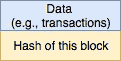
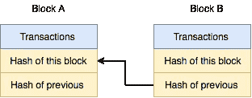
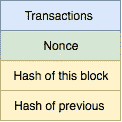
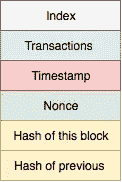

# 区块链:快速入门

> 原文：<https://medium.datadriveninvestor.com/blockchain-a-quick-primer-a3fc9dd393e6?source=collection_archive---------0----------------------->

我对区块链产生了兴趣，并开始搜索相关教程。有很多区块链的教程(视频和博客)，但我发现大多数要么过于淡化和卡通化，要么只是描述了区块链的机制，而没有描述设计决策的基本原理。

所以，在读了一些这样的教程后，我想我终于对区块链试图解决什么问题以及他们是如何解决的有了更好的理解。我绝不是这方面的专家，但我决定写这篇文章是因为:

*   写一个主题，通常有助于更好地理解它
*   我以后可以参考它来回忆这些概念
*   其他具有工程背景的人可能会发现这种描述很有用

# 区块链试图解决什么问题

假设我们想要创建一个不变事物的列表(例如，金融交易)，每个人都可以相信它的不变性。我们可以把这个清单写在一张纸上，交给一个我们信任的人。每当我们需要向列表中添加内容时，我们会要求信任的人将新条目添加到列表中。

这种方法的问题:

*   找到一个被所有人信任的值得信任的人是很难的
*   可信实体可能由于各种原因变得不可用(单点故障)

由多个实体维护同一个列表的分布式方法似乎是一种自然的解决方案，它不存在上述问题。然而，分布式方法有其自身的问题:

*   如果列表由不一定值得信任的随机实体维护，如何确保不变性？
*   这些随机实体维护不可变列表的动机是什么？

# 区块链如何解决这些问题

目标是创建一个包含数据(我们希望确保数据不被篡改)和元数据的块，元数据有助于防止数据被篡改。添加对数据计算的散列本身并不能保护数据不被篡改，因为不良行为者可以简单地更改数据，然后根据修改后的数据重新计算散列，一切都没问题。如下图所示。

Simplified Block: Does not protect the data against tampering

现在，假设我们添加了另一个元数据字段，它是对前一个块计算的散列。

Linking Blocks Together

如上图所示，将块 A 和块 B 链接在一起后，如果不良参与者试图修改块 A 中的事务字段，他们必须重新计算块 A 的哈希，从而重新计算块 B 的“以前的哈希”字段。这反过来迫使不良参与者也重新计算块 B 的哈希(请注意，块 B 的哈希是根据 B 的事务字段和块 B 中的“以前的哈希”字段计算的)。通过归纳，我们可以看到，修改块 A 会对块 A 之后的块产生连锁反应。

计算一个散列值并不昂贵，所以要求为块 A 之后的内容重新计算散列值并不是特别麻烦。换句话说，我们仍然没有实现使块不可变的目标。为此，另一个字段，即现时字段，被添加到每个块。包含 Nonce 字段的目的是使篡改大量数据块变得困难。

# 故意刁难

Nonce(也称为“工作证明”)是一个 32 字节的数字，具有以下属性:

sha 256(Transaction | Nonce | Hash _ of _ previous)= 00…000 xxxxx

SHA256 是一个具有理想属性的散列函数，在这里描述为[。这里，前导零的数量由特定的区块链协议规定，并被称为区块链算法的“难度”。](https://en.wikipedia.org/wiki/SHA-2)

Nonce is Added to Make is Difficult to (Re)compute Hash of the Block

因为散列函数被设计成单向的(即，给定一个输入，很容易计算散列值，但是走另一条路是不可能的并且是不明确的)，所以没有封闭形式的解决方案来求解 Nonce 的这个方程。找到满足上述等式的 Nonce 值的唯一方法是尝试不同的 Nonce 值，并检查散列的输出，以确保散列值至少具有期望数量的前导零。所需前导零的数量越多，找到满足该等式的随机数所需的时间就越长(因此得名“困难”)。对于比特币协议，难度被调整为平均需要大约 10 分钟来找到这样的 Nonce 值。

乍一看，包含具有上述属性的 Nonce 的要求可能听起来很奇怪。为什么我们要浪费计算机时间来计算具有这种任意属性的随机数呢？答案与我们在上一节中发现的内容有关。具体来说，回想一下，篡改任何块中的数据都会迫使坏人重新计算后续块的所有哈希值。重新计算一个块的散列会改变后续块的散列函数的输入。这又需要计算新的现时值。对于长区块链，重新计算满足“工作证明”等式的大量现时值将花费很长时间并消耗大量计算机资源。

此外，即使坏行动者成功地为后续块重新生成了所有随机数值，他们仍然需要向参与验证区块链的其他实体广播修改后的区块链。对新区块链的接受是基于共识的，因此，坏演员将不会成功地使被篡改的块被接受。

实际上，区块链中的块也包含索引和时间戳字段，并且它们也是散列函数的输入。

# 什么是采矿？

当用户提交要添加到区块链的交易时(例如，鲍勃给了爱丽丝两个比特币)，该交易被添加到未验证交易的列表中。矿工进程从该列表中抓取一些交易，并添加额外的交易(作为块中的第一个交易)，该额外的交易用一定数量的比特币(例如，12.5 BTC)奖励矿工本身。对于大约 10 分钟的计算机时间(这是计算一个块的随机数所花费的平均时间量)，这个奖励似乎异常慷慨。但是，系统只需要一个有效的块，因此，只有来自第一个构建并发布该块的挖掘者的块才会被接受。所有其他矿工消耗的能量和时间都被浪费了。

所以，真正的挖矿奖励是‘12.5 * probability _ of _ block _ acceptance’比特币。考虑到有许多配有高速图形处理器的采矿场都在竞争每个区块的这一奖励，这一采矿奖励的预期价值相对较低，甚至可能不足以支付采矿发生地区的电力成本。[这个](https://99bitcoins.com/bitcoin-mining-profitable-beginners-explanation/)站点有一个计算采矿盈利能力的计算器。

# 摘要

现在我们知道区块链做什么和他们如何工作。这是非常容易建立自己的区块链实验。[这个](https://hackernoon.com/learn-blockchains-by-building-one-117428612f46)是 python 中一个很棒的教程。