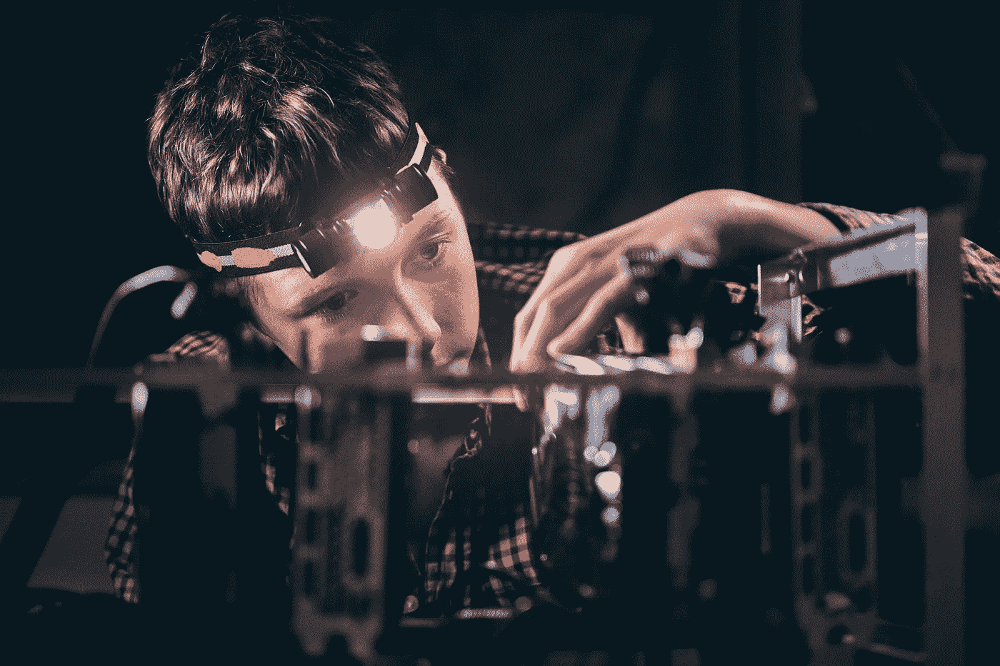
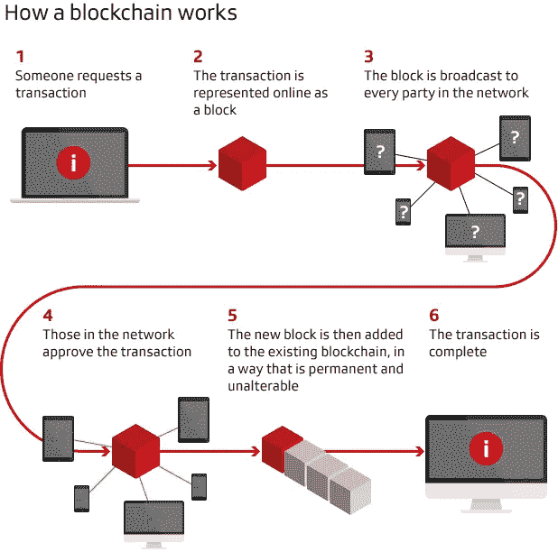
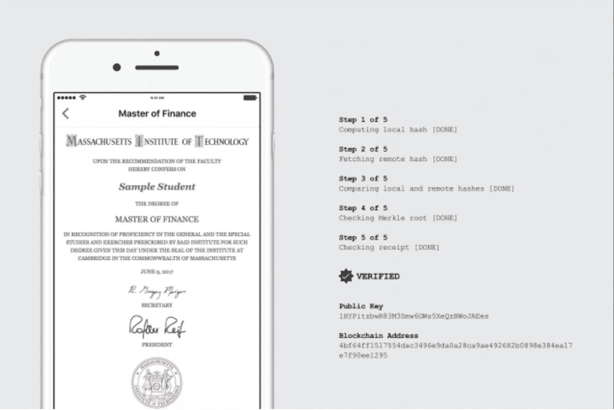
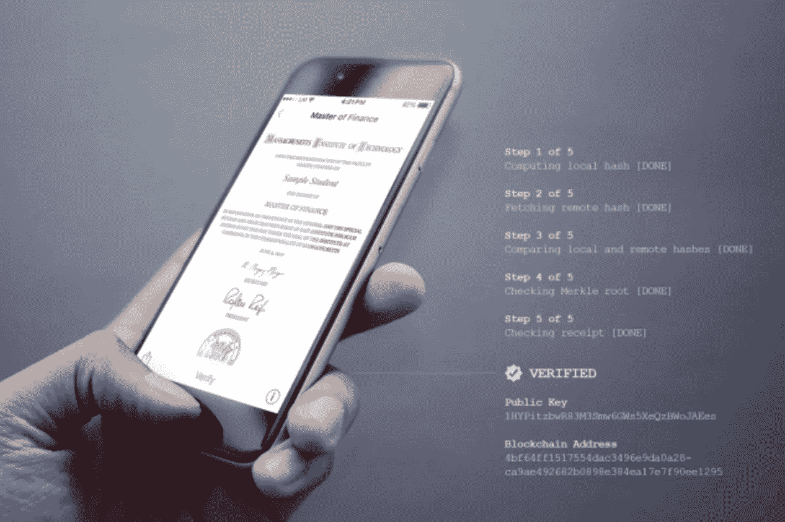
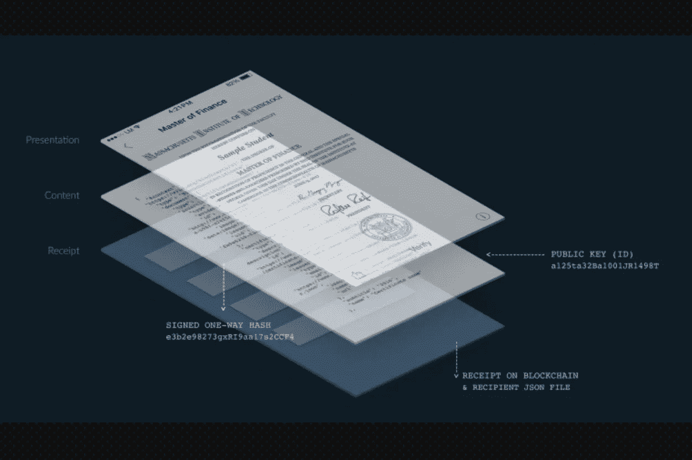
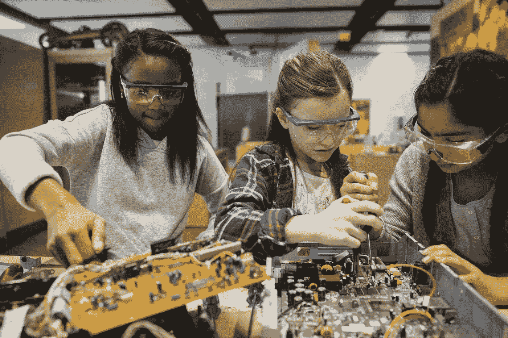

# 区块链:STEM 教育的革命

> 原文：<https://medium.datadriveninvestor.com/blockchain-a-revolution-for-stem-education-654050e22355?source=collection_archive---------9----------------------->

## 培养对权力下放的理解

Image: Getty / Teen Working On A GPU Rig

*作者:* [*安德鲁·b·劳普*](https://medium.com/u/d8c8d333927a?source=post_page-----654050e22355--------------------------------)*/*[*@ stem CEO*](https://twitter.com/stemceo)

最近，似乎每个人都在谈论区块链科技。关于比特币和其他加密货币的新闻很难抗拒，尤其是当它们的价值飙升和下跌，每个人都想知道区块链如何让他们变富或变穷——在财务上。但区块链的实际价值不一定仅仅与扰乱货币现状有关。它还在于这项技术如何转变和简化各种领域的交易和记录，特别是教育领域。

## **一个区块链引物**

如果你不熟悉[区块链技术](https://blockgeeks.com/guides/what-is-blockchain-technology/)的工作方式或需要改进，将加密货币与你的常规银行开展业务的方式进行比较会有所帮助。银行基本上把你所有的账户数据都放在一个电子表格里，以便跟踪你的交易。这很好，但是一个高度集中的 T21 数据系统很容易被黑客攻击，你不能不通过中间人(银行)就把钱汇给一个家庭成员。另一方面，加密货币依赖于完全分散的用户网络来存储所有交易的信息。没有银行作为看门人，但信息(块)被添加到一个永久的链中，没有人可以改变。它更安全，因为网络中的每个人都可以随时访问信息，所以如果有人试图改变记录，每个人都可以看到这种情况的发生，并阻止它。

Image: Financial Times / PwC United States

## 一场教育革命

去年，麻省理工学院通过他们的智能手机向毕业生颁发了第一份区块链文凭。它不仅仅是一个数字化证书:与容易丢失或伪造的纸质文凭不同，区块链确保这一重要数据永远不会丢失。它也省去了大学或传统的票据交换所作为发布成绩单的中介。取而代之的是，学生可以通过手机直接查看他们的教育记录。无论他们的房子被烧毁，还是他们搬到世界的另一边，他们的文凭都是安全的。

Image: Learning Machine / MIT’s Digital Diploma 1 of 3

*数字文凭剖析:“麻省理工学院注册主任兼高级副院长玛丽·卡拉汉说，麻省理工学院的数字文凭‘让(学生)拥有自己记录的所有权，并能够以安全的方式与他们选择的任何人分享这些记录*[*——麻省理工新闻*](http://news.mit.edu/2017/mit-debuts-secure-digital-diploma-using-bitcoin-blockchain-technology-1017)

Image: Learning Machine / MIT’s Digital Diploma 2 of 3

使用麻省理工学院新的数字文凭系统，雇主和学校可以通过使用一个链接或上传学生的档案来快速验证毕业生的学位是否合法。[*——麻省理工新闻*](http://news.mit.edu/2017/mit-debuts-secure-digital-diploma-using-bitcoin-blockchain-technology-1017)

Image: Learning Machine / MIT’s Digital Diploma 3 of 3

*“表示层具有传统麻省理工学院文凭的定制图像；内容层包含带有学生公钥的代码，并生成图像；收据层证明交易已被记录在区块链上。”*[*——麻省理工新闻*](http://news.mit.edu/2017/mit-debuts-secure-digital-diploma-using-bitcoin-blockchain-technology-1017)

这不仅仅是一个方便的问题。如果像[证书和徽章](https://www.forbes.com/sites/tomvanderark/2018/08/20/26-ways-blockchain-will-transform-ok-may-improve-education/#b0c88984ac91)这样的其他证书也存储在区块链上，学生在大学之间转学并决定自己的教育轨迹将变得容易得多，因为转移学分的障碍将开始消失。在这个世界上，MOOCs 也可以更容易地获得有意义的学分，从而获得学位。一个人的全部教育记录只需按一下按钮就可以查阅。

如果个人教育记录以这种方式加密，K-12 评估也可以更好地协调。人们可以设想一种更为纵向的评估系统来跟踪成绩，而不是每年因州和年级而异的高风险测试。例如，如果一名八年级学生通过了十年级的几何考试，她无论走到哪里都会将这一成绩记录在自己的记录上，让她能够继续以适合她个人的水平接受数学教育，而不是在接下来的几年里重新参加同样的考试。通过这种方式，区块链可以帮助改革个性化教育。

## **将区块链融入 STEM 教育**

Image: Getty / Two Students Studying Electronics

如果区块链是未来的潮流(看起来确实如此)，那么确保今天的学生准备好在职业生涯中使用这项技术似乎是合乎逻辑的。这已经在高等教育中发生，像 T4 弗吉尼亚理工大学和 NYU 大学增加了区块链浓度。研究区块链利用了许多 STEM 学科，包括计算机工程和高等数学来加密数据。

由于技术相对较新且复杂，目前 K-12 学生很少有机会更多地了解区块链。尽管确实存在一些独立的课程，但在这方面确实需要开发适合年龄的课程。对于年龄较小的学生来说，了解关于网络的基础知识并磨练相关的数学技能是一个良好的开端；对于年龄较大的学生来说，金融知识与加密货币非常吻合，可以激发他们的兴趣。此外，学习编码总是一项重要的 STEM 技能，Python 中的[类对于理解区块链尤其有用。与所有 STEM 教育机会一样，它开始得越早，动手越多，孩子们就越有可能坚持下去，并把自己视为未来的区块链贡献者。](http://edtechreview.in/trends-insights/insights/3234-ways-to-help-kids-and-parents-understand-blockchain)

## **分权哲学**

Image: Getty / Students Building Computers

最后，值得注意的是，区块链代表了向分散知识的文化转变的一个重要步骤。正如技术本身消除了你和你的钱(或你的教育记录)之间的中介一样，它也暗示了一个学生可以更直接地获得和控制他们的教育的世界。如果区块链导致分散的记录和更大的全球知识数据库访问，教育将进一步民主化，更多的人将有机会获得他们渴望的学习。

这场运动发生在教育——尤其是 STEM 教育——高度公司化的时候。向人们出售教育可以赚钱，但允许企业垄断所有我们教给学生的东西将是一个真正的错误。尽管大学变得越来越商业化，但没有一个机构“拥有”STEM 教育。为了 STEM 教育运动的蓬勃发展，它必须保持[的分散化](https://www.forbes.com/sites/forbestechcouncil/2017/12/07/a-decentralized-internet-will-preserve-innovation-in-stem-education/#795f34c171ab)并且面向所有人，无论其社会经济地位或原籍国。它也不应该被重视利润甚于创新和真实学习经历的特殊利益集团所吸收。

Image: Getty / Student Studying On A Tablet

通过教授学生理解区块链所需的 STEM 基础知识，我们还可以培养他们对其带来的价值的欣赏。毫无疑问，这是一项有价值的技术，但它也植根于一种文化中，这种文化认为信息是每个人都有权利免费获取的东西，而不必为获取信息向中间人付费。在这种哲学中，知识是与生俱来的权利——有效的 STEM 教育有助于保持这种权利。

*本文原载于 2018 年 11 月 30 日福布斯社区之声* [*麻省理工学院校园新闻*](http://news.mit.edu/news-clip/clip-forbes-blockchain-revolution-stem-education) *。*

[Andrew B. Raupp](https://medium.com/u/d8c8d333927a?source=post_page-----654050e22355--------------------------------) 是创始人/执行董事 [@stemdotorg](https://twitter.com/stemdotorg) 。*“通过健全的政策&实践使科学、技术、工程和数学(STEM)教育民主化……”*