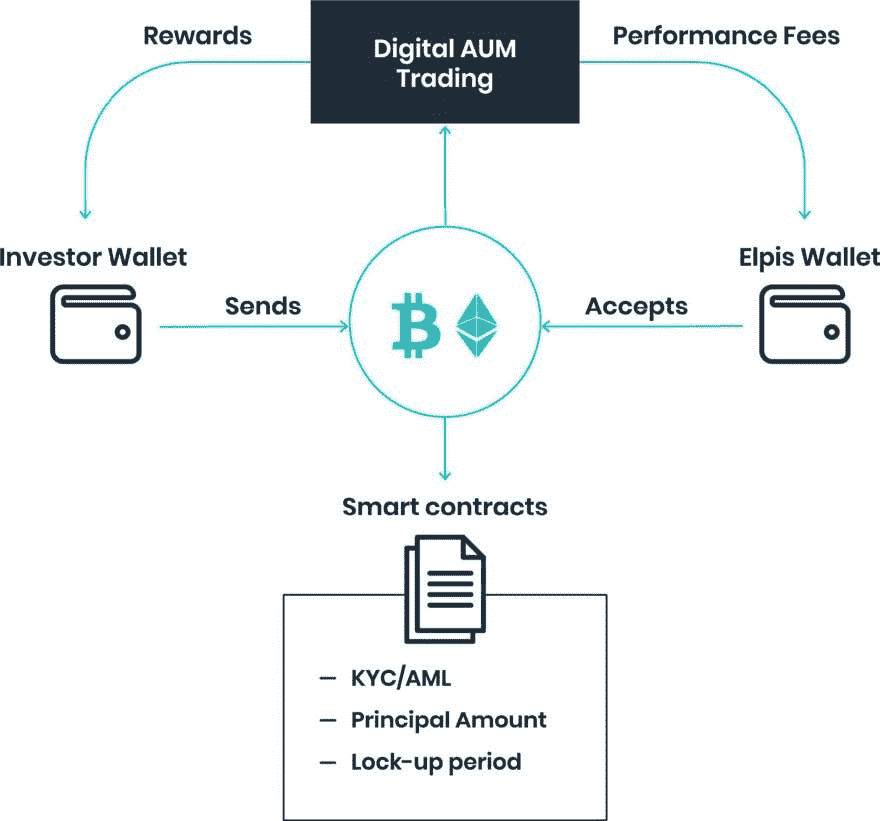
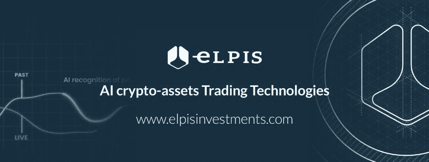

# 区块链和受过科技教育的新一代投资者

> 原文：<https://medium.datadriveninvestor.com/blockchain-and-a-new-breed-of-tech-educated-investors-4c13238d7927?source=collection_archive---------15----------------------->

根据比特币基地和奎莉一起进行的一项调查，一个新的加密和区块链教育的一代投资者正在形成，涉及美国各地的学生和大学。原始研究最惊人的发现之一是，“**世界前 50 名大学中的 42%现在提供至少一门加密或区块链课程**

[elpisinvestments.com](https://elpisinvestments.com/)

这项研究确定了这种兴趣的一个可能原因是**这项技术对整个社会的潜在影响**。[研究](https://blog.coinbase.com/the-rise-of-crypto-in-higher-education-81b648c2466f)引用加州大学伯克利分校计算机科学教授 Dawn Song 的话说:“区块链结合了理论和实践，可以在许多研究领域带来根本性突破。它可以对许多不同行业的社会产生深远而广泛的影响。”

区块链和加密货币获得的关注是合理的，因为这个市场的**规模在短短几年内就达到了 2546.7 亿美元**(截至 2018 年 7 月初)。作为对该领域感兴趣的进一步迹象，世界上一些最重要的大学，包括哈佛大学、耶鲁大学、斯坦福大学、达特茅斯学院、麻省理工学院和北卡罗来纳大学，都投资了“至少一只加密货币基金”。

特别是，一周前来自美国消费者新闻与商业频道的一份报告指出，耶鲁大学捐赠基金对安德森·霍洛维茨基金的 3 亿美元加密基金以及最近由红杉资本前合伙人 Matt Huang 和比特币基地联合创始人 Fred Ehrsam 发起的 Paradigm 基金进行了持续投资。

耶鲁大学投资办公室的决策者是大卫·f·斯文森(David F. Swensen)，他被广泛认为是世界顶级的机构投资经理之一，因成功管理该校 294 亿美元的捐赠基金而被称为“耶鲁的沃伦·巴菲特”。

David F. Swensen, Chief Investment officer of the Yale University Investments Office.

大卫·f·斯文森的捐赠基金管理方法已经成为其他大型捐赠基金的典范，仅次于哈佛。在斯文森的指导下，耶鲁大学的捐赠基金在过去十年中产生了 7.4%的年化回报率，在 20 年内达到了 11.8%，从 2017 年 6 月到 2018 年 6 月达到了 12.3%，而哈佛大学的回报率为 10%。

正如[美国消费者新闻与商业频道的报告](https://www.cnbc.com/2018/10/05/yale-investment-chief-david-swensen-jumps-into-crypto-with-bets-on-two-silicon-valley-funds.html)所强调的那样，耶鲁大学的投资代表着“**对一个资产类别投下了急需的信任票，该资产类别在去年的历史性反弹后于 2018 年受到了打击**，尚未得到主要捐赠基金和基金会的支持。”

在 [Elpis 投资](https://elpisinvestments.com/)，我们坚信区块链**在运营管理**方面具有不可思议的价值，即使是在一个正经历低迷阶段的市场。在我们的第一年，**我们将使用区块链记录每一笔交易**，向我们的客户和监管机构公开。使用区块链和分布式账本技术(DLT)存储交易数据，我们将**节省专用基础设施**的极高成本。我们的投资者也将从区块链的效率和透明度以及更具竞争力的管理费中受益。

[elpisinvestments.com](https://elpisinvestments.com/)

[Elpis Investments](https://elpisinvestments.com/user/pages/pdf/White%20Paper%20-%20EN.pdf) 将使用一个基于区块链的系统来存储来自购买和出售操作的所有信息，以便**对公司的每笔交易进行公开审计。I** 增加对资产信息的信心和对系统的信任，同时降低攻击和网络黑客的可能性。在运营的第二阶段，随着 [PSD2](https://www.pwc.co.uk/industries/banking-capital-markets/insights/psd2-a-game-changing-regulation.html) 的推出，Elpis 投资公司将利用区块链来降低交易的时间/成本比率。

利用区块链的技术将使 Elpis Investments 的管理结构更加透明和安全:投资者将确切地知道他们的钱每天都去了哪里，股息结构和成本将自动计算，没有人为错误和猜测的余地。

[Elpis Investments](https://elpisinvestments.com/) 的使命是明确而雄心勃勃的:**通过比一般的交易竞争对手更高效地运营，只关注业绩，并建立一个结构完全开放、对投资者透明的**组织【感谢区块链:**他们将能够不断验证和审计交易，从而成为交易和区块链领域的领导者**。

**区块链技术以及最新的** **人工智能技术，如** [**机器和深度学习**](https://drive.google.com/file/d/0BylWh_GCTZAyQWhsTFA2NW82d3M/view) **，**将允许 Elpis 投资公司提高投资策略的效率，并让传统的机构投资者与**受过教育的新型散户投资者一起参与，这种新型散户投资者得益于所述的授权过程**，日益传播对这些技术潜力的更有意识的方法。

[elpisinvestments.com](https://elpisinvestments.com/)

***如果您正在寻找一家坚实可靠的人工智能驱动的贸易公司，并希望参与我们的 ICO，请查看我们的网站***[***www.elpisinvestments.com***](https://elpisinvestments.com/)***，或者加入我们的*** [***电报***](https://t.me/joinchat/E34qxhL2yukir8BJSGpNMw) ***群与我们直接取得联系。***

朱塞佩·索利纳斯

**首家人工智能驱动的加密和传统资产投资公司 Elpis Investments 主编:**[**www.elpisinvestments.com**](https://elpisinvestments.com/)**、info@elpisinvestments.com**