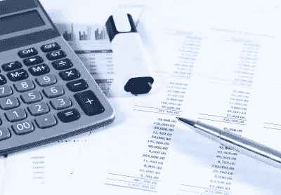

# 区块链和会计—基础 1

> 原文：<https://medium.datadriveninvestor.com/blockchain-and-accounting-the-basis-1-bbb6c56dad08?source=collection_archive---------42----------------------->

*Image courtesy of Pong at FreeDigitalPhotos.net*

2018 年即将结束。在区块链，所有财年与日历年相同的公司很快将不得不关闭 2018 年的账目。

我们公司在四个不同的司法管辖区从事加密工作。幸运的是，我们只能向瑞士当局提交年终报告。他们似乎是欧洲最讲道理的。

> 为了将加密经济引入“旧”经济，我们必须了解现有的会计标准如何限定不同的加密项目。

**1。资产或负债**
根据内容(加密项目)，会计师必须将加密鉴定为:

资产
-货币
-合同
-预付款/预付款项
-债券
-股票
-混合金融工具
-期权(看跌/看涨)
-保险合同
-商品
-能源

或者

负债
-贷款
-租赁
-混合金融工具

**2。收入**

我们出售代币商品。本地会计需要使用本地货币或至少法定货币。

我应该取哪种价值的代币？
如果您收到代币，并且如果您出售代币用于加密或其他代币——在您出售代币的日期使用价值

如果您将代币保留到年底，请使用您保留的代币的年末价值(如果代币已上市，则在交易所中)。

如果代币不在市场上或交易所里会怎样？
使用代币的购买价格(如果没有，使用估价)。

**3。费用**

我们用代币支付的服务—这些服务是否符合费用条件？

是的，它们是费用。按照付款日的汇率用当地货币对其进行估价。

注意:我写的是做生意所需的费用。

**4。专有令牌**

公司发行了自己的代币——这是资产还是负债？

未售出的代币(如果可用)是资产
售出的代币是负债

使用当地货币的市场价格进行核算。

如果代币不在市场上或交易所里会怎样？
使用代币的平均销售价格(如果没有，使用估计价格)。

> 记住:保持简单并有据可查！