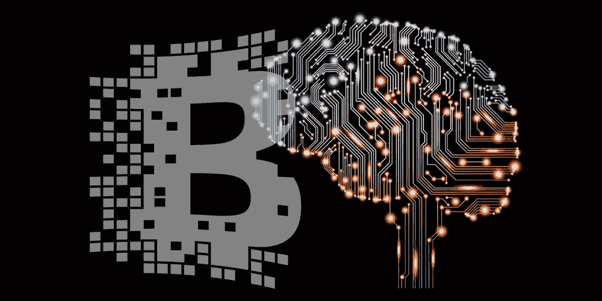

# 区块链和人工智能编码技术

> 原文：<https://medium.datadriveninvestor.com/blockchain-and-ai-1862917bdb2b?source=collection_archive---------14----------------------->

# 在过去的三年里，人工智能和区块链已经成为科技界最热门的话题。

只是为了刷新我们的记忆，人工智能最简单的形式是用来描述创造机器的理论和实践的术语，这些机器有能力执行需要一定智能水平的活动。机器学习和深度学习是即将使这成为现实的技术。

另一方面，区块链是一种创新的数字信息归档系统。该系统上的数据被加密并以分类帐格式存储。这种存储和安全系统允许数据库被篡改，只有授权或足够的权力。

作为科技界的热门话题，关于人工智能和区块链会相互产生什么影响，已经有很多思考。本文将讨论当我们将人工智能与区块链结合时产生的三(3)个好处，以及区块链将如何影响人工智能。

首先，让我们考虑一下 AI 和区块链结合的好处。

## 人工智能与区块链结合的好处

1.  使用区块链，我们可以更好地理解人工智能。在区块链的帮助下，我们可以理解人工智能“思考”的方式。很多时候，我们作为人类并不能完全理解 AI 所做决定的原因。然而，我们现在可以通过区块链来理解它。
    与人类不同，人工智能有能力一次评估大量变量。这一特性使得许多公司在想要检查系统中的欺诈活动时，决定使用人工智能。虽然人工智能是可信的，但有时也需要人眼。
    这就是区块链的用武之地。区块链可以帮助保持人工智能系统提供的信息安全，直到审计即将发生。
2.  **区块链本身在人工智能的帮助下管理得更好。普通计算机不能执行没有命令它们执行的任务。考虑到人工智能系统所提供的东西，这是一个极端的限制。在这种系统上使用区块链意味着要使用大量的处理能力。然而，在人工智能的帮助下，任务得到了更智能的处理。正如人类编码员会随着他或她破解的每一个代码而变得更好一样，人工智能系统也会在完成任务时变得更加智能。**
3.  人工智能和代码运行良好。区块链是世界上最安全的系统之一，因此当敏感数据存储在区块链上时，没有必要担心。将这一点与人工智能相结合将意味着，虽然你的数据是安全的，但它也是经过处理的，可以为你提供很多很好的服务。例如，想一想你在网上收到过多少次广告，是关于满足你目前特定需求的产品的。
    区块链存储系统与其他系统的不同之处在于，数据是以加密的形式存在的，因此只有密钥必须保持安全，才能保证数据的安全。

## 区块链会如何影响人工智能？

*   **数据可以在公开市场上获得。**没有数据，人工智能系统就无法工作，因为数据是经过处理为我们提供信息的东西。虽然世界上的科技巨头每天都收集大量数据，但这些数据并不向公众开放。随着区块链的使用，这种情况即将改变。区块链系统上的对等连接的概念是解决这个问题的简单方法。由于区块链是开源系统，使用该系统的每个人都可以访问系统数据。这将允许一个开放的数据市场。
*   **更好的安全性。为了在使用人工智能系统时尽量减少错误或财务纠纷的发生，数据必须高度安全。人工智能系统本质上是自主的；因此，很容易将错误的数据输入系统。
    区块链凭借其高安全性和加密系统，有助于将错误降至最低。**
*   **数据共享和分散系统。**区块链在一个分散连接节点的系统中工作。这些节点一起工作，以便解决呈现给系统的问题或任务。人工智能也以类似的方式工作。当一个问题被提交给一个人工智能系统时，这个问题的可能的解决方案被测试，然后导致人工智能作出决定。在测试了所有可能的解决方案后，选出最佳方案。
*   **处理大规模数据的能力**。人工智能有能力一次处理大量数据。大多数情况下，这要求系统依赖人工通用智能(人工智能的一个子领域)，这有助于系统更好地与数据进行交互。
    区块链也有些类似，只是区块链上的数据不仅仅存储在一个位置。这意味着在发生灾难的情况下，数据仍然受到很好的保护。

## 最后的想法

将人工智能和区块链的力量结合起来，无疑将是人类生活进步的一大飞跃，因为数据将能够以前所未有的方式得到控制和存储。

艾和配合得非常好。无论你是想保存数据，还是收集数据，还是处理数据，人工智能和区块链的结合都会给你带来很多好处。没有太多的工作可以展示这两者可以一起做什么，但我们毫无疑问地相信，在未来几年内，变化将会到来。

Enkode Technologies 是美国顶尖的软件开发公司之一，它将这些技术结合在一起，并将其推向市场。如果您想让我们为您的项目报价，请直接联系我们！

如果你想了解更多令人兴奋的话题，请访问 www.Enkode.co/blog。

