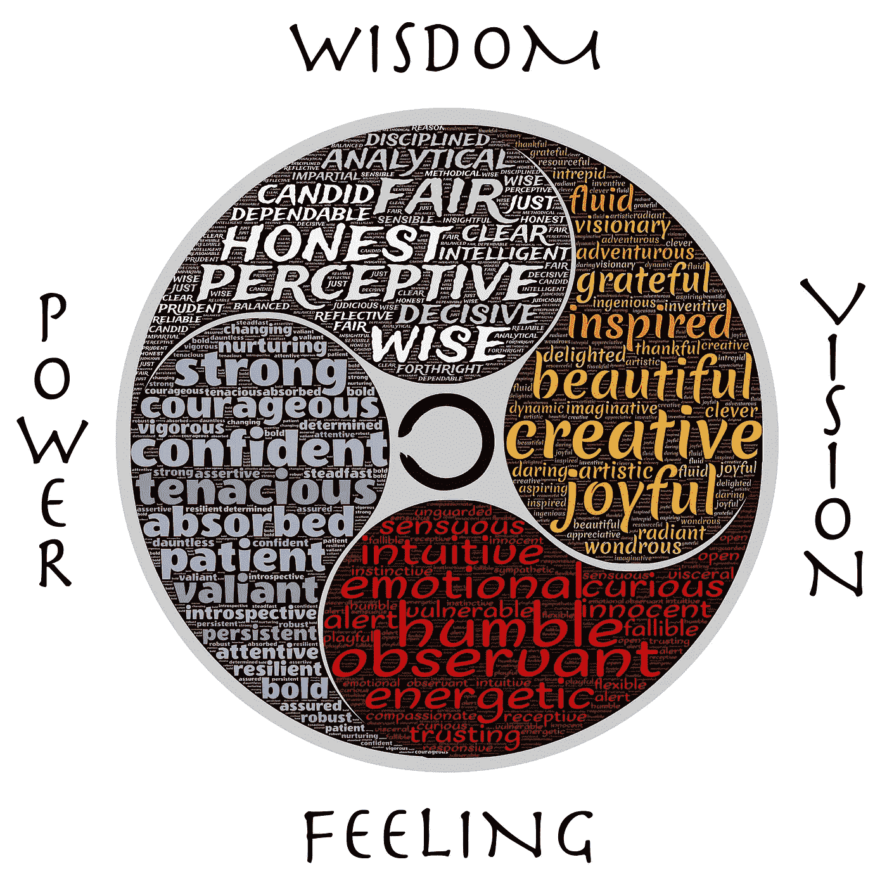

# 区块链和商业进化

> 原文：<https://medium.datadriveninvestor.com/blockchain-and-business-evolution-edf5443c515?source=collection_archive---------8----------------------->

# 回溯:区块链之前的商业进化

**1。商业链**
众所周知，绝大多数实物商品都要经过原材料(-加工/制造)、商品、(营销)、渠道、交易等步骤。其中，现代化的大型工厂和分布更广的媒体出现后，大部分的加工和营销阶段都需要资金的初期投入来支撑。

人类完成的绝大多数服务主要是以原材料准备——营销、客户服务处理和商品的形式进行的。这也可能是因为，在缺乏目标市场营销的情况下，服务需求首先被消费者接受。提到并把链条转换成一个(广义的)营销存取器——原材料加工(人工服务)——商品形态。
由于行业和服务的特点，核心环节可能前后有所调整。然而，由于时代背景、技术限制、人的素质和行为的差异而产生的基本环节的构成在很大程度上是不变的。

## **2。不断移动核心战场。**

在商品经济到来之前，基础材料的供给尚未稳定，原材料本身就是商品，经济活动的竞争集中在原材料的所有权上。

在商品经济早期，原材料存在过剩和大量同质化交易，竞争的焦点集中在经过初步加工、功能差异显著、尚未饱和消费市场的商品上。

在商品经济发展到一定程度后，商品种类和功能的差异已经减少，竞争已经转向需要资金的生产标准化，以及扩大销售所必需的营销门槛。

随着商品基本质量的提高和反消费主义的兴起，尤其是互联网时代到来后，具有实用品质的商品因技术进步而变得更加丰富，依靠产品质量和标准取胜的大规模生产，但在销售门槛相对较低后的营销中，更加多样化的产品瓜分了消费市场。

当原材料、商品、资金、渠道在商业竞争中不再起决定性作用的同时，最终产品在实用品质上的差异越来越小，越来越用依恋文化和情怀来衡量；尤其是以人力为基础的服务行业已经日益成为一种重要的暂时商品。链家预测，未来的竞争将更多地依赖于基于开放的产业链，基于生产和组织变革的信用可视化的要素。

# 区块链带来的转变

## **1。关于经济、个人、组织环境**

**(1)经济:**基本消费品过剩，越来越多的商品出售情感而不是出售功能

除了非洲等一些贫困地区，全球生产的基本温饱已经可以满足人们的基本生存需求，甚至还有相当的生产能力过剩。制造业和制造业比重下降，服务业和技术比重逐年上升。

除了人的需求依然存在并能保持开放想象的蓝海科技领域，在基本生存产品的末端，产品质量差异已经不能成为消费者做出选择的首要考虑因素。商家只能靠口碑、情感营销等。唤起人们对安全和尊严的需求。

**(2)个人:**食品和安全需求得到广泛满足

在贫困基本消除的市场上，劳动力的价值和货币的购买力基本上可以支撑人们衣食住行的基本生存。在和平安全时期，所谓的安全需求更多的是依附于“安全感”的感觉。

**(3)组织:**科学技术提高了信息处理的效率，一种基于个人劳动的扁平化组织被热议

当制造端逐渐被机器取代时，信息的加工、处理就成了当代劳动力的主要工作内容。在智能信息技术的辅助标准下，单人可以处理和维护的异常情况的覆盖范围越来越广。科技让日常交流距离和信息黑箱越来越小，个人作为劳动单位扁平化的趋势被热议。

## 2.正在进行的技术变革

**(1)分布式账本和数字货币**

区块链的底层缓存技术使交易记录公开、透明且可搜索。在此基础上，建立了马克货币增减的协议，以及实现这些协议的软件系统。这些不同的协议是目前最流行的数字货币。

除了比特币已经被一些消费终端接受为支付手段，很多新的数字货币也是此起彼伏。

**(2)智能合约和数字资产**

以太坊创造的智能合约是在数字货币发展之外，基于经济活动、市场领域，尤其是金融操作，应用于各个方面，现在已经可以标准化。目前，许多基于以太坊的区块链项目创造了许多富有想象力的数字资产。

**(3)可编辑的智能商业/社会秩序**

人们的经济活动和社会生活规则大多建立在一个集权的权威体系之上，无论是信息中心、渠道中心、权力中心，还是其他任何集权秩序。然后，人们为这些中心出售信任，他们也给予不同程度的制定规则的权力。

当信任的真空可以被分布式技术取代时，当前的各种集权秩序将面临被重新编译的可能。

## 3.技术变革对经济、个人和组织的影响

**(1)经济:**在科技蓝海之外，服务于个体的独立经济形态的服务业被称为

在以竞争意识为基础的现代社会秩序下，积累的负面情绪由此得到缓解。由此，与安全和尊严属性相关的消费品需求相对减少，基于个体虚拟场所的社交变得更加规范，实体经济创造场所的社交变得日益孤独。改变。

其结果是，依附于既得需求的商品和服务的价格将被更多的公共产品所取代，这些领域的需求和运行效率将同时得到提高。

当生产活动的环境越来越以个人为基础时，个人用于独立的时间增加，而群体用于经济活动的社会时间相对减少。在更加稳定和多样化的新群体、社会活动充分丰富之前，链家期待心理健康咨询服务、多样化需求的养老服务、更加信任和智能的集体护理服务会受到广大市民的期待。获得更多关注。

**(2)个人:**个人活动的焦点转向所有权和尊严

在个体生理需求和安全需求基本得到解决的情况下，归属、尊重、认同成为人们日常活动的主要诉求。人们对食品和安全的追求已经从有而无转向追求品质。衡量“质量”的标准也是上面提到的归属、尊重、认可。

**(3)组织:**个人边界和组织边界的重新定位，信用可视化助推组织的去中心化趋势

个体之间的集群活动是从生产的主题向生活的主题聚集的，如音体美、知识、娱乐，以及与信仰有关的精神归属和认同，等等。

组织实体边界是后向的，虚拟边界是前向的，在范围上是延伸的。生产组织面临最大动能和最小损失的智能订单设计挑战，新的组织文化和生产流程出现，行业能够基于技术变革和创新以及生产流程的再制造带来新的可能性。

个体实体边界前移，虚拟边界后移，不以经济利润为目的的群体增多。由于组织形式的变化，生产活动中的行为会更加情绪化，在更大的市场中劳动力产品的价格会更加统一。

## 4.已经完成和正在进行的商业生态进化

**(1)个人身份确认:电子身份证**

因为区块链的历史信息是不可篡改的，只需要保证从个体实体到区块链的网络行为主体是相同的，就可以完成认证工作。

该技术已经在一些领域实现，这些领域对目标准入相对较低、伪造成本和欺诈诱惑的目标活动的识别并不具有吸引力:爱沙尼亚政府于 2014 年向全球发放了“电子公民”的数字身份证。有身份证的居民可以和爱沙尼亚人交易。爱沙尼亚电子居民可以向世界上任何国家转账。

**(2)个人意愿确认与统计:投票系统**

近年来，选举和干预已经成为国际新闻的热门话题。跟随我的投票，一家总部位于区块链的技术公司致力于创建一个透明、开源、可审计的投票系统。有了区块链技术，选票的来源、数量、去向都可以事后查询。

**(3)个人经济活动获得经济利益:网上彩票和小额网上投资**

个人小额网络经济投资带来的资金价值变化，涉及的范围比互联网彩票更广。严格来说，二级市场的所有投资活动都是可以挂钩的。

通过汇集个人经济投入，然后告知个人其成功的投资操作因软件故障而失败，亏损的投资操作相对成功，后期通过资金池完成更高收益的投资行为——此类操作的平台目前也在金融监管被列入重点查处的档案中。

有了区块链技术，这样的线上运营中心将被取代，个人意志和经济行为结果将被清晰记录。

**(4)资金调拨:财务**

目前，区块链技术在点对点转移支付领域的应用最为著名，正在蓬勃发展的各种电子货币就是证明。此外，区块链技术还广泛应用于银行、供应链金融、证券、保险等诸多领域。

该银行具有许多功能，如信息筛选、信用筛选、信息和资金保管、支付和资产管理。有了区块链技术，信用成本、信息安全成本、金融安全，甚至支付成本都会有很大程度的降低。目前，许多世界顶级金融机构已经在区块链项目上投入了数十亿美元。

供应链金融涉及企业之间的点对点支付。使用区块链技术，它将能够更好地协调物流、资金流和信息流，并降低交易中间的信用成本。

在证券行业内部，交易和承销中心的部分功能可以由区块链技术取代，形成一个相对开放的资源、支付和筹资渠道领域。

在保险行业，资金归集和理赔确认也可以通过区块链科技实现透明化。剩下的问题是保险匹配和风险定价。

**(5)核心基础资源的生产与创造:能源、物联网**

基于矿产、油气、核能等单一资源的现状，推高了企业的经济成本、居民的生活成本、经济依赖的风险，不仅困扰着众多经济体，也加剧了资源丰富国与全球治理的纷争。它遇到了很大的麻烦。

2016 年 5 月，全球首个能源区块链实验室正式成立。通过区块链技术，能源的生产、加工、销售和利用可以实现共产化，不仅增加了清洁能源的比重，而且降低了经济成本。它还消除了当前经济体系中的能源依赖和能源中心化。许多政治和经济问题。

**(6)产品和服务的生产和创造:订单设计、监督和执行**

在当今众多集权形式的组织实体中，东方传统上被赋予了伦理要求，西方被赋予了更多的制度要求，公司被赋予了诚信要求，而这些个体无法实现自身但不可分割的“不可控力量”。是委托给组织去完成的——这个信任转移的过程需要付出安全、健康、经济和心理成本的损失。
区块链把这种损失降低到了设计透明处决令时的智能程度。

作者:[马尔科·维德里](https://twitter.com/VidrihMarko)

[@密码](https://steemit.com/@cryptomarks)

*图片通过 pixabay*