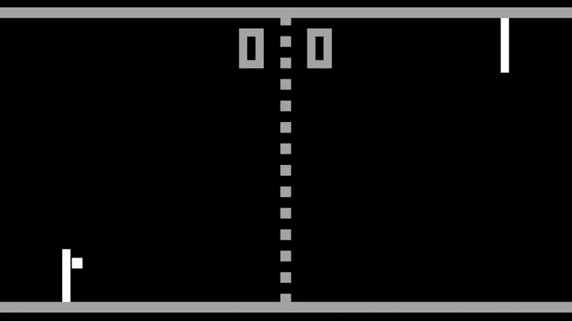

# 区块链和密码已经准备好解决游戏行业的问题

> 原文：<https://medium.datadriveninvestor.com/blockchain-and-crypto-are-ready-to-solve-the-gaming-industrys-problems-a01ff39a25ba?source=collection_archive---------8----------------------->

区块链技术已经能够在多个方面改变我们的生活方式。最大的公司开始采用它，甚至政府现在也在研究如何利用它变得更有效。但有一个价值数十亿美元的行业，颠覆的时机已经成熟。博彩业。

## 第一款电脑游戏

自从 1975 年第一款电脑游戏“乒乓”出现在我们的电视屏幕上以来，游戏产业从未停止增长。从那个不吉利的开始，凭借两个桨和一个像素球，市场已经看到世界各地的游戏玩家在 2018 年花费了大约 1380 亿美元。

The very first PC game “Pong”

## 区块链游戏

传统的游戏平台在开发方面形成了闭环:外部没有人能够构建不同版本的游戏平台，看到核心逻辑或使用现有的数据(资产)。在区块链中，大多数核心逻辑和数据(资产)都由智能合同管理，并且可以被分析和重用。

区块链游戏是去中心化的。区块链游戏资产(数字商品)不是生活在中央控制的服务器中，而是分布在‘玩家’之间。区块链游戏要么发行自己的令牌，要么使用现有的令牌(比如以太坊中的以太)。凭借精心设计的代币经济和游戏性，区块链游戏正在开启游戏行业的新时代。

 [## 5 行业转型区块链应用|数据驱动投资者

### 除非你一直生活在岩石下，否则我相信你现在已经听说过区块链了。而区块链…

www.datadriveninvestor.com](https://www.datadriveninvestor.com/2019/02/13/5-real-world-blockchain-applications/) 

真正的所有权、去中心化的游戏、可证明公平的游戏玩法、通过游戏玩法(play-to-earn)获得密码、全球排行榜、审查阻力以及开发者无需管理的基础设施，这些只是区块链游戏被吹捧的优势中的一部分。

## 为游戏产业解决问题的方法

区块链和加密货币是完美的创新，非常适合解决游戏行业的问题，并为玩家提供更加完整和自由的游戏体验。

1.  **提高支付处理的成本效益**

博彩业可以从世界各地进入。尽管玩家有机会利用法定货币，但就成本效益而言，它们并不有效。玩家必须支付昂贵的费用来利用在线游戏。

有了区块链，游戏玩家可以远离他们的借记卡或信用卡。无论支付金额有多小，这项技术都为其提供了一种去中心化的方法。骗子没有办法窃取信息或操纵该部门。

**2。最大限度减少欺诈活动**

博彩业遭受网络欺诈的打击最大。因此，该行业一直在寻找可以节省损失收入的技术。

区块链可以通过根除每一个欺诈机会来节省数十亿美元。像 B2Expand 这样的公司已经开始使用加密经济来减少欺诈活动。

**3。储存安全和安保**

游戏道具不断面临黑客的安全威胁。因此，在线存储数据对游戏公司来说似乎是一种风险。但是区块链加密已经成为一种可持续的解决方案。

用区块链加密法存储的数据使黑客无法破解。这项技术需要在正确的时间使用正确的节点才能突破。这就是为什么游戏物品获得了双重安全保护。

**4。更好地控制游戏经济**

政府可以禁止或调节一个行业的经济。严苛的法规催生黑市，这对任何行业都不是好事。游戏公司也受到这个问题的困扰。游戏开发商正在失去对这一行业的控制。这损害了他们获得最大收益的能力。

有了区块链，就不需要制定政策了。开发者可以不断地从每个游戏生态系统中收取版税。此外，区块链允许游戏开发商开始或停止出售资产，没有任何限制。

**5。降低游戏项目的价格**

游戏项目的高价格限制了开发商的客户群。这也是游戏玩家在数字市场寻找被盗游戏物品的一个原因。然而，区块链带来了负担得起的微交易好处。这可以让开发商在不损失利润的情况下以便宜的价格出售他们的电源。此外，用户可以在玩在线游戏时控制自己的支出。

***可见，区块链和加密货币是安全和蓬勃发展的游戏行业的未来。该行业的增长将在未来几年继续增长。这是必然的！***

***如果您想了解更多，请访问 BIDITEX 页面并提出您的问题，关注我们的*** [***推特***](https://twitter.com/biditex_com) ***，*** [***脸书***](https://www.facebook.com/biditex/) ***，*** [***中型***](https://medium.com/@biditex) ***，*** 用[***bidi tex***](http://www.biditex.com/)***投标你的空格。***