# 加密货币背后的技术是如何工作的？

> 原文：<https://medium.datadriveninvestor.com/blockchain-and-cryptoeconomics-how-it-works-1b4b5125abdd?source=collection_archive---------24----------------------->

Cryptocurrency and Cryptoeconomics

最近，锁链在几个行业越来越受欢迎，这篇文章的目的是讨论加密货币背后的技术，包括许可和非许可的区块链。

# 介绍…

区块链可以在隐私、安全和数据共享等技术领域解决问题，提高效率。

我们将要谈论各个方面，例如:

*   区块链
*   分散
*   处理
*   比特币
*   数据库比较
*   智能合约(以太坊)
*   秘密经济学
*   共识算法
*   采用中的挑战

# 区块链

区块链有助于摆脱大多数公司拥有的集中的“一个真实来源”的庞大数据库。

自从软件和数据库出现以来，两者之间的不同交互模式已经发生了巨大的变化，人们试图摆脱集中式计算。

将软件分割成更小的块、微服务和迁移到云中提高了可靠性和可扩展性，但通常会保留一个巨大的整体数据库。

Monolith

# 分散

这可以通过分散式系统来改善，但最终目标将是一个完全分布式的系统。

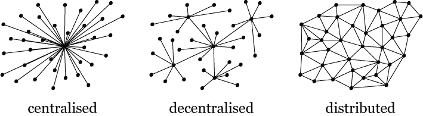

Visual representation of centralised, decentralised and distributed models.

区块链是一种分布式平台技术，这基本上意味着它是一种驻留在多个计算设备上的数据结构，通常分布在多个设备和区域上。

分布式账本技术在比特币之前就已经存在，但比特币汇集了一些核心思想，涉及时间戳、P2P、密码学和共享计算能力。

 [## Azbit 旨在连接传统金融和加密货币|数据驱动的投资者

### Azbit 是下一个提供交易平台的加密项目，该平台提供保证金和算法交易。一样多…

www.datadriveninvestor.com](https://www.datadriveninvestor.com/2019/03/20/azbit-aims-to-connect-traditional-finance-and-cryptocurrency/) 

对分布式账本技术的一个很好的描述可以概括为:

*   捕获分类帐当前状态的数据结构
*   改变分类帐状态的交易
*   允许接受交易的协议

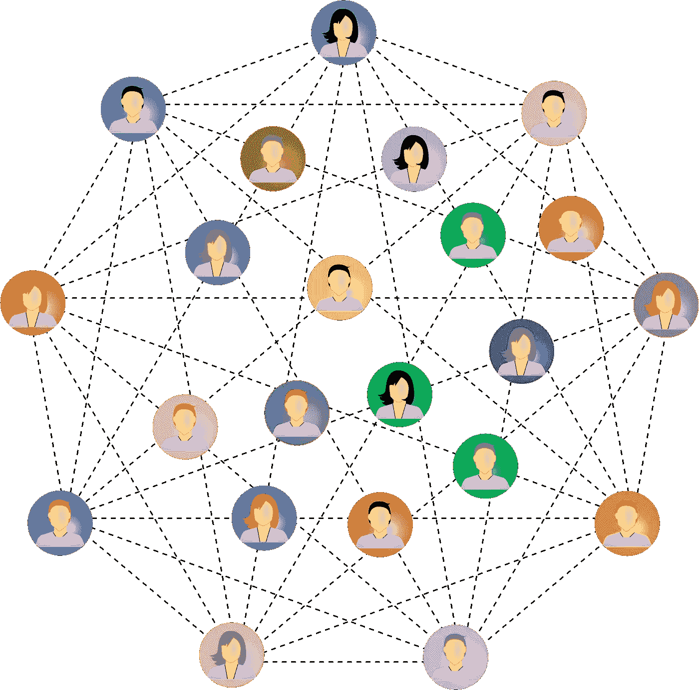

Connected

# 处理

区块链将跟踪各种资产交易，并将它们分组。在一个块中可以有任意数量的这些交易。

区块链网络组上的节点上传事务并通过网络发送它们。

所有对等体通过协议同步交易，最终每个节点将包含最新版本的分类账。

一些区块链有智能合约的概念。智能合约只是在满足特定条件时执行的预定义操作。

Transaction

# 但是什么是区块链呢？

区块链是一个非常宽泛的术语，与互联网这个词相当，它是对更广泛概念的描述，而不是实际技术。

区块链是一种基本形式，是按时间顺序排列的交易区块链，它们被捆绑在一起并添加到一个链中，同时跨越一个分布式网络。

区块链过去被称为分布式账本技术中的特定数据结构，但现在许多人使用术语区块链来指代任何东西，从加密货币到分布式账本技术的企业部署。

Blockchain

# 让我们提一下比特币

比特币是一种加密货币。它是一种去中心化的数字货币，没有中央银行或单一管理员，可以在点对点比特币网络上从一个用户发送到另一个用户，无需中介

Miner 节点将未确认和有效的事务捆绑到一个块中。然后，矿工们必须解决一个加密难题，以提出下一个区块。人们将此称为“工作证明”。

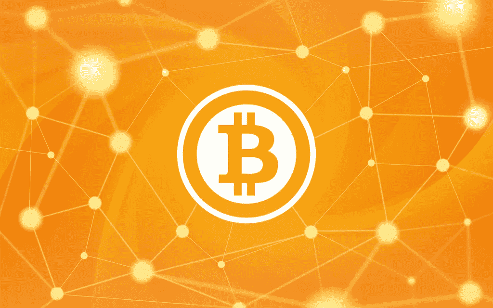

Bitcoin

一个块由 4 段元数据组成。

*   对前一个块的引用
*   工作证明(称为 nonce)
*   时间戳
*   对事务的 merkle 树根的引用

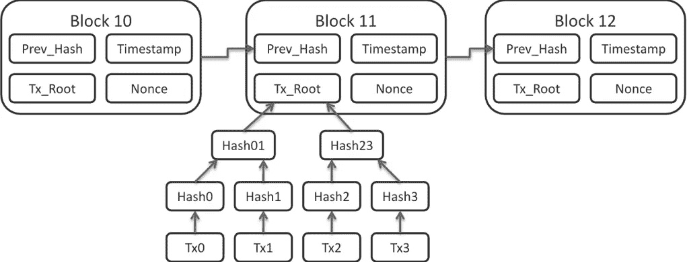

Diagram of how bitcoin stores its metadata

# 为什么区块链技术这么好？

区块链在互不信任的各方之间建立了分布式共识，同时创建了共享的即时真理源。

相比之下，一些银行会在一天结束时进行对账，一些商店会在一天结束时处理所有销售并更新库存水平，为第二天做好准备。

理论上，你可以在任何时候从任何节点查看整个交易链，并且知道你收到的信息是好的。

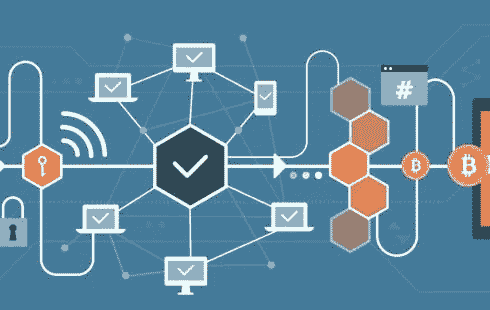

Transactions

# 区块链和数据库有什么区别？

区块链是一种只写的数据结构，下一条记录总是写在链的末尾。

这是通过每个块引用前一个块来实现的，这意味着没有一种简单的方法来编辑或删除区块链中的数据，并且试图这样做将非常容易被检测到。

相比之下，数据库管理员或可能改变某些数据状态的应用程序可以很容易地操作和更改数据库。

区块链我们被设计成去中心化的，那里的数据库通常被设计成中心化的，或者倾向于有一个单一的“主”节点来控制数据。

Data transfer

# 智能合同

智能合约是一些代码，当满足某些条件时，它们会执行预定义的操作。

这允许修改分类帐状态，或者促进某种资产的转移，或者可以验证或协商某种法律合同。它们因以太坊区块链而流行起来。

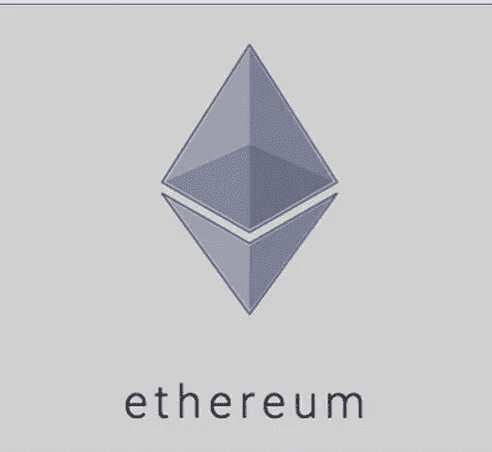

Ethereum

# 以太网智能合同示例

在股权融资中，在收到公司股份后，从投资者处转移 X 金额给公司。

X 的货币价值已由该公司就该交易预先确认。该金额由智能合约持有，直至收到股份。

*   智能合约对融资公司和投资者之间的协议进行了编码
*   智能合约位于以太坊公共区块链。一旦某个事件被触发，例如到期日或预先编码的执行价格，智能合约就会执行其逻辑。
*   如果需要的话，监管者可以在不暴露具体参与方身份的情况下审查市场活动。

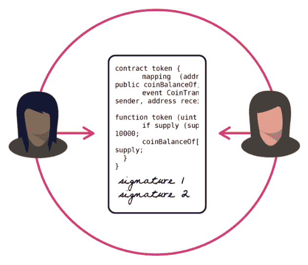

# 以太坊区块链的另一个应用例子

查看网站 [https://stamp.io](https://stamp.io/)

你可以把一份文件上传到区块链以太坊。

Stamp.io 会返回一个证书，然后你就可以在区块链公共以太坊上查看你的交易了

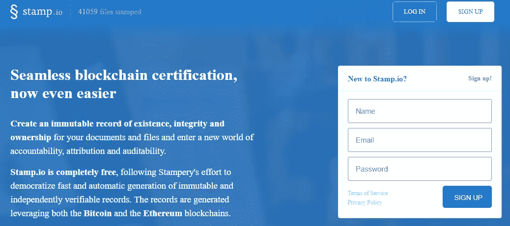

stamp.io

# 为什么要创造这些技术，它们解决了什么问题？

比特币于 2009 年发行，以应对当时的全球金融危机。这个想法是在没有中介的情况下通过互联网转移价值。比特币本质上是可编程的货币。

以太坊是为了应对比特币而创建的，它有一套更广泛的 API，并允许智能合约。

以太坊区块链的核心是运行在以太坊网络上的 EVM(以太坊虚拟机)。与比特币不同，以太坊不只是追踪交易。

# 什么是密码经济学？

密码经济学是关于建立系统，该系统具有某些期望的属性，使用密码学来证明过去发生的消息的属性，同时使用系统内部定义的经济激励。

比特币等无需许可的区块链是公开的、开放的，而不是强加准入门槛。但是，这也意味着它们对恶意攻击者开放。

通过奖励良好行为来防止这种情况，以便:

*   恶意攻击者无法通过升级攻击来接管系统
*   恶意攻击者无法进行有组织的多数攻击
*   保护的收益高于攻击的收益

# 共识算法

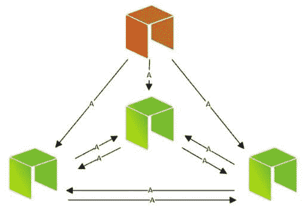

Consensus Algoritms

共识是网络参与者就系统中数据的正确状态达成一致的过程。

它做两件事:

*   确保网络上每个节点的数据都相同
*   防止恶意行为者更改信息。

比特币挖矿是共识算法的一个例子，尽管还有其他例子。

## 工作证明

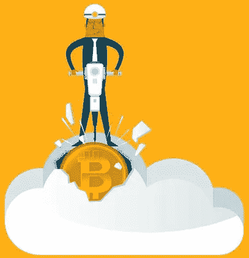

PoW 在比特币内部使用，通常被称为挖矿。为了在区块链上添加新的块，必须解决计算上的挑战。

“采矿”的动机是一种经济回报。

工作证明很难创建，但很容易验证，你可以把它比作密码锁。要猜出一把密码锁的正确数字序列真的很难，但是一旦你知道了密码，就很容易验证了，因为它打开了锁。

工作证明需要排出巨大的能量，每块通常需要 10 分钟左右的时间来挖矿。

采矿集中在能源廉价的国家。

## 利害关系证明

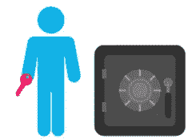

在 PoS 中，节点被称为验证器，而不是挖掘器。当一个节点验证时，它赚取少量的交易费。

随机选择节点来验证块，选择的概率基于已经持有的股份。这节省了创建下一个块所需的大量计算资源。

选择如何工作的示例:如果节点 X 已经验证并获得 2 枚硬币，而节点 Y 有 1 枚硬币，则节点 X 被调用来验证一批交易的可能性是 2 倍。

## 经过时间的证明

PoET 模仿比特币工作证明的挖掘风格，但不是竞争解决加密挑战，而是随机抽奖，并基于先到先得的原则工作。每个验证器都有一个随机的等待时间。

获胜者创建链上的下一个块。

## 权威证明

PoA 使用一组授权，它们是指定的节点，被允许在链上创建块。使用 PoA 的分类账需要大多数授权节点的签核，以便创建块。

# 采用和部署分布式分类帐技术的挑战。

目前，有很多挑战。

*   缺乏标准
*   监管挑战
*   缺乏知识

## 标准

标准需要到位，以确保互操作性和防止一个支离破碎的生态系统。不仅需要为区块链创建标准，还需要为其上使用的服务创建标准，如隐私、身份和数据治理。

2016 年，区块链和分布式账本技术国际标准化组织成立。

## 规程

缺乏监管会给所有参与者带来不确定性。高度监管的行业，如金融业，正在非常谨慎地使用分布式账本技术，因为目前还没有针对智能合同的监管准则。

这很可能是阻止快速采用 DLT 的主要原因之一。

## 缺乏专业知识

区块链一般正在获得更多的牵引力，人们对它越来越感兴趣，但区块链仍然缺乏技术人才