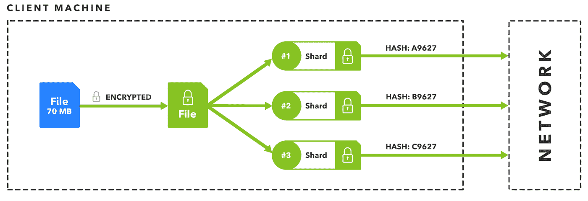
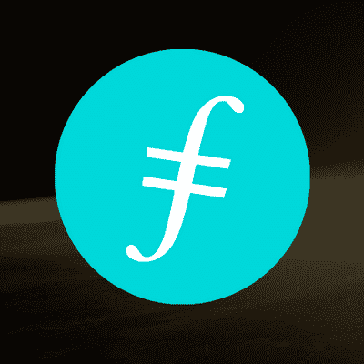
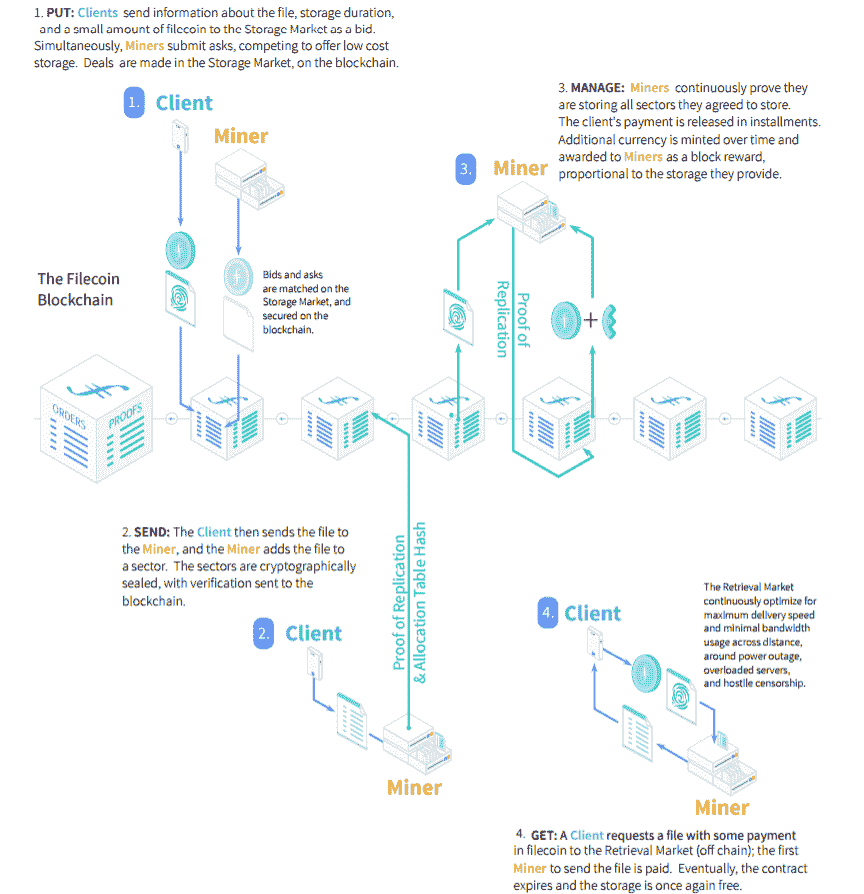

# 区块链和数据存储:3 个有前途的项目

> 原文：<https://medium.datadriveninvestor.com/blockchain-and-data-storage-3-promising-projects-bffbdbefe0a9?source=collection_archive---------7----------------------->

在我们的[上一篇文章](http://www.datadriveninvestor.com/2018/09/05/blockchain-and-data-storage-a-perfect-match/)中，我们概述了区块链技术如何为更安全、更私密、更具成本效益的数据存储模式提供令牌化激励。因此，我们可能会看到目前主导市场的集中式云存储系统出现重大中断。

然而，大多数基于区块链的存储项目仍然需要大量开发，尤其是在扩展方面。对最终将会取得什么样的成就的期待不断增加。

我们现在来看看迄今为止最有前途的三个项目。

# 斯托尔杰

Storj 于 2014 年推出，最初是为基于比特币的交易对手平台开发的令牌，后来在 2017 年夏天作为 ERC20 令牌迁移到以太坊。大约在同一时间，一个新的 3000 万美元的 ICO 也成功完成。

Storj 的主要目标是通过使用其令牌来激励人们(被称为“农民”)将数据存储在他们的硬盘空间上，从而打破传统的集中式数据存储模式。这个想法是让用户上传文件，这些文件经过加密、分片，然后通过网络以小块的形式发送给农民进行存储。与此同时，*的农民*出租他们的硬盘来存储数据。

[*来源*](https://decentralize.today/simplifying-the-storj-whitepaper-ef38ad0ea7de)

Storj 的核心技术本身包括可执行的 P2P 存储合同，规定了农民和用户如何交换文件进行支付。在数据从用户转移到农民手中进行存储之前，双方可以协商一份合同。

为了让对等体更有效地连接，Storj 使用了分布式哈希表(DHT ),在我们的[上一篇文章](http://www.datadriveninvestor.com/2018/09/05/blockchain-and-data-storage-a-perfect-match/)中有简要的解释。网络对等体可以更容易地在 DHTs 下协商合同，以及传输数据，验证远程数据的完整性和可用性，并向其他节点付款。

Storj Share 也提升了网络性能，这是一个允许用户在任何机器上开始耕作的工具。Storj Share 图形用户界面(GUI)允许此类农民将其额外的硬盘空间出租给 Storj 网络，为此，他们将收到 Storj 令牌，以获得主机上已利用的资源(存储和带宽)。

签约系统和网络一起构成了 Storj 协议。

**挑战**

新的 Storj 用户和农民目前被列入等候名单。这主要归因于自网络存储数据达到 1 亿千兆字节以来出现的可扩展性挑战。尽管迄今为止，这样的存储容量对于区块链项目来说是相当可观的，但它仍远远落后于亚马逊网络服务(Amazon Web Services)等集中式竞争对手。

因此，该团队决定暂时限制网络访问，因为它的目标是实现下一个 1 [艾字节](https://en.wikipedia.org/wiki/Exabyte)的容量目标。作为期待已久的网络升级 V3 的一部分，这很可能会实现，预计 V3 还将引入缓冲视频流等服务，并为 AWS 用户提供将 Storj 集成到其平台以增强隐私的机会。虽然 V3 的发布日期尚未宣布，但据报道工作正在[进行](https://blog.storj.io/post/176743349808/development-update-4-from-storj-labs)，而与 Storj 实验室领导的[定于 9 月的市政厅](https://blog.storj.io/post/176962790373/join-the-storj-labs-town-hall-on-september-12)可能会提供更具体的答案。

还应该提到的是，Storj 本身并不运行自己的区块链，而是作为以太坊上的一个分散式应用程序。尽管实际的文件存储是分散的，但向农民付款的过程是由 Storj Labs 决定的。事实上，Storj 创建了“桥”，这是一个允许各种应用程序与网络通信的集中式管道，这意味着向农民付款、合同谈判和审计以及网络上的其他重要功能仍然是集中式的。

抛开这些考虑因素，就存储的数据量而言，Storj 仍然是最古老、最常用的区块链存储项目。如果该团队能够提高其存储容量，那么它将成为分散式文件存储领域的市场领导者。

# 希雅·凯特·伊索贝尔·富勒

Sia 的存储模式与 Storj 使用的模式并非完全不同。然而，有几个关键的差异，可以说，使新航是目前市场上的首选。

首先，Sia 目前有一个工作产品。你可以运行软件，将加密文件分割成更小的片段，然后上传并分发给世界各地的农民，他们负责在需要时返回数据。

Sia 还使用 [Reed-Solomon 擦除编码](https://en.wikipedia.org/wiki/Reed%E2%80%93Solomon_error_correction)，它允许农民持有的大量文件段离线，但仍能完全恢复用户的文件。例如，在 30 台主机中，如果用户想要取回他们的数据，他们需要至少 10 台在线。

不过，与 Storj 不同的是，新航运营着自己的区块链。这不仅允许文件存储过程去中心化，还允许用户和农民之间的存储契约(因此不需要 Storj Bridge 的等价物)。存储协议是一种智能合同，允许双方确定定价(以 Siacoins 计价)和其他事项，如正常运行时间承诺。

双方最初将 Siacoin 纳入合同——用户的钱代表合同履行后向农民支付的款项，而农民的钱是抵押品，如果农民未能按照合同规定提供托管服务，则可能被没收。因此，抵押品是农民下线的一个强有力的抑制因素。

区块链用于存储合同并使其可公开审计，同时也是双方的托管设施。合同完成后，农场主向区块链提供文件被存储的证明，之后抵押品被返还，用户的付款被转移给农场主。

用户和农民都使用 Siacoin 来买卖存储空间，因此具有由市场决定的浮动价格。它还用于向 Sia 区块链工作证明的矿工支付工资，这意味着人们可以通过出租硬盘空间用于文件托管来赚取 Siacoin，或者通过挖掘加密货币和赢得区块奖励来赚取 Sia coin。

**挑战**

新航最直接的挑战之一是扩大用户群。目前，有很多人对交易 Siacoin 感兴趣，但没有多少人将这项服务用于存储数据的预期目的。这是影响数字资产生态系统的最重要的问题之一——使用和囤积令牌以获得预期未来收益之间的权衡。

它的用户群也受到一些关键问题的限制。首先，这个软件肯定不是用户友好的——它需要几个小时来安装。网络节点目前也只能上传最多 5TB 的数据，这很可能会将较大的企业排除在外。也许最令人担心的是，由于 Sia 不支持数据备份或恢复，如果您的机器崩溃，您将丢失所有上传到 Sia 的文件。

如果团队未能解决这些问题，Siacoin 的价值可能会开始下降，这可能会使其成为解决数据存储问题的更低成本的替代方案。

也就是说，Sia 已经节省了大量成本，其云存储成本比现有云存储提供商平均低 90%。与许多其他数据存储平台不同，鉴于 Sia 已经启动并运行，它在当前的分散文件存储提供商中处于领先地位。

# Filecoin

去年，Filecoin 的 ICO 成为当时有记录以来最大的代币销售，筹集了 2.57 亿美元(仍然轻松进入前十)。虽然它还没有推出，但人们对它可能成为一种独特的文件存储方法有很多期待。

由“[网络协议研究、开发和部署实验室”Protocol Labs 开发的“T3”Filecoin 建立在“](https://protocol.ai/blog/protocol-labs-creating-new-networks/) [IPFS(星际文件系统)](https://ipfs.io/)之上，这是一个 P2P 文件共享系统，旨在改变数据在世界各地的分布方式。事实上，IPFS 雄心勃勃，想要取代 HTTP 成为分散网络的新协议。它已经被一些 dapps 采用，例如 [DTube](https://about.d.tube/) ，它使用该系统存储其所有视频。

在 IPFS 之上，Filecoin 添加了它的令牌来创建一个市场，激励农民为用户存储文件。矿工通过向网络提供开放的硬盘空间来赚取 Filecoin，而用户则花费 Filecoin 来存储他们在去中心化网络中加密的文件。

Filecoin 网络包含两种类型的节点

1.  存储节点，类似于 Storj 的农民，他们可以出租自己的硬盘来托管数据；
2.  检索节点，位于存储节点附近，为用户查找和检索文件最快而获得报酬。

此外，与新航一样(但与 Storj 不同)，Filecoin 将在自己的区块链上运营，这意味着合同谈判和支付等流程也可以下放。一层将用于使用 IPFS 的分布式文件存储，另一层将维护合同。

但 Filecoin 没有使用 PoW，而是使用了一种新的共识机制，称为存储证明，它涉及两个独立的方案

1.  [复制验证(PoRep)](https://web.stanford.edu/~bfisch/porep.pdf) ，允许存储主机让用户相信数据已经复制到其唯一专用的物理存储中。根据[白皮书](https://filecoin.io/filecoin.pdf)，PoRep 还可以防止网络上的 Sybil 攻击、外包攻击和生成攻击。
2.  时空证明(PoST)，提供时间戳验证，表明主机正在存储数据。

白皮书提到，该团队的目标是设计一个基于存储用户数据的有用工作的共识协议，与比特币的 PoW 相比，它可以减少浪费的工作和能源消耗。

矿工也会因为托管文件而获得 Filecoin 代币奖励。但是，他们必须提供验证，证明他们正在复制文件以获得更高的存储安全性。然而，与 Sia/Storj 不同，Filecoin 矿商也可以是 IPFS 的农民。

[*来源*](https://coincentral.com/filecoin-beginners-guide-largest-ever-ico/)

在这个阶段，Filecoin 似乎仍然处于开发模式。随着[除了](https://filecoin.io/blog/)[一个演示](https://www.youtube.com/watch?v=kW6e1GCpqpE&feature=youtu.be&t=6h53m41s)之外，几乎没有什么更新，有越来越多的猜测(或者可能是惊愕)关于该项目是否会在今年推出——或者甚至根本不会推出。

鉴于该项目得到了包括安德森·霍洛维茨和文克莱沃斯资本在内的顶级风险投资公司的支持，并且它在协议实验室团队中拥有丰富的经验，Filecoin 肯定有机会在分散存储市场中占据一席之地。

*原载于 2018 年 9 月 11 日*[*www.datadriveninvestor.com*](http://www.datadriveninvestor.com/2018/09/11/blockchain-and-data-storage-3-promising-projects/)*。*