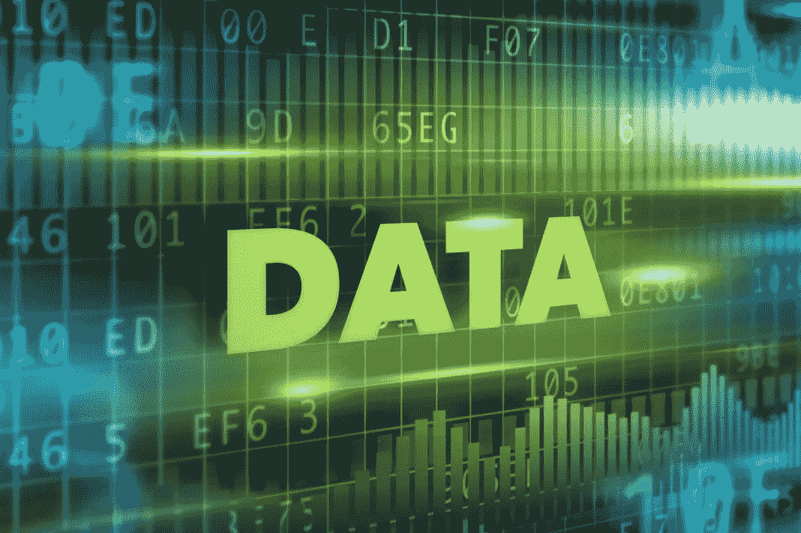

# 区块链和数据存储:绝配？

> 原文：<https://medium.datadriveninvestor.com/blockchain-and-data-storage-a-perfect-match-d0e715b90497?source=collection_archive---------0----------------------->

数据。它正迅速成为世界上最珍贵的资源之一。事实上，它最近的扩散实际上是我们在[数据驱动投资者](http://www.datadriveninvestor.com/)的*存在的理由*。

当然，我们 DDI 的人不是唯一相信数据力量的人。即使粗略地看一下[全球市值前十大公司](https://www.pwc.com/gx/en/audit-services/assets/pdf/global-top-100-companies-2018-report.pdf)，也能看出亚马逊、脸书和微软等渴求数据的科技公司令人生畏的统治地位。所有这些公司都将在未来几年释放大量数据，许多其他公司也是如此。

因此，考虑到世界现在预期的数据冲击，我们存储数据的能力必须变得越强。这不仅适用于大数据，也适用于我们自己的个人数据。毕竟，数据在未来提供的效用越多，它就越会受到黑客不必要的关注。

事实上，我们已经看到了这一幕，近年来对 Equifax 和 Anthem 的灾难性破坏证明，在集中式服务器上存储有价值的、通常高度敏感的信息非常容易被窃取，并且对存储提供商来说成本非常高。

“photo of optical disc drive” by [Patrick Lindenberg](https://unsplash.com/@heapdump?utm_source=medium&utm_medium=referral) on [Unsplash](https://unsplash.com?utm_source=medium&utm_medium=referral)

# 文件存储的分散体系结构有助于…

分散式文件存储绝不是一个新概念。如果你在 20 世纪 90 年代末或 21 世纪初疯狂下载 mp3 音乐文件，那么你很可能熟悉 Bittorrent 和 Limewire。

这些点对点(P2P)程序不是从中央服务器下载文件，而是使一个文件首先由一台计算机托管(或“播种”)，然后被分成更小的块，然后分布在也试图下载该文件的计算机网络中。

这最终允许每个网络节点从它们的对等节点下载文件的各个部分，同时也将文件的其他部分上载到其他对等节点。分散化还应该提高下载速度，因为文件是从多个节点下载的，而不是从一个集中的服务器下载的。

但是这种模式也出现了一些问题:

1.  如果一台计算机在网络中的其他计算机之前完成了文件的下载，几乎没有什么可以阻止所有者在完成时关闭他的机器，这意味着在某些情况下，网络中的其他计算机可能永远不会收到文件的完整副本。
2.  播种不太受欢迎的文件的动机就更少了，这会使下载它们变得不太可靠，而且通常很慢。因为播种会占用带宽，所以没有动力继续托管这样的文件。

因此，应该激励节点在所有条件下继续托管数据…

“worm's eye-view photography of ceiling” by [Joshua Sortino](https://unsplash.com/@sortino?utm_source=medium&utm_medium=referral) on [Unsplash](https://unsplash.com?utm_source=medium&utm_medium=referral)

# 区块链疗法

区块链现在通过向人们提供具有货币价值的令牌来激励他们继续托管数据。

这种模式包括 P2P 网络中的“农民”,即在网络上提供存储空间的实体，以及托管数据并因此获得代币报酬的实体。一些项目要求农民通过智能合同抵押抵押品，这样他们可以保证足够的正常运行时间来托管数据。但最终，以密码形式获得潜在利润回报的机会阻止了农民关掉电脑。

但是，正如基于区块链的应用程序经常出现的情况，可伸缩性是一个问题。在这一阶段，有两种特定的技术被用来应对这一挑战:

*   分片—一种在数据库中逻辑划分数据的技术。数据被分解成“碎片”,当这些碎片被重新拼凑在一起时，就形成了原始数据库。
*   群集——这是一个将碎片集中存储在 P2P 网络中的一大组节点(群集)中的过程。然后，群内的设备可以方便地从最近的节点检索数据，最终减少延迟，提高可靠性和可扩展性。

类似于分散式文件存储的 torrenting 模型，文件被上传、分片并分发到整个网络中的节点。这确保了如果一个节点出现故障，其余的节点仍然可以从分布在整个网络中的碎片构建文件。此外，为了增加安全性，文件被加密，这防止节点能够解密文件包含的内容。

为了召回一个文件，使用一个[分布式哈希表](https://en.wikipedia.org/wiki/Distributed_hash_table)——一个包含相关键和值的列表，其中包含指向数据存在位置的指针——来定位文件的所有碎片。然后，在文件所有者使用私钥解密文件以供使用之前，网络可以使用碎片来重建文件。

# 使用区块链存储数据的 3 大优势

1.  这比亚马逊网络服务等单点故障的集中式云服务更难破解。存储的分散性质，加上分片和加密等过程，意味着那些设法破坏节点的黑客将只能访问一小部分加密的数据。然后，他们必须找到并解密其他节点上的所有其他碎片，才能理解这些数据。
2.  分散式文件存储比集中式存储解决方案或维护您自己的服务器更便宜。这主要是因为它不需要像云存储公司那样运行庞大的服务器群。以存储项目 [Sia](https://sia.tech/) 为例(我们将在下一篇文章中更深入地讨论)。据报道，Sia 的分散式云存储平均成本比现有的云存储提供商低 90%，而在 Sia 上存储 1TB 的文件每月成本约为 2 美元，而亚马逊网络服务的 S3 服务则为 23 美元。
3.  奖励制度意味着，如果你有额外的存储空间，你可以出租免费空间，并赚取回报。显然，如果这种模型在消费者需求和可用性方面取得成功，代币本身的价值应该会大幅升值。这意味着你的农业服务最终会产生健康的回报。

# 那么，数据存储和区块链是完美的组合吗？

还没有。虽然区块链被吹捧为解决了一系列与集中存储相关的数据安全和透明问题，但它并不完全是现有解决方案(如 AWS 和 Dropbox)的首选。以下是几个原因:

1.  尽管缩放技术正被用来提高文件的速度和可检索性，但基于区块链的数据存储解决方案的分散和分布式本质意味着它将很难与 AWS 这样的公司竞争。虽然新的区块链公司可以满足消费级需求，但在支持企业的大数据需求方面，它们仍未经证实。
2.  加密*永远*管用吗？目前，诸如不对称加密之类的加密技术通过创建两个相关的密钥来工作。虽然加密使用任何人都可以使用的公钥，但文件只能由拥有相应私钥的所有者解密。虽然这种方法目前是安全的，但不能保证量子计算等强大的技术在未来不会设法克服这种安全性并解密文件。
3.  有了 Dropbox，一旦你不想保存你的文件，你可以简单地删除它。相比之下，区块链涉及存储在不可变链上的文件引用，而文件本身存在于潜在的数百个网络节点上。这使得确保文件被完全删除变得相当困难。自从最近引入新的数据隐私法以来，这变得更加相关，例如 [GDPR](https://www.eugdpr.org/) ，其中“[被遗忘权](http://data.consilium.europa.eu/doc/document/ST-5419-2016-INIT/en/pdf)”要求公司应要求删除个人的个人数据。事实上，在这个阶段还不清楚数据是否可以存储在不可变的区块链上，同时仍然遵守这一义务。

不言而喻，正如许多有前途的区块链应用程序一样，数据存储仍处于发展的早期阶段。缩放问题很可能被克服，而更健壮的安全和加密技术必定会被开发出来。事实上，现在有一些区块链项目正在寻求将数据存储带入一个新时代。在下一篇文章中，我们将调查这些项目中最有前途的。

*原载于 2018 年 9 月 5 日*[*www.datadriveninvestor.com*](http://www.datadriveninvestor.com/2018/09/05/blockchain-and-data-storage-a-perfect-match/)*。*