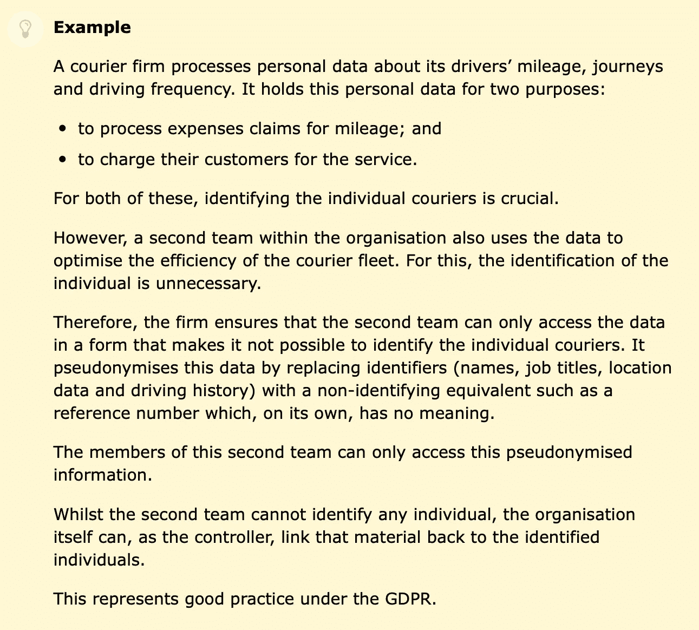

# 区块链和 GDPR

> 原文：<https://medium.datadriveninvestor.com/blockchain-and-gdpr-e1a968b1b91a?source=collection_archive---------22----------------------->

现在，围绕 GDPR 的大部分愤怒已经平息，组织越来越多地考虑如何更好地遵守立法，我觉得这是一个挑战这些想法的好时机，我最初是在迈克尔·巴克斯特关于 GDPR 的一篇文章中读到这些想法的:2018 年 8 月发表的报告。

在 Michael 的文章中，他认为分布式账本技术(DLT)本质上不符合 GDPR 法规，尽管做出了让步，一些实体正在尝试添加删除数据的功能，但这仍然不够。然而，我认为 DLT 在本质上是合规的，许多网络都是围绕数据匿名的概念构建的，我认为应该有可能为一个既合规又允许客户放心提供数据的组织构建一个数据解决方案。

我们将从定义几个术语开始；客户是指组织的数据源，用户是指访问数据的组织或授权方，本地数据库是指可在本地访问但不能访问互联网的数据库。

让我们考虑英国信息专员办公室的[例子](https://ico.org.uk/for-organisations/guide-to-the-general-data-protection-regulation-gdpr/what-is-personal-data/what-is-personal-data/)，一家快递公司试图符合 GDPR 标准。我们可以将每个客户的数据输入到我们的组织数据库中，首先将数据输入到我们的 DLT 应用程序中，并接收该客户的公共和私有链标识。然后，我们存储客户的识别因素(姓名、地址等。)连同配对的公钥-私钥一起存储在本地数据库中。数据现在是匿名的，我们可以只向那些需要访问的部门提供识别因素，这将符合 GDPR。

Sourced from ICO [here](https://ico.org.uk/for-organisations/guide-to-the-general-data-protection-regulation-gdpr/what-is-personal-data/what-is-personal-data/).

如果客户希望根据“被遗忘权”立法删除他们的数据，我们只需删除本地数据库中的识别因素标签，数据现在已被匿名化，不再被视为私人或个人数据。

“为什么要大费周章地为可以存储在中央数据库中的东西建立一个 DLT？”我听到你问了。简而言之，客户会感到更安全，因为他们知道你可能保留在他们身上的任何剩余数据都被安全、永久地存储着。偏好的任何变化都将被记录在 DLT 中，并可以受到质疑，从而使组织对其有关存储的客户数据的决策更加负责。

客户通常意识到，他们的识别因素是这样的，因为他们已经以某种形式公开访问，这是个人偏好和意见，人们希望安全地存储，并与他们的公开访问数据分开。

目前有许多项目建立在 Hyperledger [Fabric](https://www.hyperledger.org) 的基础上，我很有兴趣看看 GDPR 和数据合规性将如何受到初创公司的影响，如 [Tap](https://tapmydata.com) ，这是一种免费使用的服务，由 DLT 支持，为你获取个人数据记录。

感谢您阅读我的文章，所有表达的观点都是我自己的。

泰国(Thailand)