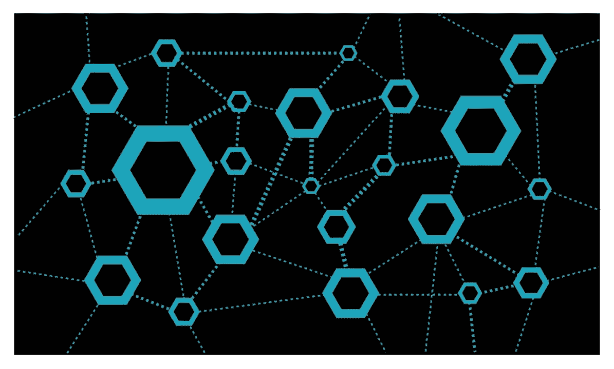
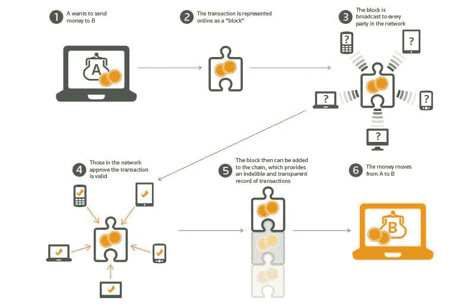

# 区块链及其在电信中的作用！

> 原文：<https://medium.datadriveninvestor.com/blockchain-and-its-role-in-telecommunications-48837c5a11f6?source=collection_archive---------1----------------------->

**什么是区块链？**

区块链是一个去中心化的软件平台，用于管理加密货币(比特币、以太网)等数字资产，其中所述技术允许用户直接与另一个用户进行交易，而无需任何第三方中介的参与。区块链被描述为记录数字交易的去中心化数据库或分布式账本。

**三种类型的区块链**:

在区块链中，一旦交易发生，一个矿工网络就会相互竞争，以验证交易区块是否正确，一旦交易区块得到验证，它们就会被纳入一个连续的交易链。它本质上是一个不可改变的交易记录，防止任何人对分类账做任何改动。

图 1:区块链是如何工作的

*图片来源* : [Thomsonreuters](https://blogs.thomsonreuters.com/answerson/blockchain-technology/)

**电信行业的区块链机遇**

电信行业已经在向虚拟化、人工智能、RPA 等方向进行数字化转型。因此，在等式中加入区块链无疑会为电信运营商的日常运营和未来准备提供一些可衡量和可量化的好处。

电信可以受益于区块链的几个用例:

用例 1:欺诈防范

在当前场景中，当用户漫游到伙伴网络时，伙伴网络通过一些数据交换所(DCH)发送作为离线机制的 CDRs 信息。DCH 随后负责将 TAP 文件发送到家庭网络。

解决方案:许可的区块链可以在每一对具有漫游协议的运营商之间实现。来自两个运营商的指定节点充当挖掘者，以验证通过从归属到访问者网络的漫游订户在网络上广播的每个交易的神圣性，其中漫游协议作为智能合同在归属和访问者网络之间实现，当包含 CDR 数据的交易通过订户(如语音呼叫或数据分组)在区块链网络上广播时触发该智能合同。每次用户在访问网络中触发事件时，VPMN 将 CDR 信息作为事务广播给 HPMN。该数据触发智能合约，并执行协议条款。因此，HPMN 可以根据所提供的服务自动计算账单金额，并将该信息发送回 VPMN。这有助于根据基于区块链的智能合同条款进行即时和可验证的授权以及结算。通信服务提供商还可以取消 DCH 作为中间人的角色，从而进一步节省成本。区块链将实现跨多方的复杂数据集，具有高度的实时信任和安全性，特别是建立用户身份。

用例 2:身份管理

电信公司可以期待为自己的服务提供集中的身份管理，并将其提供给 it 合作伙伴。使用区块链技术，身份认证可以跨设备、应用程序和不同组织应用。这将有助于用户/订户跨不同平台保持多个身份。基于区块链的平台可以通过使用带有身份验证的去中心化区块链原理，轻松实现跨设备和组织的认证。

用例 3:对内部流程的支持:

通过标准化和流程简化，区块链技术将支持许多 BSS/OSS 流程，如号码可移植性(用户可以保留同一号码并更换其服务提供商)、计费(预付费和后付费)SIM 卡供应(将移动服务激活到网络上)。

在号码可移植性方面，使用区块链技术，可以消除对第三方清算所的依赖，并通过自动化从一个运营商的区块链到另一个运营商的路由的整个过程来缩短时间。

用例 4:为 5G 做好准备

运营商可以轻松使用区块链来克服网络供应和实时处理方面的障碍，并减少实施 5G 网络所需的摩擦。通过使用智能合同来调用不同访问机制之间的规则和协议的自动执行以及网络资源(例如公共 Wi-Fi)的实时供应，区块链技术将有助于加快网络实施和与第三方增值服务交互的用户的管理。

如果你真的很喜欢这篇文章，并想看到更多这样的文章，请确保你给这篇文章 50 次关注。

【www.quora.com】最初发表于**。**