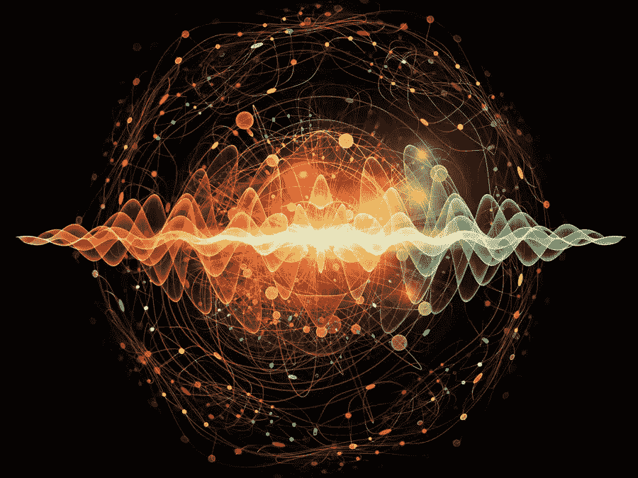

# 区块链和泡利不相容原理

> 原文：<https://medium.datadriveninvestor.com/blockchain-and-the-pauli-exclusion-principle-39713b67e9e6?source=collection_archive---------16----------------------->

关于每周的洞察力和灵感——查看我的 [**时事通讯！**](https://apsis.substack.com)

**双重支出问题**

最初的比特币白皮书奠定了区块链的基础。在摘要中，中本聪概述了这项新技术的一个革命性的方面。

> 我们提出了一种使用对等网络来解决重复花费问题的解决方案

首先，我想简要概述一下这篇开创性论文中概述的区块链系统的重要组成部分。然后，我想看看这项技术和自然的一个基本定律:泡利不相容原理之间奇怪的相似之处。

我有一张纸，上面记录了一群朋友之间所有的货币交易。我按照发生的顺序给它们编号，并要求交易双方在交易旁边签名以示证明。一些问题是显而易见的。理想情况下，作为这个名单的监护人，我的工作是检查没有人参与超过他们余额允许的交易，确保他们没有重复花费他们的钱。然而，作为这份文件的唯一保管人，我可以根据自己的判断轻松地增加或减少交易行。

区块链技术通过向每个交易成员提供他们自己的*交易列表的*副本，消除了中央权威(me)。另一个问题出现了——我们如何确保每个人都有这个分类账的相同副本？此外，我们如何将事务添加到一个副本中，并确保所有其他事务实时正确更新？为什么我不能直接编辑我的文案，给自己免费的钱？

鉴于没有中央权威机构，整个网络需要就单一交易历史达成一致。它以如下方式实现:分布式网络的每个成员接收一个事务列表。一定数量的这些被收集到*块*中，并且*工作证明*由网络中的节点计算。整个网络都认为真实的分类帐是计算工作量最大的分类帐。

这种做功的想法可以被认为是找到一个数学难题的困难解。计算工作与每一个事务块都有内在的联系，每个事务块都包含前一个事务块的一部分(事务块是链接的)。这意味着，如果你想回去伪造一个旧的交易，你不仅要改变特定的交易，而且要重做所有的工作，直到你的区块链和原来的一样长。只有这样，整个点对点网络*才会相信*你的账本是真实的。然而，这个过程是完全不可行的，因为所需的工作量将是天文数字。此外，当你忙于破解时，真正的区块链在不断增长，以至于你永远没有时间赶上。白皮书简明扼要地概述了这一概念:

> “网络通过将事务散列到正在进行的基于散列的工作证明链中来对事务进行时间戳标记，从而形成在不重做工作证明的情况下无法更改的记录。最长的链不仅证明了目睹的事件序列，还证明了它来自最大的 CPU 能力池。”

**泡利不相容原理**

指出没有两件事是完全相同的，这几乎是微不足道的。即使在高度优化的制造过程中，微小的缺陷也总是存在，明眼人会指出来。然而，在微观量子世界的领域，事情是不同的。电子是完全相同的，在某种程度上，没有任何宏观物体是相同的。没有办法区分它们。现代量子场论通过描述粒子电子是基础场的简单激发振动模式，使这一点变得一致。

> 没有两个费米子可以有完全相同的量子态

这是在我的一本本科量子课本中找到的泡利不相容原理的陈述。一个量子态由*量子数的特定配置来表示。*这些数字代表了自旋、角动量等参数。费米子是电子所属的一类基本粒子。费米子的*自旋*参数被限制为半整数值，而另一类基本粒子玻色子的自旋为整数值。

简而言之，该原理认为，对于任何两个电子，表示其量子态的数字永远不会相同。这不是沃尔夫冈·泡利制定的特别规则，而是量子力学规则的一个结果。在宏观世界中，我们可以通过指定物体的位置和动量(作为时间的函数)来表示物体的*状态*。从这个状态，我们可以计算出我们的物体在所有未来时刻会做什么。然而在微观世界中，状态是由状态向量来表示的。我们无法指定粒子的确切位置或动量(由海森堡测不准原理决定)，因此这种状态不包含物质的明确、确定的事实。它包含所有与情况相关的概率信息。泡利不相容原理是我们写多粒子电子系统的状态向量的结果。如果这些电子中的任何一个都有相同的量子数，那么这些状态将是无意义的。

**富足与匮乏**

开悟后，许多禅宗大师想出奇异的说法来概括他们的全部经历。这是多根众多短语中的一个:

> 放下身心——跳过富足和匮乏

跳过富足和匮乏——多么令人困惑的想法！我们生活在这样一个二分法的世界里，然而多根敦促我们超越它。超越——他的意思是拥抱这两个对立面的相互渗透的本质。区块链和泡利原理的表述阐明了它的含义。

我们有两个全球规则:一个管理宇宙，一个管理系统。一个被创造，另一个被发现。

> 你如何解决重复支出的问题？
> 
> 如何保证没有两个费米子处于同一个量子态？

泡利不相容原理来自量子力学——我们不需要确保粒子遵守它，因为它是我们以前科学的结果。没有不诚实的电子——它们中没有一个会偷偷溜进彼此相同的量子态。这个原理是电子不可分割的一个方面。它给了我们一种限制，一种缺失。例如，在一个原子的价层(外层)不可能有无限的电子。正是因为这种*缺乏*，我们才有了世界上*丰富*的分子。仅仅这个事实就产生了元素周期表和恒星的内部结构。

双重支出问题是富足和匮乏之间平衡的一个直观的、近乎平庸的例子。你不希望有人花掉他们已经花掉的钱——当他们缺少钱的时候，你不希望他们谎称钱多。这是事情变得有趣的地方，也是区块链开始反映自然的地方。*工作证明*与*块*是不可分的，系统以一种局部变化(试图恶意改变交易)具有全局影响的方式链接在一起(你需要重做每个先前的块)。同样，改变一个小系统中一个电子的量子态(局部改变)具有改变整个系统状态向量的全局效应。这种不可分割的联系不仅要求坚持一项原则，而且使之成为必要。我想这就是多根在描述跳过富足和匮乏时的意思。没有极性，我们永远无法生存——但接纳它们的关系才是给我们真正丰富的东西。

观察大自然如何运作是为我们自己的创作寻找灵感的好方法。无信任和自动遵守规则是大自然的标志——区块链成功地重新利用了这一技术。

*参考文献*

白皮书:[https://bitcoin.org/bitcoin.pdf](https://bitcoin.org/bitcoin.pdf)

区块链解释:[https://www.youtube.com/watch?v=bBC-nXj3Ng4&t = 768s&frags = pl % 2 wn](https://www.youtube.com/watch?v=bBC-nXj3Ng4&t=768s&frags=pl%2Cwn)

量子文本:格里菲斯的量子力学导论——尚卡尔的量子力学原理