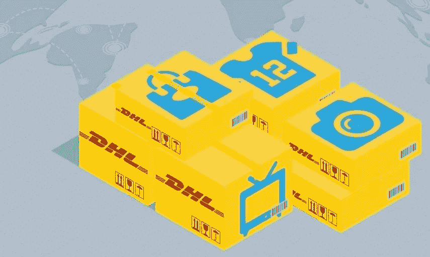
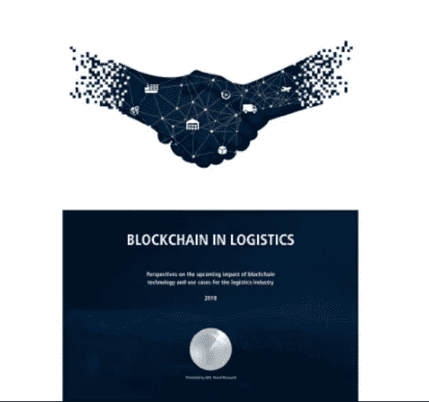

# 区块链和航运业

> 原文：<https://medium.datadriveninvestor.com/blockchain-and-the-shipping-industry-f135e73ebc87?source=collection_archive---------9----------------------->

在航运业工作了 7 年多之后，我对物流和国际贸易略知一二。而其中之一恰恰是行业对自动化、数字化的迫切需求。毫无疑问，技术工具就是区块链。

Giants logistics players as DHL are considering seriously the benefits of the blockchain for the shipping industry

在当今需要将某物从一个国家运送到另一个国家的步骤和程序的数量所导致的非常复杂的行业中，并且在没有一个公司大到能够提供完美的门到门服务的行业中(有时在一次运送中涉及大约 10 个不同的公司，考虑到海关代理、内陆运输、空运或海运以及货运代理)，很难实时准确地获知运送的精确位置。

出于这个原因，我真诚地相信，区块链不仅会把航运业变成一个更好、更透明的行业，而且会把目前的行业变成一个有可能完全数字化和自动化的新行业。

 [## 正在改变行业的 5 个真实世界区块链应用——数据驱动的投资者

### 除非你一直生活在岩石下，否则我相信你现在已经听说过区块链了。而区块链…

www.datadriveninvestor.com](https://www.datadriveninvestor.com/2019/02/13/5-real-world-blockchain-applications/) 

目前，航运业的大公司正在研究和探索区块链如何改善全球供应链的几种方法。基本上，区块链可以在物流业务中实施的主要方式如下:

-货物、文件和签名的证明和认证。

-装运的实时跟踪。

-用于支付的资金转移。

可能我甚至没有告诉该行业中的大玩家将使用的实际用途的一半。

最近我看了一份由 DHL 和埃森哲联合制作的名为“物流中的区块链”的文件。展望区块链技术对物流行业的未来影响和使用案例”(参见参考资料中的以下文档)，该文档揭示并定义了这一历史悠久的知名物流巨头的研发路线，以及中长期的业务前景。该文件还谈到了物流和航运业将受到的影响。

这份文件的意义是巨大的，因为它完美地暴露了大玩家在区块链的真实利益(当然还有数十亿美元)。到目前为止，我们只看到初创公司和小公司应用区块链解决方案来解决物流和运输问题。但是，当这个行业的大玩家，如 DHL 开始实施(全球或本地)区块链解决方案来解决现实生活中的物流问题时，这将是一个彻底的游戏改变。

总之，我现在还不清楚 DHL 将如何以及何时开始提供基于区块链的物流服务，但可以肯定的是，他们迟早会这样做，航运业的常规运营方式将永远改变物流业务。

参考

[https://www . logistics . DHL/content/dam/DHL/global/core/documents/pdf/GLO-core-区块链-trend-report.pdf](https://www.logistics.dhl/content/dam/dhl/global/core/documents/pdf/glo-core-blockchain-trend-report.pdf)