# 区块链作为游戏产业发展和货币化的新螺旋

> 原文：<https://medium.datadriveninvestor.com/blockchain-as-a-new-spiral-of-the-gaming-industry-development-and-monetization-ab5df6663646?source=collection_archive---------0----------------------->

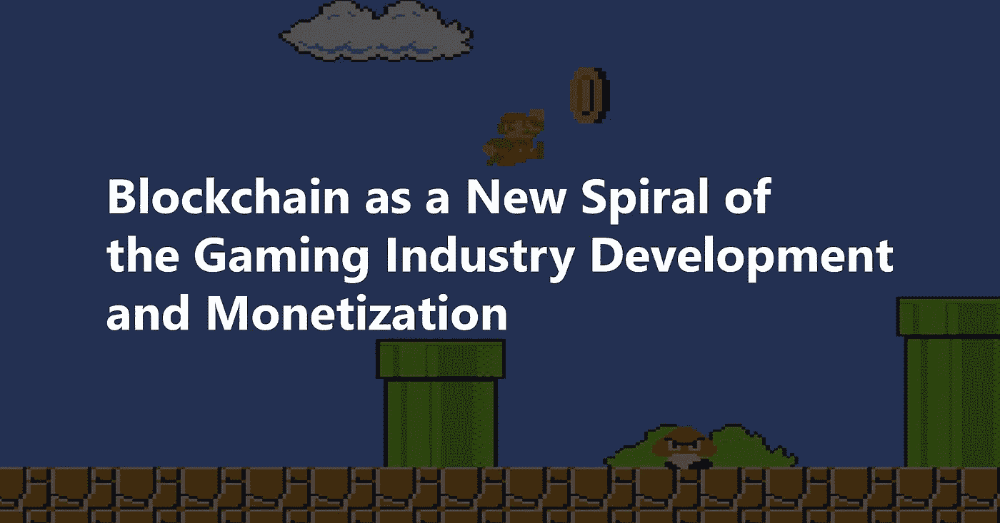

21 世纪标志着区块链技术的开始，但与许多其他创新不同，它的发展并没有花费几十年的时间。它的实施在许多领域飞速发展。有人说，到本世纪末，目前的商业惯例只能在布满灰尘的历史书里找到。

游戏中的区块链技术正在蓬勃发展，势头越来越猛。但是，为了找出游戏赚钱的创新方式，必须理解什么是区块链技术。

## 区块链技术和筹款的一瞥

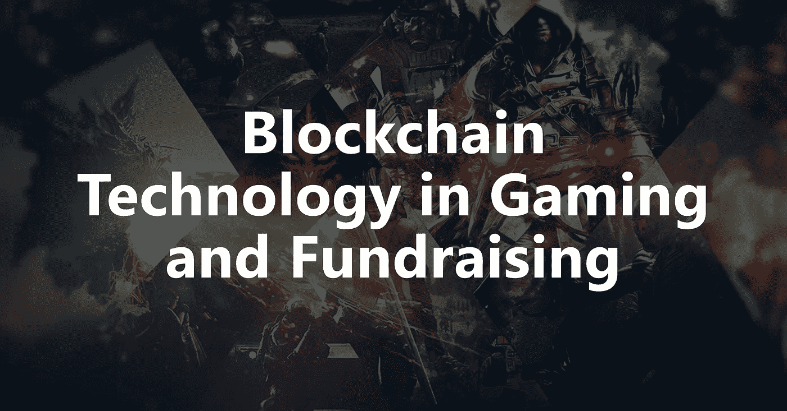

区块链是一个不断增长的经济记录和交易清单，更准确地说，是通过加密技术以安全的方式连接在一起的。该列表分布在计算机网络中，而不是存储在单个服务器上，并且不断更新。

由于这项技术是革命性的，它影响了初创公司为其区块链项目筹集资金的方式。首次公开募股(ICO)已经取代了首次公开募股(IPO)和众筹。初创公司已经设法用精心编写的白皮书和加密货币吸引了数百万资金。

最近，Block.one 初创公司已经筹集了令人震惊的 40 亿美元，并通过一个尚未推出的产品做到了这一点。EOS 是 Block.one 出售的令牌，不提供 ICO 中规定的“任何明示或暗示的权利、用途、目的、属性、功能和特性，包括但不限于 EOS 平台上的任何用途、目的、属性、功能和特性”。投资者不知道大部分资金将如何使用。

## 游戏中的区块链:历史概述

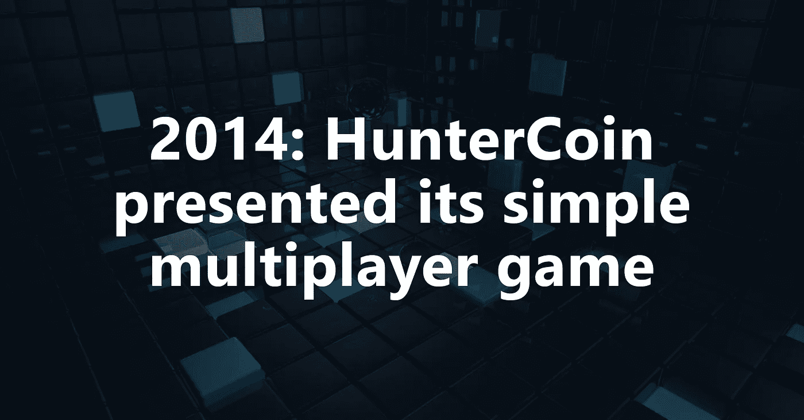

尽管 Mastercoin 在 2013 年推出了第一个 ICO，筹集了约 230 万美元的资金，但代币销售直到 2017 年才开始流行。实现区块链的第一次游戏尝试是在 2014 年，由 HunterCoin 凭借其简单的多人游戏和 p2p 资源大战进行的。这次尝试仅仅是一次测试，有许多改进和修正要做。2015 年，一款交易卡牌街机游戏“创世纪的咒语”取得了更好的成绩，提取的资金为 934 BTC。这个游戏催生了新一代的密码游戏项目。

加密游戏发展的下一个螺旋是创造一个隐蔽的世界，它有自己的游戏内货币，用于游戏内购买或额外的内容和升级。这些宇宙的代表有:Skara，Lordmancer 2 (MMORPG)，以及 Beyond the Void(多人在线对战的 RTS)。

到目前为止，密码游戏项目可以提供更多。像 DMarket 和 EnjinCoin 这样的公司使得在游戏世界之间同步虚拟资产成为可能。他们的生态系统允许在不涉及第三方协助的情况下进行支付和支付所有权转移。

由于像 CryCash 和 GameMachine 这样的公司根据他们在游戏中花费的时间和完成的特定任务或使命给予支付奖励，每个顽固的游戏玩家的梦想成真了。由于 CryCash 硬币可以在交易所上市，玩家有机会通过他们的游戏技能和花费的时间赚取真钱。更进一步，CryCash 计划与大型游戏平台合作，并提供降低独立游戏开发商获取玩家的成本，为他们提供 CryCash 用户群。

## ICO 与 IPO

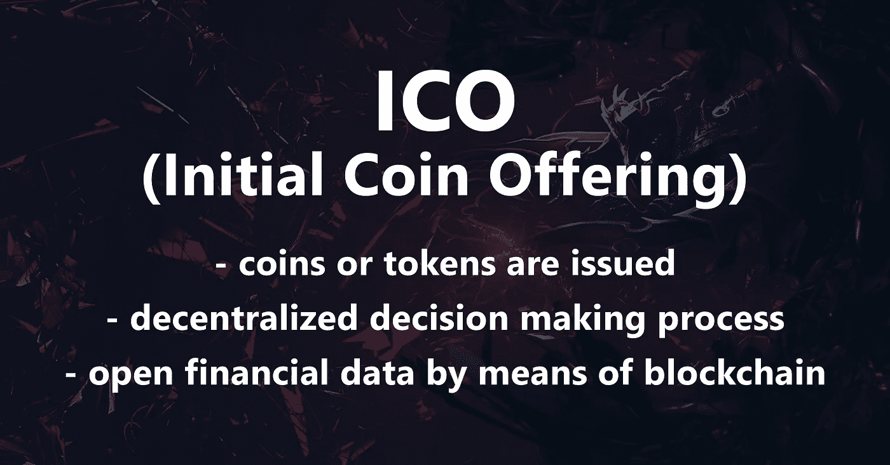

猜测 ICO 为什么比 IPO 更适合游戏项目这个话题，应该强调其核心的区别性特征。

*   ICO 类似于 IPO，区别在于发行硬币或代币，而不是证券或公司所有权。IPO 根据你拥有的股份数量提供所有权。Coin ICOs 仅提供参与特定项目的权利，token ICO 支持项目的所有权或版税，但不支持启动项目的公司。
*   尽管投资者的权利通常在 ICO 中有详细说明，但据了解，ICO 提供了一个分散的决策流程，而不是集中的 IPO 流程，支持首席执行官和董事会的垂直管理。
*   首次公开募股的财务信息按照首次公开募股发生的交易所发布。ICO 财务数据要么在白皮书和与投资者的正式协议中规定，要么通过区块链公开，为几乎任何人提供任何投入金额的透明度和访问权限。
*   IPO 公司需要缴税，而 ICO 公司避免了这种间接浪费，只有投资者需要缴纳资本利得税。
*   IPO 意味着在一个过程中有许多中介参与的单一销售，而 ICO 可以在几乎没有中间人的情况下提供频繁的融资迭代。

ICO 价格通常由项目创建者设定。其最大的优势之一是，公司可以在推出可行产品之前，从开发的早期阶段获得资金。Block .一个例子就是 ICO 效率的绝佳证明。

虽然一些国家对加密货币提供法律授权，承认它们是合法的，但 ICO 即将面临 SEC 的监管变化，以保护投资者。随着 ico 数量的快速增长，欺诈活动的案例也变得越来越频繁。根据 SEC 的最新公告，他们正在关注 ico，将其作为投资市场的一个潜在重要部分，预计通过 ico 筹集资金的企业将成为监管行动的对象。很难预测 SEC 监管介入的结果及其对投资者和公司的影响。但是，从好的方面来看，法律的执行应该会减少骗局和欺诈的案件，并可能会邀请那些由于 ICO 项目不受监管的性质而保持观望的投资者。

## ICO 筹款的阶段

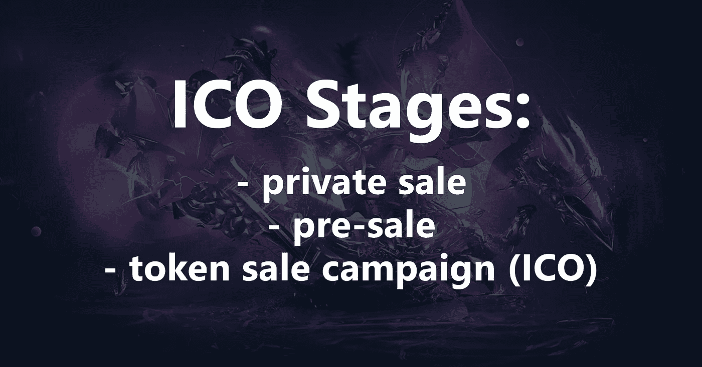

ICOs 规划因公司而异，但总体成功的 ICO 经验强调 ICO 项目的几个重要阶段。这些包括但不限于以下内容:

*   预发布是概念形成及其在 Reddit、Bitcoin Talk 等加密货币社区发布的初始阶段。ICO 的创建者准备一个简短的陈述，表明他们想法的实质和目的。然后，这个想法会根据社区的问题和评论进行修改，以使投资者更倾向于参与进来。一旦解决了最基本的问题，白皮书就诞生了。
*   奉献是 ICO 的实质。白皮书最终定稿，包含项目的主要细节，如时间表、所需资金、销售的金融手段(通常为代币)、代币成本、投资者权利等。
*   当签署 ICO 并宣布活动开始日期时。营销阶段开始了。这是项目筹资的关键阶段。

至于 ICO 的具体筹资阶段，通常有三个阶段:

*   私人销售有时是封闭的象征性销售，旨在为正式发布筹集资金。在这个阶段，代币可以用大折扣或奖金购买。
*   预售是一个中间阶段，代币的成本低于官方 ICO 活动期间，但高于私人销售。还提供折扣和奖金。一些投资者认为这是最赚钱的阶段，因为他们可以以折扣价购买代币，然后在 ICO 活动期间以官方价格出售，进行短期投资。
*   代币销售活动或 ICO 通常始于在公司平台上购买代币的要约。后来，代币可以在公共加密货币交易所使用。这通常被认为是对公司支付能力的确认。

在明确如何为区块链项目吸引资金时，还应考虑吸引劳动力资源的问题。ICO 的创作过程需要一定的人力资源用于不同的活动或产品阶段，如内容写作、SMM、翻译、运行功能测试、推广和营销等。招聘长期员工是不现实的，因为随着项目的进展，对某些资源的需求会发生变化。此外，长期员工倾向于为实际收入而工作。

这就是赏金战役派上用场的时候，它通过以项目代币的价格外包员工来解决各种各样的任务。一个任务一个象征性的价格。就节省而言，这种解决方案是实用的，因为代币是凭空编码的，没有任何实际的资金支出。赏金战役还有另一个有价值的优势。由于他们大多不受监管，如果公司不喜欢完成任务的质量，他们可以不支付服务费用。这使得项目的开发没有风险，没有任何附带的浪费或损害。

# 基于技能的加密游戏和 ICO 的兴起

新游戏平台和应用程序的快速发展使得开发领域成为最重要的数字游戏平台成为可能。随着比特币、莱特币、以太坊的兴起，各种新的替代币和代币一直试图夺取游戏加密货币的宝座。然而，不是每个人都能在短期内取得惊人的成绩。

下面的列表显示了世界各地正在开发或已经推出的顶级技能型加密游戏项目。

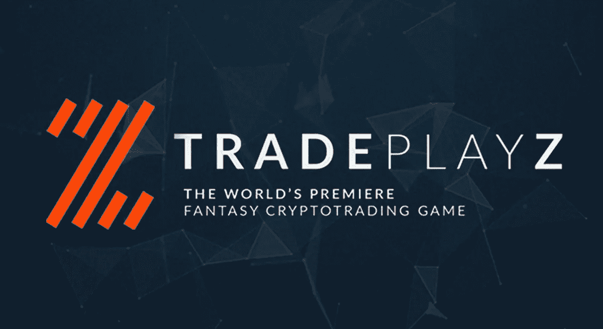

Tradeplayz 提供了一个在线游戏平台，为玩家提供了一个在任何游戏中施展技能的公平机会，包括国际象棋、双陆棋、问答游戏等。

让 tradeplayz 脱颖而出的独特事实是，它让游戏玩家更容易使用加密货币玩真钱游戏。在这个平台上，所有的游戏玩家都可以通过他们的技能安全匿名地赢得加密货币。

TradePlayz 是一个移动平台，通过 TPZ 代币玩基于真实价值的真实赢款/奖励的梦幻交易和投资。该公司认为，游戏的最佳元素、交易和投资的兴奋和激情可以从一个诚实和公平的平台上获得，这个平台同样令人兴奋。考虑到这些因素，该项目与区块链技术相结合，所有游戏都在真人之间进行。由此，玩家创造了产品的独特和令人激动的个性和环境。Tradeplayz 的主要重点是教育人们如何投资，包括获得真正回报的机会。

该项目战略由两个宏观阶段组成:第一个阶段是为作为 B2C 运营商的平台建立技术和流动性，以证明解决方案对选定的当地市场的可取性、完整性和可信度，严格遵守法律标准，随后，它是证明保留和数量的持续增长以及全球扩张。

Tradeplayz 的不懈团队已经为潜在玩家提供了 ZED 令牌，供他们在自己的平台上使用。这个代币仍然是不同玩家在他们的平台上玩游戏的主要货币。但其他加密货币如比特币、以太币、莱特币、以太币经典、Dash、Zcoin、比特币现金等多种加密货币在平台上也是允许的。这提供了一个在平台上玩几乎任何加密货币的绝佳机会。被商业化的代币是创新的、有价值的和有利可图的。同时，它还是一个基于 ERC20 以太坊的实用令牌。这个 ICO 的一大优势是公司有一个人们每天都在玩的产品。

Truegame 是一款独特的 iGaming 产品；用户已经在玩十几种不同的游戏(刮刮卡、抽奖、彩票、礼品盒等。).此外，这是第一个令牌众筹销售，一个完全有效的 iGaming 项目获得了专业社区的积极反馈。

该项目于 2017 年启动，已收到来自专业社区和焦点小组的大量积极反馈，吸引了玩家的注意力，并制定了有效的营销策略来吸引尽可能多的用户加入该平台。

与大多数代币众筹项目不同，TrueGame 的基础设施是基于区块链的技术。当然，区块链能够非常实际的领域并不多。然而，一个巨大用途的领域是 iGaming，因为区块链技术能够解决许多现有的问题，并极大地改变现代市场。

预计 2017 年至 2021 年期间，全球移动赌博市场将增长更快，CAGR 将达到 18.84%。这个市场被认为是最赚钱的在线业务之一。关键问题是赌场流程的不透明，以及由此导致的玩家对赌场管理层的不信任。玩家不能检查游戏或集会的完整性，并且不能完全确定游戏组织者的完整性。用户不能确定娱乐场管理部门是否有支付的资金，以及是否能够提供承诺的累积奖金。但在这种情况下，Truegame 试图提供完全透明的所有资金都包含在智能合同中，以便在没有游戏组织者参与的情况下自动支付奖金。任何人都可以检查累积奖金的可用性和大小。

至于令牌，TGAME，实用令牌，是 Truegame 架构和经济的主要组成部分。它们是根据 ERC20 标准在以太坊平台上发布的。发行的代币总数为 300，000，000。超过这个数量的更多令牌不计划被释放。分配给团队的令牌持有 12 个月，随后每月发放的令牌不超过团队令牌总数的 5%。

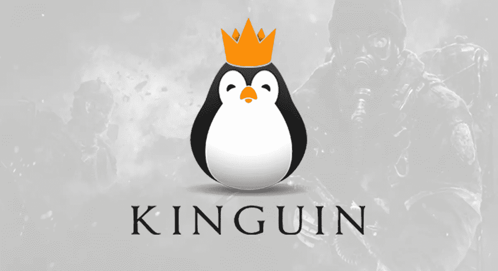

视频和 PC 游戏行业的主要全球零售商之一，Kinguin 公司，在区块链以太坊上为其下一代在线市场推出了一个 ICO，由符合 ERC23 的 Krown 令牌提供支持。今天，金谷是一个数字游戏、物品和相关服务的市场。Kinguin 在 2017 年促成了 9200 万美元的营业额。它是希望节省游戏购买费用和获得游戏内资产的游戏玩家的首选平台之一。Kinguin 的目标是成为数字游戏、项目和服务的分散式提供商。通过区块链和智能合约，这使得全球玩家对玩家的交易达到了最高水平。

此次象征性出售是 Kinguin 通过一系列私人和公共融资筹集 5000 万美元的两年计划的一部分。该公司表示，每一轮都与新产品发布相关，并允许投资者参与开发和测试，并跟踪其进展。用于购买、销售和交易数字游戏和其他游戏相关服务的对等网络允许游戏玩家购买、销售和交易具有高透明度和安全性的游戏和游戏内项目，以及像教练和游戏内训练这样的货币化服务。

Kinguin 在 ICO 审批流程中执行比市场标准更严格的标准，所有回合都遵守 KYC(了解您的客户)和 AML(反洗钱)政策。此外，该项目已经能够聘请 MC2 解决方案，以开发其智能合同，经过独立的第三方安全和代码审计。

该公司使用以太坊区块链网络作为会计系统，完全不受攻击、欺诈和数据可变性的影响。从第一个区块到第一亿个 Krown 的每一点信息都通过智能合约进行安全处理。因此，游戏玩家和商家可以放心地进行交易，查看所有权证明，并访问记录的所有交易的历史数据。

# 2018 年有 ico 的游戏项目

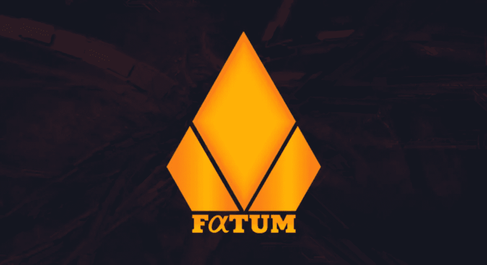

这是一个基于区块链和加密技术的游戏项目。它利用去中心化和加密的优势使欺骗变得不可能。该平台提供了在线赌博和游戏平台中实现的最佳技术形式。法图姆并不局限于网上赌场。它是一个用户可以玩各种游戏的平台。每场游戏收取的佣金很低，低于其他在线赌场。由于收费结构，他们没有谁赢谁输的利害关系。

为了确保公平和使用不可预测的随机数，法特姆发明了 RNG 硬币。由于在加密、去中心化和随机化方面有许多重要的问题，它允许 Fatum 解决这些问题。Fatum 代币用于玩游戏，允许游戏透明。FTM 代币可用于通过智能合约和经典游戏模式进行游戏。

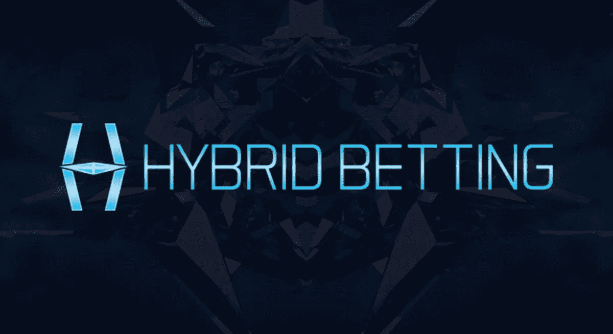

混合下注是一种基于以太坊的下注游戏，没有强制的庄家优势。该项目模式与其他任何博彩平台相比完全不同。没有报价，没有中间人，只是在同一水平上的竞争对手。这个博彩游戏平台是基于自己的令牌，HYB，一个基于以太坊(ERC20)的令牌。

**盈利模式**

混合博彩盈利模式基于所玩的班次数量。每项体育赛事都可以是一个转变，在赛事开始前的投注阶段结束时(当投注者做出决定时)收取一小笔费用。事件转移可以由一个体育事件或多个事件一起组成。该项目设置了所有的事件转移，但在未来，它会考虑由玩家创建的事件转移。

混合博彩的费用从大型赛事的 0.5%到小型赛事的 2%不等；无论这笔费用有多低，对于混合博彩来说都是纯利润，因为公司在游戏期间没有资金风险。

混合博彩众筹于世界协调时 2018 年 6 月 14 日下午 12 点开始。它将持续到达到 400 万美元的软上限或 700 万美元的硬上限。那些希望通过购买混合代币来投资混合博彩的人有机会通过混合众筹来这样做。从众筹中获得的资金将用于资助混合博彩的进一步发展，包括第三方合同安全审计和进一步的网络/应用程序开发。

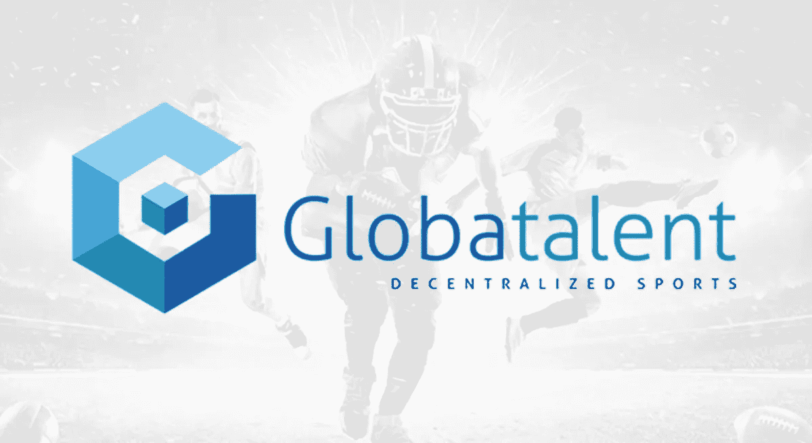

这是一个分散化的市场，投资者和球迷可以投资俱乐部或球员，并通过买卖他们的形象权、球员转会、奖金、工资、票务、电视合同或任何其他收入所保证的未来利益来获得回报。来自世界各地的球迷能够在他们的俱乐部或运动员身上投入或多或少的资金，并且与俱乐部和运动员带来的未来收入息息相关。

GLOBATALENT 平台帮助全球体育界获得资金支持，以继续开展活动，促进更健康的生活方式，并消除通常利用有经济需求的俱乐部和运动员的第三方。

在使用区块链技术的智能合同的帮助下，投资过程实现了自动化。这确保了以快速、安全的方式进行代币交易。2017 年，体育产业在全球创造了 1000 亿美元的收入。

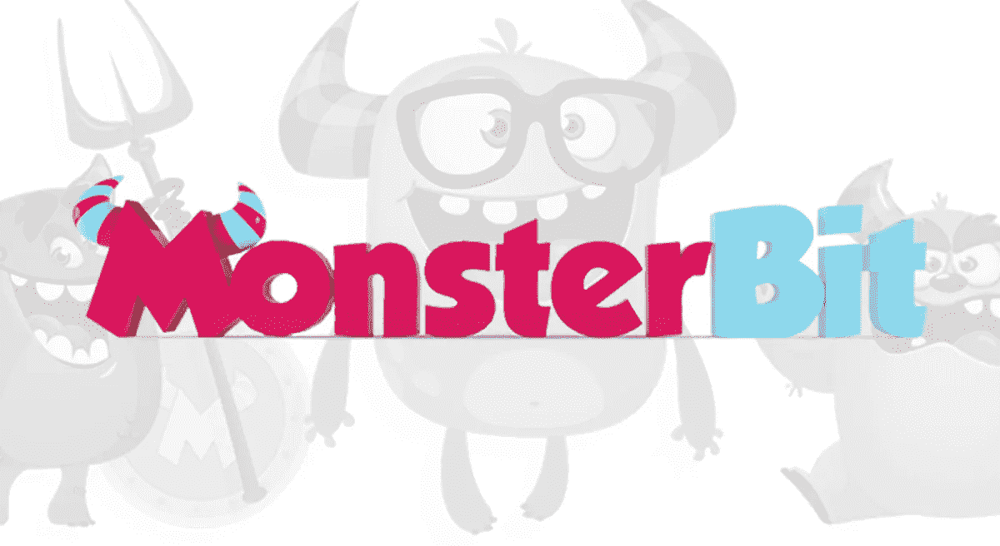

MonsterBit 是著名的密码游戏的模拟游戏，对双方玩家来说都是有趣的补充。该公司接手了这个成功的项目，并使它在功能上更强大，在设计上更有活力。除了正常的繁殖和独特的 DNA，英雄的成熟是以牺牲喂养他们为代价的。所有用户买卖不同年龄和世代的怪物。系统中的所有交易都通过以太坊以以太币进行。

代币持有者接收代币 MB 以购买生成系统的系统怪物。用户可以在内部市场购买或出售代币。这是公司的主要目标:进入外部市场。此外，代币持有者自动成为游戏中所有有价值商品的卖家，系统怪物产生、出售并提供利润。1 个令牌= 1 个系统怪物。

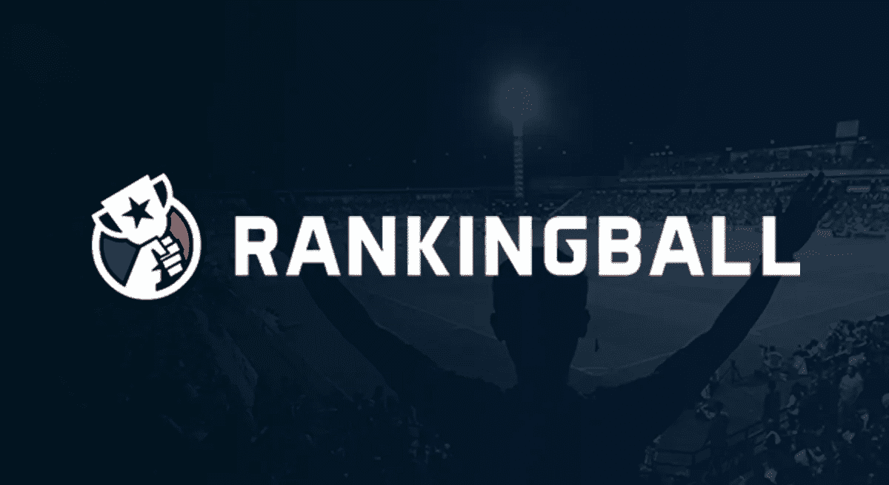

RankingBall 是一个创新的游戏平台，为体育和电子竞技开启了一个新的未来，将粉丝从无所事事的观众转变为全身心投入的参与者。RankingBall 利用直播体育和电子竞技赛事的实时数据开发了自己的技能型游戏，将 Daily Fantasy Sports (DFS)与 Bingo 合并。这种游戏允许粉丝在与区块链公平竞争的同时测试他们的技能。玩家可以在观看现场比赛的同时享受 RankingBall 游戏，通过与其他玩家竞争获得乐趣，并根据他们的表现获得奖励。

该公司无与伦比的优势是玩家在一个应用程序中参与他们正在观看的体育/电子竞技的方式。通过结合现有幻想体育网站的最佳元素，并添加独特的宾果式卡片格式，它为体育和电子竞技的观看方式增加了更多的刺激和竞争力。

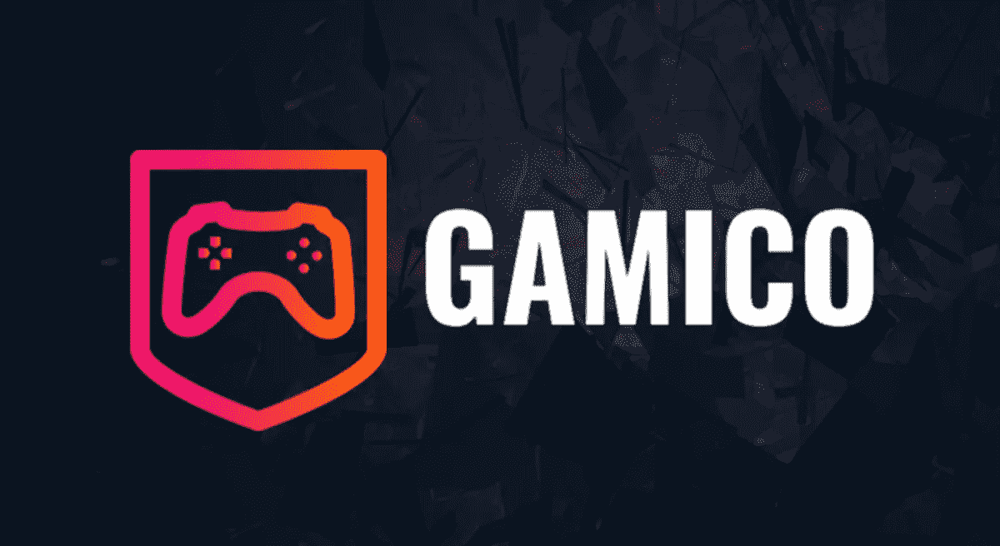

Gamico 是一个游戏玩家可以通过玩电子游戏赚钱的平台。游戏玩家和游戏狂热者能够玩、竞争和货币化他们的技能和花费在玩他们喜爱的视频游戏上的时间。Gamico 提供各种游戏成就和里程碑的奖金，让每个人都可以探索有趣的新方法来赚取 GMC。这个分散的平台确保了所有人的公平竞争。用户可以提交匹配分数来验证结果，或者获得免费的 GMC 来验证其他匹配。

此外，在 Gamico，所有人都致力于保护玩家和利益相关者的利益，并不断努力创造一个安全、可靠、公平的平台。这就是为什么该公司选择了区块链技术和智能合同的独特方法。

*   公共托管(GMC 托管、智能合同和分销)
*   GMC 交易验证(通过区块链防止欺诈/篡改)
*   数据/记录完整性(记录的准确性)

# 我们可以从未来的游戏产业发展中期待什么？

在线游戏技能平台正以贪婪的速度增长。它与电子竞技和游戏市场都有关联。2016 年，技能游戏占据了约 10%的移动市场，价值约为 43 亿美元。据博彩公司预计，到 2020 年底，这一数字有望达到 70 亿美元。有鉴于此，基于技能的密码游戏的受欢迎程度预计将会上升，并保持每年的快速增长。

ico 作为融资的一个很好的选择，也有很大的需求和受欢迎程度。然而，人们应该记住一些困难。和我们分享一下你参与过的游戏项目名称，或者其他一些值得人们关注的顶级游戏项目。

