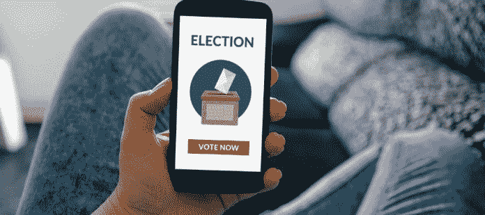

# 基于区块链的投票——一个有前途的用例

> 原文：<https://medium.datadriveninvestor.com/blockchain-based-voting-a-promising-usecase-8bbecb814b9d?source=collection_archive---------7----------------------->

随着最近结束的国内大选，操纵选举的失败政党也出现了类似的叫嚣。尽管外国观察员给了选举委员会一张干净的支票，说要举行一次透明、自由和公正的选举，但疑虑仍然存在。人们通常怀疑选举结果被操纵，投票率低&安全问题继续困扰着巴基斯坦等国的整个选举过程，在这些国家，古老的纸质投票仍在使用。新引入的 RTS(结果传输系统)在选举后的午夜崩溃，停止了整个过程&酝酿关于阶段性结果的阴谋论。尽管住在西方，但有一件事一直困扰着我，那就是你仍然不能在线投票。我的意思是，你可以在网上办理银行业务，在网上更新你的护照/带照片的身份证，在杂货店购物，报税&几乎所有你能想到的网上操作，但是网上选举投票却不在这个领域。区块链技术将很快改变这一切。

就像许多其他已经渗透到全球生态系统的区块链技术的创新用例一样，基于投票的平台最近获得了很多关注和欢迎。一个这样的投票平台的 [**第一次试验**](https://business.nasdaq.com/marketinsite/2017/Is-Blockchain-the-Answer-to-E-voting-Nasdaq-Believes-So.html) 是由纳斯达克在 2017 年与爱沙尼亚的塔林交易所合作进行的，他们在当地的技术合作伙伴 [**链**](https://chain.com/) 。然而，这只是股东投票的一个简单例子。

我们第一次听说在任何司法管辖区使用区块链技术进行选举是在 2018 年 3 月，在塞拉利昂，一家瑞士初创公司 [**Agora**](https://agora.vote/) 似乎促进了这一民主进程。政府官员后来否认了这一说法，称没有采取这样的举措。事实证明，Agora 被要求在 11，200 个投票站中的 280 个投票站担任国际观察员，他们像往常一样计算选票，并将其公布在他们的区块链上，从而展示如何利用这项技术。不用说，围绕这一点的炒作有点言过其实，但确实展示了该技术的有效使用&如何有效地应用于这一过程。

最近才出现了更多关于区块链在投票试点中被利用的高调且有据可查的案例。第一个是加密安全天堂&目标是成为区块链的世界之都——瑞士的楚格市。该市不仅允许用比特币支付市政服务，还在 6 月底成功测试了实际投票试点。电子投票系统使该市市民能够使用智能手机&投票，这是 2017 年推出的新电子身份证( **eID** )系统。该项目由一家当地软件公司 [**Luxoft**](https://www.luxoft.com/) 与卢塞恩应用科技大学计算机科学系合作开发。

另一个主要的投票试点正在为即将到来的美国中期选举做准备。西弗吉尼亚州将允许驻扎在国外的军事人员在该州的所有 55 个县通过他们的移动设备投票。这款手机是由波士顿的一家初创公司开发的。到目前为止，对其云区块链基础设施的测试运行&审计没有发现任何问题，因为为 11 月选举部署应用程序的绿色信号已经发出。该公司声称，这些数据将被加密并安全地藏在一个分散的网络中。当然，有一堆反对者和怀疑者认为这是一个可怕的想法，但话说回来，什么时候每个人都会对一项新技术感到舒服。我们很快就会知道进展如何。

最后，根据昨天的一则新闻报道，乌克兰中央选举委员会正与该国的 NEM 基金会合作，在区块链为下一次选举进行试点测试。上个月建立了一个有 28 个使用 NEM 令牌的节点的测试网，以检验该项目的可行性。投票仍然开放，任何人都可以参加。中央选举委员会的国家登记册表明，安装在警察局的每个节点的计算成本为 1227 美元，事后看来，对于一场透明、安全&无可辩驳的选举活动来说，这并不是一个巨大的代价。总结一下，这里有我遇到的一些其他有前途的专业区块链投票平台的链接——以及它们的标语。

> **—安全在线投票系统**
> 
> *[***secure vote***](https://secure.vote/)*—全球最安全、可扩展、最可靠的区块链投票平台**
> 
> *[***follow my vote***](https://followmyvote.com/)*—为现代社会推出安全透明的在线投票解决方案**
> 
> *[***抽签方式***](http://www.reply.com/en/content/ballotchain) *—抽签方式允许与公开选举具有相同保证的在线过程**

*这些只是处于开发阶段的少数和无数其他人。基于区块链的投票仍处于初级阶段，上述试点和试运行将在很大程度上决定此类项目的可行性和实施。然而，权力下放、安全和透明的关键特征可以为世界各地的选举进程带来公信力、不变性和大规模的公众参与。我的意思是，如果只需点击几下鼠标就能安全地投票，谁会不想投票呢——想象一下这会对投票率产生什么影响——这就是我所说的真正的民主。将会面临一些挑战，如培训公职人员使用该技术，收集用户反馈以改进不足之处，以及保护系统免受外部威胁，所有这些都可以通过早期采用、投资、尽职调查和简化当前流程来解决。*

*相关文章: [**电信领域的颠覆——区块链驱动的手机**](https://medium.com/datadriveninvestor/disruption-in-telecoms-blockchain-powered-phones-29861a1fd5) 、 [**TechFin 与 fin tech——有什么区别？**](http://www.datadriveninvestor.com/2018/08/01/techfin-vs-fintech-whats-the-difference/) ，[，**P2P 金融模式的兴起**，](http://www.datadriveninvestor.com/2018/07/31/the-rise-of-p2p-finance-model/)[，**区块链，加密货币&转变范式**，](http://www.datadriveninvestor.com/2018/07/26/blockchain-cryptocurrencies-the-shifting-paradigm/)，*

*保持联系:[Twitter](https://twitter.com/fklivestolearn)|[StockTwits](https://stocktwits.com/trade_nut)|[LinkedIn](https://www.linkedin.com/in/faisal-khan-2a3009b/)|[Telegram](https://t.me/joinchat/IWzyHBGWCFwPQTe8Tm5H_Q)|[trade alike](http://www.tradealike.com/)*

**原载于 2018 年 8 月 8 日 www.datadriveninvestor.com***。***