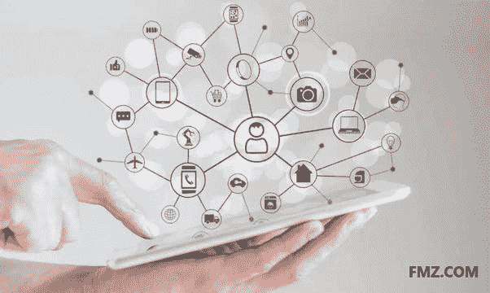

# 【区块链基础】区块链≠比特币

> 原文：<https://medium.datadriveninvestor.com/blockchain-basics-blockchain-bitcoin-7f51414b54e7?source=collection_archive---------23----------------------->

**区块链≠比特币** [**FMZ**](http://www.fmz.com/)

很多人认为区块链和比特币是一样的。区块链是比特币的基础技术。两者关系密切，但不是一回事。

2008 年，比特币作为一种不受监管的数字货币由匿名的中本聪创建。区块链是一种分类账解决方案，用于安全记录这种新货币的使用，因为没有银行或政府参与监控或监督交易。因此，比特币实际上可以被视为区块链技术的第一个用例。区块链和比特币经常混淆，因为这两个概念是同时引入的。

**区块链和比特币交易** [**FMZ**](http://www.fmz.com/)

自从引入区块链技术以来，它一直被推断为与货币以外的资产相关的许多其他行业的总账解决方案。这些领域包括医疗保健和患者记录、贸易融资和发票或采购订单的所有者，以及保险和房屋或汽车的所有权。

比特币被称为加密货币，是同类中第一种离散数字货币。它是一个开源解决方案，无需中央存储库或单一管理员。比特币交易使用分布式分类账在开放、公开和匿名的共享网络上进行转移和存储。区块链是维护比特币交易的交易总账的底层技术。

用于比特币的区块链技术允许交易记录在用户网络的分布式账本上。开源技术允许将事务中的数据存储在一个块中。每个块都包括一个带有时间戳的事务记录，并且每个块都链接到前一个块，从而创建一个链。存储在区块链中的信息是完全透明和永久的，不可能从分布式分类账中更改或删除以前的交易数据。此功能和解决方案可用于解决不同应用和行业中的许多低效问题。 [**FMZ**](http://www.fmz.com/)

虽然区块链是数字货币的绝佳选择，但它可以用于维护各种资产类型的可信审计系统的所有权。这些资产可以是无形资产(如贸易融资资产)和有形资产(如钻石)。这为多个行业和机构提供了广泛的区块链应用选项，包括专注于贸易金融行业的 TradeIX，以及利用区块链技术的专用解决方案。

区块链是当今真正可用的技术。目前，区块链正在全球许多不同的行业和地区接受概念验证(POC)测试。还要记住，这项技术仍处于早期阶段。几家区块链提供商，如 IBM 和 R3，在 2017 年发布了他们解决方案的第一个版本。因此，所有这些都是非常新的，出现在我们面前。

[**FMZ**](http://www.fmz.com/)

**最初发表于 [TRADEIX](https://tradeix.com/essential-blockchain-technology-concepts/) 。**