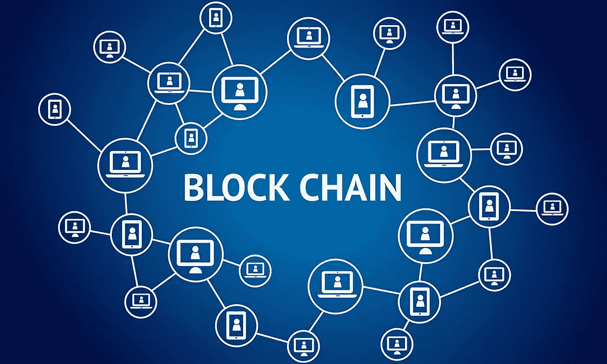
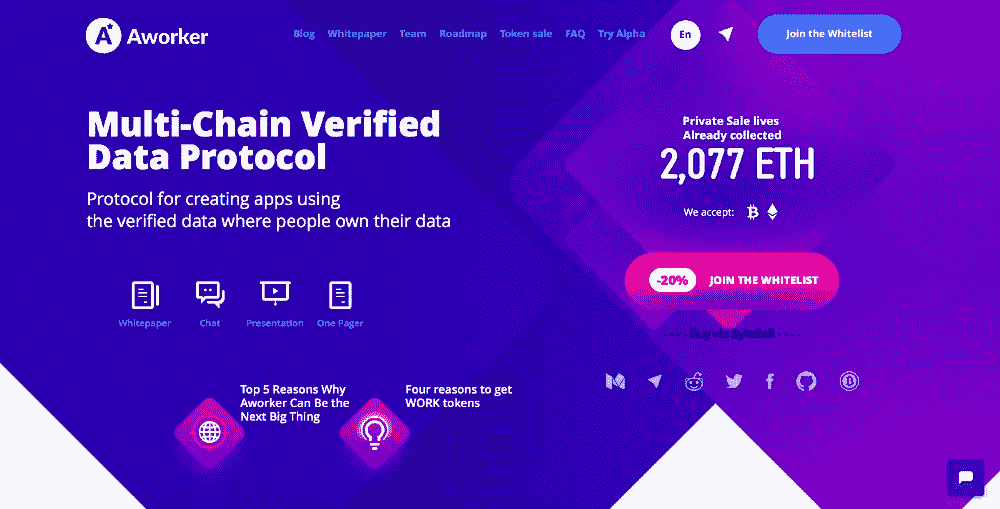
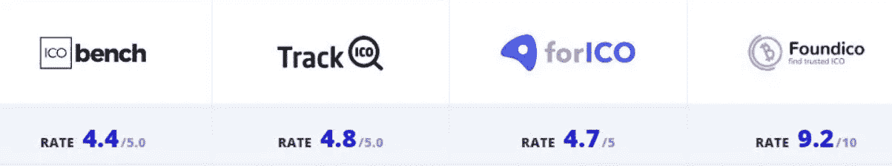
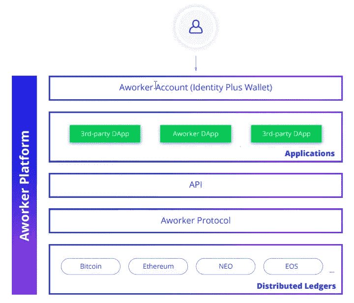

# 区块链可以重振招聘行业

> 原文：<https://medium.datadriveninvestor.com/blockchain-can-reinvigorate-the-recruitment-industry-9f9d3147bb24?source=collection_archive---------0----------------------->

面对现实吧，招聘行业形象很差，做了很多年。

无论是招聘员工还是寻找新工作，这个行业都因为许多原因而黯然失色。

*   将候选人视为无生命的物品，放在货架上，会让人感觉没有人听，更糟糕的是，他们只是一个数字，满足招聘人员的职位配额
*   对他们所代表的客户或候选人缺乏兴趣和了解
*   向世界承诺却什么都没兑现
*   不回电话，无视电子邮件
*   无法建立“人类”连接
*   将候选人纯粹视为满足渴望佣金的销售人员的一种手段
*   一旦“出售”成功，就有“放下就跑”的心态
*   鼓励候选人夸大他们的技能和适合性
*   向雇主发送大量不相关和不合适的简历，希望有人会留下来
*   在自己的行业中，员工流动率高，导致客户服务水平低下，无法与候选人和客户建立有意义的关系
*   缺乏/缺乏沟通和诚信
*   很少努力与招聘公司或求职者建立关系，导致误解需求和愿望

这个清单还在继续。

近年来，“在线”机构和相关平台开辟了额外的招聘机会。不幸的是，LinkedIn、Monster 和脸书等平台向他人出售个人和商业数据，而数据所有者(求职者和雇主)却得不到任何回报。

与许多行业一样，区块链带来了重组和重塑的新希望和机遇。

分散化和区块链带来的公开分类账的性质，可以很容易地在招聘行业中被利用，以提供急需的问责制和完整性。智能合同在端到端招聘流程中的使用为所有相关方带来了好处，交易的透明度必须成为该行业的一个重大突破。

一个工人可能会成为革新这个行业的平台。

它在各种 ICO 评论网站上一直得分很高，这就是我如何看到它的。

他们是仅有的几个拥有工作平台的 ico(首次公开募股)之一，事实上，真正的工作已经存在了。在 [app.aworker.io](https://app.aworker.io/) 查看他们的平台

Aworker 是一个用于应用程序创建的多链验证数据协议，允许人们控制自己的信息。他们的协议使得基于经过验证的数据和信誉分数来创建和管理应用程序变得容易。一个工人区块链框架工程与公共区块链，并有权力为不同的应用程序定制它。

Aworker 生态系统包括开发跨平台架构，将数据(hash)存储在比特币、以太坊、EOS、NEO 中；所有成熟可靠的区块链基础设施平台。

**令牌**:**工作**令牌在工作协议上创建了加密经济激励。令牌用于支付验证费用和系统用户之间的数据交换。对于想要购买/出售在平台上使用的令牌的应用程序参与者来说，它也将是一个可替代的工具。代币的数量限制在 4，800，000，000，从而为用户和投资者创造了一个良好的供求关系。

**奖励**:在一个工人的招聘过程中，参与者之间的奖励分配如下，从而创造了所有参与者的双赢:

*   50%给推荐最佳候选人的人
*   10%给公司选择的最佳候选人
*   10%由那些推荐前来面试的人接收
*   10%给来面试的人
*   推荐不适合该职位的候选人(未被邀请参加面试)的人收到 10%
*   10%给工人平台

如果你对注定会颠覆现有行业的技术感兴趣，那么《工人》可能适合你。在投资任何 ICO 之前，一定要做好自己的研究和尽职调查。

欲了解更多信息，请访问[工人](https://aworker.io)网站或他们的[电报](https://t.me/aworkerio)小组。