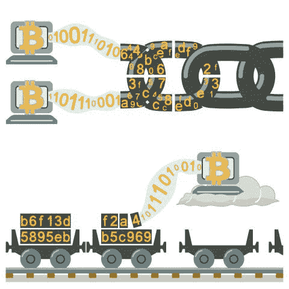
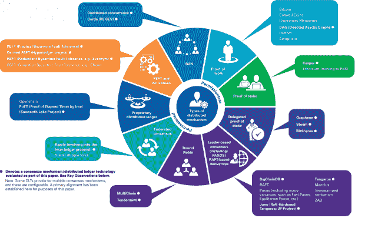

# 区块链共识算法:PoW、PoS 和 Beyond

> 原文：<https://medium.datadriveninvestor.com/blockchain-consensus-algorithm-pow-pos-and-beyond-21cafaa0ac32?source=collection_archive---------0----------------------->

理解区块链最重要的方面之一——它的速度、应用和潜力是共识算法。它决定了从网络安全、确认速度到环境友好性的一切。

尽管这一点至关重要，但很少有人理解这样一个动态概念在实践中是如何运作的；最容易被误解的方面包括如何将新的信息块安全地添加到分类帐中，考虑到没有中央权威机构参与维护网络的完整性。

从[的一篇早期文章](http://www.datadriveninvestor.com/2017/10/13/how-to-structure-a-successful-initial-coin-offering/)来看，区块链提供了一种在分布式分类账中对交易进行排序和验证的方法，并最终提供了一段时间内的真实记录。

如果没有一个中央中介，组成这个系统的参与用户网络需要使用一套*预定义的*规则，就添加到账本的内容的有效性达成一致。网络中的大多数节点需要达成 ***共识*** 。但是，直到今天，落实这一共识的效果如何仍然是一项正在进行的工作。

# 工作证明的出现

在 1982 年发表的学术论文[“拜占庭将军的问题”](https://dl.acm.org/citation.cfm?id=357176)中首次正式提出了确保分散系统可靠性的问题。在作者创作的插图中，一支拜占庭军队正在攻击一座城市，并将它完全包围。为了继续进行，分散在城市外围的将军们必须就作战计划达成一致；但是当一些将军想要进一步进攻时，其他人想要撤退。更复杂的是，将军们彼此相距甚远，需要信使在他们之间传递信息，而一个或多个将军也可能是意图破坏局势的叛徒。

在这种情况下，军队能执行任何战略吗？

是的，他们可以，但这需要大多数人(即 51%或更多的将军)同意所选择的战略。

拜占庭将军的问题类似于解决区块链的共识问题。节点必须都同意某一组规则，并且能够在交易信息被添加到链上之前，通过同意对交易信息的特定评估而前进。这并不容易——成千上万的人使用网络，必须确保他们同意要添加的新信息的有效性，此外还要防止坏人破坏账本和重写历史。因此，必须采用特定类型的**共识机制/算法**。该协议使得一组一致的网络实体能够一起工作，以便以安全的方式更新分类帐。

[用以太坊创始人 Vitalik Buterin](https://blog.ethereum.org/2014/11/25/proof-stake-learned-love-weak-subjectivity/) 的话说，共识算法的目的是*“允许根据一些特定的状态转换规则安全地更新状态，其中执行状态转换的权利在一些经济集合中分配”*。Buterin 将这个集合定义为一个包含用户的集合，这些用户可以“被赋予通过某种算法集体执行转换的权利”，并且*“必须被安全地分散——这意味着没有一个单独的行动者或行动者的共谋子集可以占据集合的大多数，即使行动者拥有相当大数量的资本和财务激励”*。因此，共识算法确保通过去中心化，下一个要添加到链中的块是系统中唯一的*版本的真理。*

通过比特币区块链在加密时代出现的第一个共识协议是“工作证明”。PoW 要求每个验证用户证明他已经执行了一个计算动作，以此来防止网络受到垃圾邮件和拒绝服务的攻击。每个节点都试图使用自己的计算资源来解决复杂的密码问题——最终找到解决方案的节点可以确认交易并将块写入链中。这意味着节点(也称为挖掘器)相互竞争以创建区块链上的下一个事务块。反过来，获胜的矿工将获得加密货币代币，作为对他花费大量时间和精力来生成解决方案的奖励；例如，一个比特币矿工将获得比特币作为他的奖励。这个奖励系统激励矿工产生正确的解决方案，并确保网络保持安全；而新铸造的加密货币被添加到网络上流通的硬币的总供应量中。

# 权力的普遍缺点

考虑到挖掘中涉及的计算资源的大量使用，PoW 被认为是昂贵的、浪费的和低效的。让数千名矿工每次只研究一个解决方案是对资源的过度使用，特别是因为唯一有价值的区块是已经解决的区块。因此，每开采一个新区块，就有一堆实际上无用的副产品。

此外，采矿是一项耗资巨大的工作。一些估计认为，整个比特币开采业务的电力消耗成本在每年 5 亿美元左右。事实上，[一项研究](http://www.karlodwyer.com/publications/pdf/bitcoin_KJOD_2014.pdf)已经将比特币开采的全部电力消耗等同于爱尔兰的平均电力消耗。这还只是针对比特币——一大堆新的加密货币已经出现，它们利用了某种形式的幂算法。

此外，采矿过程中使用的硬件通常是一套先进而昂贵的专用设备。这导致矿工购买这种硬件，这反过来又刺激了制造方面的大规模发展，以创造最先进的采矿专用硬件。以专用集成电路(ASICs)为例，这是一个高度专业化的产品，旨在专门挖掘比特币和其他加密货币。虽然专用集成电路大大提高了采矿过程的效率，但这种特殊设备的独特性质使其相当昂贵。目前，ASICs 的大部分研发源自中国，这个国家的电力也相对便宜。因此，鉴于中国 ASICs 制造商有相当大的动机为自己开采比特币——事实上也确实如此——这导致了比特币总哈希能力的大约 60%—70%集中在这个国家。

因此，过度*集权*的问题出现了——这与区块链的建国信条背道而驰。几乎没有什么可以阻止这种紧密相邻的矿工相互勾结，以控制区块链的加工能力的重要和有影响力的比例，这意味着他们可以恶意地将数据写入可能偏离真相的账本。按照我们拜占庭将军的比喻，这相当于一个将军派系之间的勾结。

# 利害关系证明

早在 2012 年，PoS 以 Peercoin 项目的形式出现，试图解决上述与*工作验证*相关的成本、效率和集中化敏感性问题。基本前提是，网络中的每个“验证”节点购买在特定区块链系统中使用的硬币，而不是购买昂贵的计算机设备来在竞争对手之前开采区块。

在 *PoS* 算法下，令牌从网络存在的最开始就被发放给网络中的验证节点，这意味着与 *PoW* 不同，当新的块被添加到分类帐时，令牌不会被同时铸造(尽管一些区块链采用混合 *PoW/PoS* 算法，该算法允许在切换到 *PoS* 之前进行 *PoW* 铸造)。然后，每隔几秒或几分钟，选择一个特定的节点来提交新块。但是如果一个节点持有更多的硬币，它就对账本上被认为是真理的东西拥有更大的权力。因此，选择受到拥有最多硬币的人的强烈影响——他们在网络上投资越多，一旦发生意外，他们的损失就越大。另一个影响因素是用户持有硬币的时间，这表明他们是否进行了长期投资——显然比昨天刚刚购买硬币的人更理想。

因此，那些在网络中拥有更多利益的人被认为更值得信任，并被认为不太可能攻击网络。事实上，为了发动攻击，用户必须购买整个网络 51%的硬币价值。这将是昂贵的，也是荒谬的——用户没有动机去攻击一个他已经投入如此多的网络。攻击自己显然是不符合逻辑的行为。

此外， *PoS* 通常比 *PoW* 更受青睐，因为它需要的计算工作要少得多，这意味着它不那么费力，也不那么浪费。由于计算量更少，因此，执行 *PoS* 的成本大大降低。这为那些希望成为块验证者的人消除了一个主要的障碍。采矿要求的缺乏简单地消除了开发专门硬件的需要；相反，这项技术可以很容易地在消费级计算机上运行。

# “没有利害关系”的问题

然而，最常被提及的利害关系证明问题之一是众所周知的*“无利害关系”*问题。在区块链的*统治下，有一种激励继续挖掘账本上最长的链条，因为这条链条将被认为是真相的原始版本，也是为矿工赢得奖励的链条；因此，矿工们显然有动力去开采那一条链。*

但是有了 *PoS* ，就很难阻止矿工在众多 *PoS* 链上采矿，特别是考虑到在这种算法下，矿工的计算开销可以忽略不计。因此，假设来说，一个在各种链上运作的矿工可能会使网络难以达成共识，而一个坏演员可能会试图改写历史。

当链条中出现分叉时，这个问题尤其重要(以太坊就发生了这种情况，于是产生了以太坊经典)；在这种情况下，使用 *PoS* 的验证者可以在两个区块链身上下注，这使得改变真相以有利于他们并获得利润变得更加容易。事实上，作为解决这个问题的一种方式，以太坊正在从 *PoW* 过渡到一种新的共识策略，称为 Casper，它将采用 *PoS* 算法。此举旨在显著提高链上新区块的处理效率，同时将采用一种机制来惩罚那些试图在两条不同链上下注的参与者。对 *PoS* 模型的进一步增强现在正在许多最大的加密货币中大量出现。

其中最受欢迎的是由丹·拉里默倡导的*【DPoS】委托股权证明算法，他是包括 BitShares、Steemit 和 EOS 在内的几个备受瞩目的区块链项目的背后推动力量。 *DPoS* 与 *PoS* 的不同之处在于，它让一组由网络用户选择的代表来执行验证过程，这些代表拥有用于挖掘数据块的独立节点。因为这些委托被认为是可信的，这部分解决了无关紧要的问题。受欢迎的中国平台 NEO 采用了一种称为 ***委托拜占庭容错*** 的算法，该算法采用了委托投票过程，以防止链分叉为两部分。与此同时，Ripple 利用自己的“共识账本”，让参与者和历史来定义系统中的真相，而不是技术。越来越多的共识算法不断浮出水面，每种算法都解决区块链特定应用特有的问题:*

**

**分布式共识机制概述(* [来源](https://assets.kpmg.com/content/dam/kpmg/pdf/2016/06/kpmg-blockchain-consensus-mechanism.pdf) *)**

*显然，寻求理想的共识机制在现阶段仍是一项未竟的事业。人们预计，这将是一个持续的过程，以改善成本、效率和可扩展性等因素，这将在未来几个月和几年内带来一些有趣的进步。实现权力下放、处理速度和效率之间的平衡可能仍然是进一步发展的核心。随着区块链的更多用例继续扩展，共识机制的范围极有可能会同步增长和发展。这也有可能激发区块链的更多新应用。*

# *评论*

**原载于 2017 年 11 月 12 日*[*www.datadriveninvestor.com*](http://www.datadriveninvestor.com/2017/11/12/blockchain-consensus-algorithm-pow-pos-and-beyond/)*。**