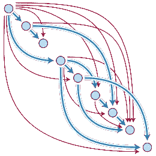

# 区块链共识机制

> 原文：<https://medium.datadriveninvestor.com/blockchain-consensus-mechanisms-7aa0176d488a?source=collection_archive---------12----------------------->

Courtesy: [https://pixabay.com/en/blockchain-block-chain-technology-3019120/](https://pixabay.com/en/blockchain-block-chain-technology-3019120/)

***新手？读完这篇文章了解区块链然后不客气的回到这里:***

*区块链周围的议论声仍然很高。区块链是一种分散的、分布式的和公共的数字分类账，用于记录跨许多计算机的交易，使得记录不能在不改变后续块和网络共谋的情况下被追溯性地改变。区块链需要一个实用、高效和安全的共识算法，以便在全球范围内通过共享的公共账本运行。*

*在这里，我将讨论区块链使用的共识机制。从区块链到区块链和他们使用的技术都不一样，比如:*以太坊*使用 ***股权证明*** 和*比特币*使用 ***工作证明。****

***区块链共识机制:***

1.  ***工作证明*****

*工作证明是一种协议，其主要目标是阻止网络攻击，例如分布式拒绝服务攻击(DDoS ),其目的是通过发送多个虚假请求来耗尽计算机系统的资源。它是这样工作的:*

*   *工作证明是定义通常被称为挖掘的昂贵的计算机计算的要求，需要执行该要求以在区块链上创建新的无信任交易组(块)。*
*   *第一个解决问题的方块矿工会得到回报。*
*   *网络矿工竞相成为第一个找到数学问题解决方案的人。*
*   *经过验证的交易仅存储在公共区块链中。*

*计算能力最强的一方通常开采区块，而其他人只是浪费精力，因为多个采矿者同时竞争开采一个区块。所以，这里我们介绍一下利害关系证明的机制。*

***2。股权证明*****

*这是工作证明最常见的替代方式。这是在区块链中创建块的另一种方法。块生产者被称为验证者，而不是挖掘者。验证者必须支付保证金或赌注，才能参与区块创建过程。*

*这里，验证器的选择是基于某种考虑了它们的利害关系的选择算法。只有被选中的验证者可以创建一个块，其他人不能参与，因此节省了其他验证者的能量。这对环境好得多。如果验证者做了一些错误的事情，那么他们会失去他们的股份，因此你会因为你的诚实而得到奖励。矿工们收取交易费，因为他们不像战俘一样没有报酬。*

****以太坊*** 已经从 ***PoW 转移到 PoS。****

***3。燃烧证明***

*Burn 证明是工作证明和利害关系证明的替代方法，也是一种分布式共识的方法。它也是由区块链网络实现的共识机制，以确保所有参与节点就区块链网络的真实和有效状态达成一致，从而避免加密硬币重复花费的任何可能性。*

*它的工作原理是允许矿工“烧毁”或“销毁”虚拟货币代币，这赋予他们按照烧毁的硬币比例写入区块的权利。你烧的硬币越多，你被选中开采下一个街区的机会就越大。它试图解决 PoW 的能量消耗问题。为了烧掉硬币，矿工需要把它送到不能花的地址，以便验证该块。 ***Slim coin*** 就是基于这种共识机制算法。*

***4。能力证明***

*嗯，这也是一个共识机制算法。这和其他算法有点不同。在这里，你必须支付硬盘空间。你有越多的硬盘空间，你就越有机会挖掘下一个区块并获得区块奖励。在 PoC 系统中进行挖掘之前，该算法会生成称为“plots”的大型数据集，并将它们存储在您的硬盘上。*

*能力证明包括两个部分。有硬盘驱动器的绘图和块的实际开采。根据硬盘的大小，制作独特的绘图文件可能需要几天甚至几周的时间。**绘图**使用一种非常慢的哈希算法，称为 Shabal。这还包括空间证明和存储证明等变化。这更像是一种支付方式。唯一基于 PoC 的加密货币是 ***爆裂币。****

***5。委托股权证明***

*这是 PoS 的扩展。在 DPoS 区块链共识协议中，加密硬币持有者使用他们的硬币余额来选举被称为证人的代表。这些证人有机会将大宗新交易标上股份，并将其加入区块链。投票权实际上是由他们拥有的硬币数量决定的，也就是众所周知的网络财富。*

*硬币或代币多的人会比硬币少的人对网络的影响更大。任何人都可以参加区块生成器选举，创建区块的机会将取决于他们获得的相对于每个其他生成器的票数。如果他们真的成功了，他们将会感谢 dpo。基于这种机制的加密货币就是 ***CaptainAlt 币。****

***6。活动证明***

*该算法更像是工作证明，其复杂性在很大程度上降低了，因此问题的解决需要几分之一秒到几分钟的时间。活动证明是一种混合方法，结合了工作证明和利益证明。就像在 power 一样，矿工们竞相解开一个密码难题。然后系统切换到 PoS。区别在于被挖掘的块不包含事务。它们只是带有标题信息和挖掘奖励地址的模板。*

*通过限制块创建的最小可能时间来验证所创建的块的正确性。这允许您限制向链中添加块的最大速度，从而防止网络中出现泛滥，我们也称之为垃圾邮件。使用这种机制的硬币有***decreed***和 ***Espers。****

***7。实用的拜占庭容错机制*****

*PBFT 是最流行的许可区块链平台协议，其目前由***Hyperledger Fabric(IBM)***使用。你听说过拜占庭将军的问题吗？没有吗？让我先解释一下那个问题，这样你就能更好地了解 PBFT 了。想象一下，一群拜占庭将军和他们的军队已经包围了一座城堡，准备进攻。要想赢，他们必须同时进攻。但是他们知道他们中至少有一个叛徒。那么，他们如何在至少有一个不知名的坏演员的情况下发动一次成功的攻击呢？*

*相似之处是显而易见的:在任何分布式计算环境中，都存在流氓行为者造成破坏的风险。因此，它对社区共识的依赖使得拜占庭式的错误对区块链来说是一个特别棘手的问题。为了解决这个问题，我们使用了 PBFT。基于所有将军提交的总决定，确定一致决定。PBFT 共识机制不需要任何散列能量来批准区块链中的交换，这意味着不需要高能量利用率，并且集中化的危险较低。它还会带来高额回报，而且交易是最终完成的。*

*8。耗时证明*

****英特尔*** 提出了自己的替代共识协议，名为耗时证明。PoET 现在一致选择的模型为 ***Hyperledger 锯齿的*** 模块化框架。PoET 算法通常用于授予权限，以确定矿工拥有的权限。使用这一点的网络在参与者能够参与之前识别他们。每个节点都有完全相同的机会成为该块的获胜者。PoET 机制基于为尽可能多的参与者传播和公平分配机会。*

*网络中的每个参与节点都必须等待一定的时间。在这种情况下，每个成员都从其本地可靠飞地请求一个停顿时间。滞留时间最短的成员在滞留了分配的等待时间后，下一个提供积木。每个节点每次都会生成自己的等待时间，之后它会进入一种睡眠模式。一旦该节点醒来并且有块可用，该节点就是幸运的赢家。然后，一个节点可以将信息传播到整个网络，保持分散状态并获得回报。*

*顺便说一句，我们必须依靠英特尔，相信我，这违背了去中心化的概念。我的意思是，我们为什么还要依赖第三方呢？*

***9。重要性证明***

*PoI 最早由 ***NEM*** 引入，因其加密货币命名为 ***XEM 币。*** 有了 PoI，看重的不仅仅是硬币余额。按照 POI 方法，奖励系统应基于用户对网络的各种贡献。因此，区块的标桩基于多种因素，包括声誉、总体平衡以及通过或来自特定地址的交易数量。*

*在这里，频繁发送和接收事务的参与者更有可能找到块。重要性证明只计算已经在账户上存在若干天的硬币。没有为网络留出的 10%的 XEM 每天都是固定的。攻击网络的代价是非常昂贵的，而且它慷慨地回报了保护网络的用户。*

***10。租赁股权证明***

*LPoS 是由 WAVES 开发的，WAVES 是一个分散的区块链平台，允许创建自定义令牌。在 PoS 中，只有当你有一定数量的硬币时，你才能添加区块，否则你甚至不能参与创建区块的过程，并且不是每个人都有机会参与链的维护并获得奖励。这个问题已经被 LPoS 解决了。*

*用户或参与者的数量越多，网络的安全性就越好。帐户上的硬币数量越多，越有可能将下一个区块添加到链和奖励中。*

***11。身份证明***

*PoI 的概念是将私钥与授权身份进行比较。身份证明(PoI)基本上是一种加密证据(一段数据),表明任何用户都知道一个与授权身份相比较的私钥，并以加密方式附加到特定的交易中。现有组中的每个人都可以创建一个数据块，并将其呈现给任何人，例如处理节点。*

> ****恭喜你，现在你已经了解了所有的区块链共识机制。****

**除此之外，我还想提一下你需要了解的这个重要的共识机制。**

***有向无环图***

**

*随着区块链随着时间的推移而增长，节点将需要越来越多的存储容量和更高的带宽(容量增加)，以与添加到分类帐的交易保持同步。*

*在 DAG 中，节点本身成为“矿工”。这个过程也更加轻量级，因为您只需验证两个最近节点的事务。由于矿工被淘汰，我们自己验证交易，交易费用降至零。“非循环”这个词只是意味着图中没有节点可以引用回自己，它不能是自己的母节点。 ***IOTA*** 利用 ***DAG(纠结)*** 。此外，它的数据结构使得网络易于扩展。每个人都参与达成共识，因此，使用 IOTA 的人越多，网络就变得越快。更多的人，更快的网络和安全的网络！*

> ***就这样，你已经准备好告诉别人你知道区块链是如何做事的了！***

*感谢您的阅读！*

****做点支持和表示点爱(鼓掌 xD)****