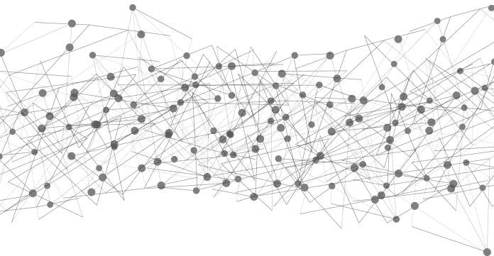
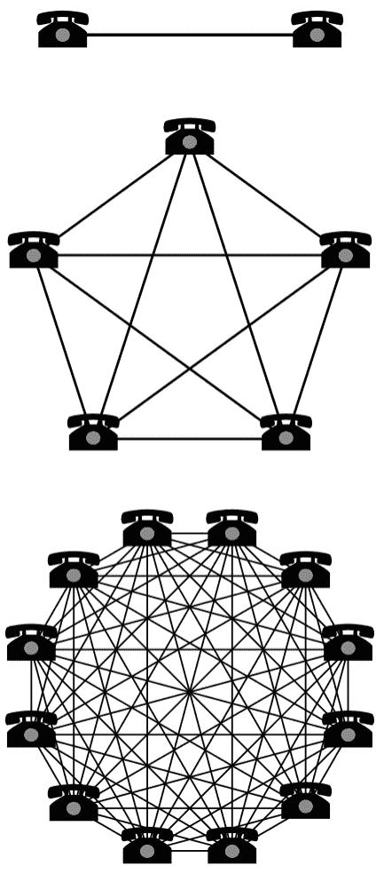
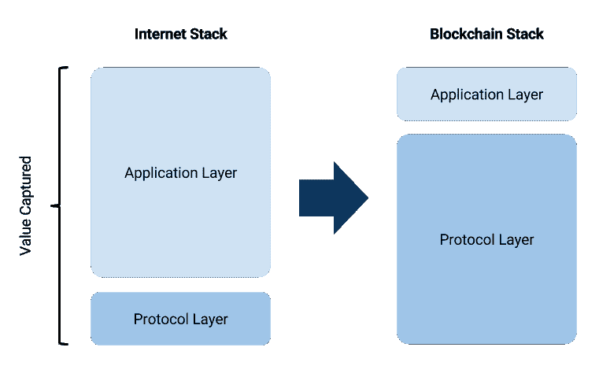
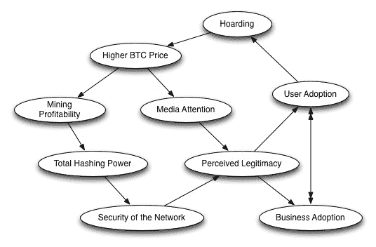

# 区块链经济学和网络效应

> 原文：<https://medium.datadriveninvestor.com/blockchain-economics-and-network-effects-85aae69f662b?source=collection_archive---------3----------------------->

看看脸书、微软和亚马逊等全球最大的科技公司积累的巨额市值，人们不禁会想，它们是如何在各自的环境中占据主导地位的，而且往往是在如此短的时间内。答案似乎在于——至少部分在于——它们产生网络效应的能力。

也被称为“网络外部性”和“需求方规模经济”，当一项技术随着更多的人使用而变得更有价值时，就可以观察到网络效应。电话是网络效应的一个例子，购买电话的用户越多，电话对每个用户来说就越有价值，尽管他们并不打算这样做。两部电话只能建立一个连接，而五部电话可以建立 10 个连接，十二部电话可以建立 66 个连接:

[*来源*](https://bitcoin-cp.com/principle5/)

当然，网络效应并不总是成立的，尤其是对于非技术服务业。例如，一条道路并不会随着更多的汽车使用而变得更好；事实上，恰恰相反！但是当新技术出现时，这种现象经常被观察到。例如，随着越来越多的用户加入，脸书变得越来越好——用户群越大，每个用户可以建立更多的朋友关系，每个用户可以从朋友和家人那里看到更多的更新。

在经济学术语中，网络效应是一种正外部性，随着更多的用户加入网络，它会提高所有网络用户的边际效用。梅特卡夫定律表明*网络的价值与网络中连接用户数量的平方成正比(n2)* 。张、刘和徐在 2015 年的一项研究中发现，这一定律对和腾讯都适用。

# 区块链网络效应

就区块链技术而言，我们应该会看到强大的网络效应从这个新的架构中涌现出来，并有更多的用户采用。

自 2012 年以来，区块链钱包的用户数量一直在加速增长:

[*来源*](https://www.blockchain.com/charts/my-wallet-n-users?timespan=all)

在此期间，许多最大的加密货币网络的价值飙升。事实上，2017 年 6 月[发表在《电子商务研究与应用杂志》上的一项研究](https://www.sciencedirect.com/science/article/pii/S1567422317300480)根据参与网络交易的唯一日常地址的数量分析了比特币、以太坊和 Dash 网络，发现数字区块链网络“似乎遵循梅特卡夫定律”。

到去年年底，Fundstrat 的 Tom Lee 设计了一个基于 Metcalfe 定律的模型，通过结合独特比特币地址的数量和每个地址的平均美元交易量来衡量用户增长。李[发现](http://uk.businessinsider.com/bitcoin-price-movement-explained-by-one-equation-fundstrat-tom-lee-metcalf-law-network-effect-2017-10?r=US&IR=T)这种追踪用户增长的方法显示出与过去四年比特币价格 94%的相关性。

也就是说，区块链网络效应也可能不同于我们迄今为止看到的其他技术。例如，Joel Monegro 的博客文章' [Fat Protocols](http://www.usv.com/blog/fat-protocols) '指出，尽管互联网在应用层(例如脸书)获取价值，但区块链很可能在协议层(以太坊、比特币)获取价值。这主要归功于区块链协议中共享数据层的价值，它使分散式网络能够复制和存储用户数据，从而创建“一个更具活力和竞争力的产品和服务生态系统”

[*来源*](https://blog.zeppelin.solutions/thin-protocols-cc872258379f)

我们当然看到了最大的区块链协议(如以太坊)的巨大估值和建立在它们之上的应用之间的巨大差异。在区块链发展的这一早期阶段，这一趋势是否会在未来保持下去还有待观察。但我们可以更有信心地观察到的是比特币正在实现的网络效应。

早在 2014 年，以太坊创始人 Vitalik Buterin [确定了](https://blog.ethereum.org/2014/11/20/bitcoin-maximalism-currency-platform-network-effects/) 12 种可能出现在密码经济学中的独立网络效应，他将其分为四个独立的类别:

1.  区块链特有的网络效应:安全效应
2.  特定平台网络效应:支付系统网络效应、开发者网络效应和整合网络效应
3.  特定货币网络效应:规模稳定性效应、记账单位网络效应、市场深度效应、市场价差效应、个人单一货币偏好效应、人际单一货币偏好效应
4.  一般网络效应:营销网络效应、监管合法性网络效应:

# 比特币网络效应

在这一阶段，比特币以及在较小程度上的以太坊已经展现出最大的可见正网络外部性。以比特币为例，网络效应可能如下发生:

1.  持有比特币的人越多，商家就越会接受比特币作为一种支付方式。
2.  随着越来越多的商家接受比特币，这将进一步诱导人们使用比特币。
3.  随着比特币被越来越多的客户和商家采用，开发者将希望创造更多可以在比特币平台上工作的补充工具。
4.  这三方共同创造了对比特币的需求，从而推高了比特币的价格，并使挖掘这种加密货币成为一项更有利可图的活动。因此，随着共识群体的增长，比特币网络变得更加安全。
5.  更安全的网络会吸引更多的用户、开发者和投资者，从而进一步推高价格。它还提高了比特币的流动性，这应该会降低交易差价，使比特币兑换成法定货币变得更容易、更划算。
6.  随着比特币达到规模，监管机构批准的可能性越来越大，补充产品被开发出来(如比特币期货)，用户接受度飙升，因为它成为了事实上的*数字货币(持有其他货币并支付转换费以进行比特币交易的经济意义将会降低)。*

**

*[*比特币网络特效*](http://themisescircle.org/wp-content/uploads/2013/02/bitcoinfeedbackloops.jpg)*

*鉴于加密货币的绝对数量，成为卓越加密货币的竞争已经真正开始。尽管存在技术上的缺陷，但从比特币相对于其他加密技术的许多主要统计数据来看，比特币目前处于领先地位。*

*大约有 2200 万比特币用户钱包存在。比特币自动取款机的数量正在快速增长([，并轻松超过其他密码服务的自动取款机](https://coinatmradar.com/))。而它的市值[是其余 cryptos 加起来](https://coinmarketcap.com/charts/#dominance-percentage)的近 50%。期货合约、不断发展的交易基础设施以及可能在不久的将来推出的 ETF 也表明，比特币已经获得了一个有弹性的经济护城河。*

*也就是说，将比特币与类似的“非区块链”在线支付方式进行比较表明，它尚未获得足够数量的用户。例如，相比比特币的 2200 万用户钱包，PayPal 拥有高达 2 . 37 亿活跃账户持有人。*

# *比特币网络效应面临的挑战*

*尽管用户数量增加，但比特币和以太坊今年没有继续增值的原因之一可能是因为它们广为人知的缩放问题。随着网络使用率的提高，负面外部性也随之产生，因为比特币和以太坊网络的拥堵已经多次出现。就像我们的道路例子一样，网络拥堵是一种*负*外部性，而不是正外部性，应该尽早解决，以实现进一步的网络效应。*

*有超过 1700 种密码在交易所交易。虽然大多数很可能最终出现在[死亡硬币的名单上，](https://deadcoins.com/)比特币或以太坊的竞争对手货币的快速增长可能会导致网络价值和使用的转变，在这种情况下，网络效应可能不会出现。当然，不一定只有一两种主要的加密货币。同样，我们许多拥有脸书账户的人也有 Instagram 和 Twitter 账户，用于不同的社交媒体目的，我们可能会出于隐私目的使用比特币和以太坊，比如 Monero。*

*区块链为执行相同规则的参与者提供了一个共享的真理观。但与其他技术不同，区块链协议可以被分叉，这意味着开发人员可以简单地复制共享的真理视图，然后改变规则，以创建具有更好技术和/或经济性的新协议。然而，在分叉竞争的情况下，“用户/读者群体可能会分散在太多不同的分类账(或加密货币)中，无法充分利用积极的网络外部性”*

*正如均衡实验室主席 Teemu PIV inen[建议](https://blog.zeppelin.solutions/thin-protocols-cc872258379f)作为对 fat 协议概念的挑战，“如果一个协议是“胖”的，并获得了不成比例的价值，它可能是一个分叉或竞争协议的成熟…这样，我认为“肥胖”实际上是效率低下和/或其他优势的表现。”*

*并非每个创建了比特币钱包的用户都是这种加密货币的长期用户。相反，寻求快速赚钱的短期投资者可能掩盖了许多加密货币的真实价值，特别是最近考虑到交易加密货币已经获得了天文数字的收益。事实上，我们今年经历的大规模抛售支持了这一观点。*

*比特币尚未达到用户接受的临界规模，这一事实意味着，从长远来看，网络效应很可能转移到另一种更具可扩展性的加密货币。它甚至可能是比特币的一个分支。在这个阶段，事情仍然悬而未决，但在未来的几个月和几年里，看到密码经济学如何演变无疑将是令人着迷的。*

**原载于 2018 年 8 月 22 日*[*www.datadriveninvestor.com*](http://www.datadriveninvestor.com/2018/08/22/blockchain-economics-and-network-effects/)*。**