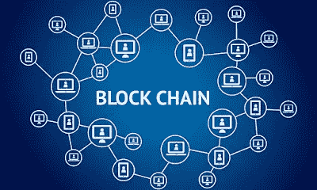
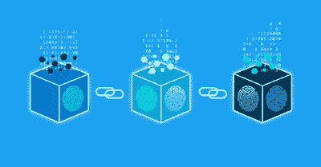
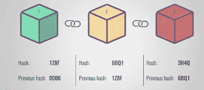
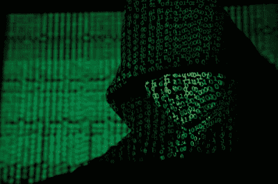

# 区块链—解释

> 原文：<https://medium.datadriveninvestor.com/blockchain-explained-3ec03d1039fb?source=collection_archive---------13----------------------->

在解释什么是区块链之前，我将首先列出关于区块链的事实。

# 关于区块链的事实:

*   区块链被认为是迄今为止发现的最安全的交易方法。
*   迄今为止，还没有黑客入侵过区块链网络。
*   到 2030 年，每家银行都将使用区块链进行交易。
*   区块链将在未来带来一场互联网革命。

# 区块链:

区块链是一种简单的安全交易，使用具有特定哈希值的区块，该哈希值将作为互连区块的唯一 Id。哈希值就像指纹。

块是数据的存储设备。每个块都有一个唯一的加密哈希值。这些块以这样的方式连接，即该块的哈希值将是下一个块的前一个哈希值。你可以在下面的图片中更好地理解。

这表明该块的哈希值是下一个块的前一个值。这就是它如何形成链条的。这就是区块链的连接方式。为了获得成功的交易，网络中超过 50%的数据应该被验证。

# 当前系统 vs 区块链:

首先，我将打破我们目前的制度。在我们目前的系统中，特定的数据和交易是由特定公司的服务器存储的。这就是我们现行制度的状况。这将导致更高的维护成本，并导致黑客容易攻击，因为他们只需要攻击一个就可以访问整个公司的数据。这些是我们现行制度的缺点。

而区块链是基于点对点的连接。这意味着我们都充当交易的服务者。我们都能看到数据。未经授权的数据更改会导致整个链条崩溃。这使得黑客无法攻击交易。因此，区块链成为迄今为止最安全的交易。

# 这么高的安全级别是如何实现的？

正如我所说的，块的哈希值将是前一个块的哈希值。因此，如果黑客试图改变一个块中的数据，它将自动改变哈希值，这将中断链。为了有一次成功的攻击，黑客需要获得超过 50%的网络访问权，这在此之前是不可能的。因此，区块链仍然是安全的交易方式，仍然是黑客的挑战。

# 示例:

点对点连接的简单例子是下载种子文件。每个人都在种子文件中看到过种子这个术语。会上传数据。在这个过程中，一个新的用户将从以前的下载器而不是原来的服务器下载 torrent 文件到不同的小部分。这将把工作分散到不同的服务器上，使整个过程比以往更快更安全。

# 重要事项:

这篇文章提供了一个关于区块链的简单描述。订阅我们的博客以获得更多类似的文章，并对你希望我发表的观点和话题发表意见。也加入我们的 facebook 群，喜欢我们的 facebook 页面。

[点击这里加入我们的脸书小组](https://www.facebook.com/groups/bugtech/?ref=bookmarks)

[点击这里进入我们的脸书页面](https://www.facebook.com/Bug-Tech-380548266042438/?modal=admin_todo_tour)