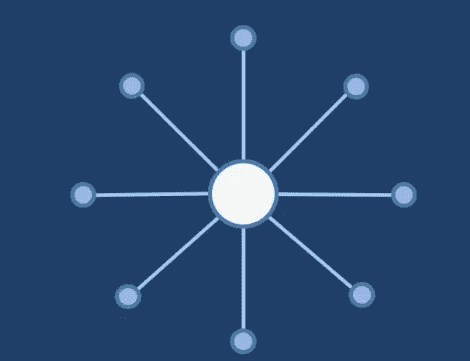
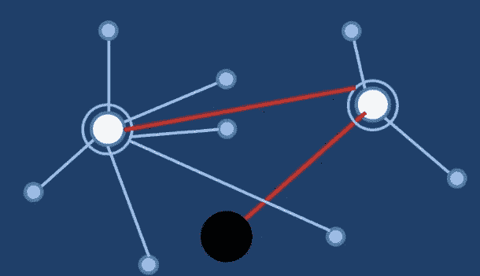
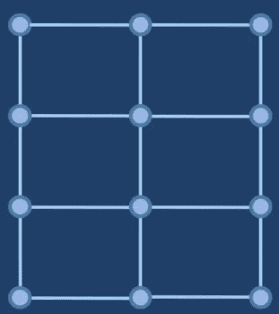
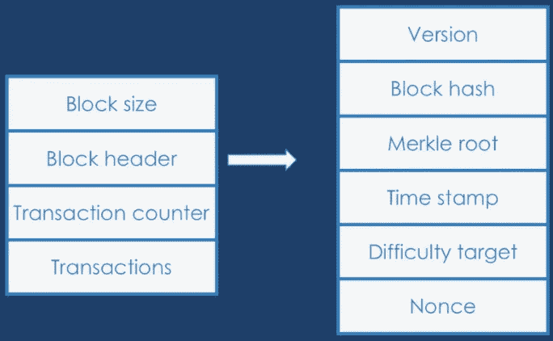
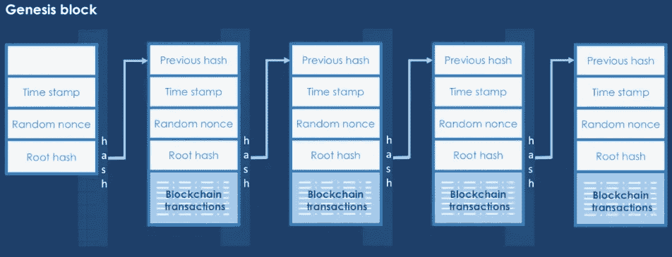
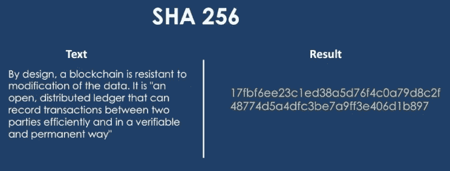
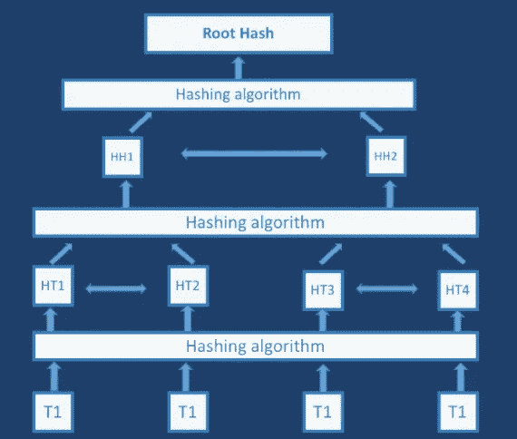
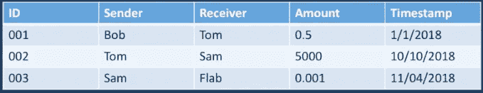

# 区块链基础简而言之

> 原文：<https://medium.datadriveninvestor.com/blockchain-fundamentals-in-a-nutshell-2ed2d5ce6c7f?source=collection_archive---------6----------------------->

有兴趣了解更多关于区块链及其实现(如比特币、以太坊和其他各种加密货币)的信息吗？继续读。

# 什么是区块链

最简单的核心是，区块链只不过是一个分布式数据库。是的，我们所知道的数据库已经存在了很长时间，这是真的，但是这些数据库已经被集中化了。这意味着一方拥有数据库。他们是维护和更新的可信权威。我们也相信所有交易和录音的权威。

而区块链使用的是去中心化的分布式系统。这意味着没有一个实体能够控制交易，从而降低了黑客攻击或欺诈的可能性。

# **集中式 Vs 分散式 Vs 分布式**

如前所述，区块链使用的是**分布式**系统，也就是**去中心化**。它既是分散的又是分布的系统，但不是集中的系统。

Centralized system

**集中式:**集中式系统只有一个权限。控制一切的可能是个人、政府、公司或组织。

集中式系统的缺点:如果一家公司倒闭，用户将被蒙在鼓里。

集中式系统的优势:因为有一个中央组织，他们可以制定一套规则。如果规则是公平的，那就很好。

Decentralized system

**分权制:**分权制要求多方各自独立决策。

因此，这种分散系统的优势在于，没有一个单一的中央权力机构代表所有各方做出决策。

Distributed system

**分布式系统:**在其最简单的定义中，分布式系统是一组协同工作的计算机，对最终用户来说就像一台计算机。这些机器有一个共享的状态，并发运行，可以独立出现故障，而不会影响整个系统的正常运行时间。

就区块链而言，它既是去中心化的，也是分布式的。也就是说，没有单一的权力机构控制它，也没有单一的地方处理信息。

# **区块链中的区块**

区块链，最初是区块链，是一个不断增长的记录列表，称为块。区块链街区的基本结构有 4 个部分

Structure of Block

a.**块大小(以字节为单位的块大小)**

b.**块头**(块头用于标识整个区块链上的特定块)

c.**交易计数器**(显示块中的交易数量)

d.**交易**(该块中正在处理的所有交易)

**块头的六个字段是**

a.**版本** —版本是跟踪软件协议更新的编号。

b.**先前块散列** —整个先前块的散列。稍后将对此进行更多讨论。

c. **Merkle root** — Merkle root 是 Merkle 树的根的散列。更多关于 Merkle tree 的信息将在文章的后半部分分享。

d.**时间戳** —该块的大致创建时间。

e.**难度目标** —这是该程序块的工作算法难度目标的证明。

f. **Nonce** — Nonce 是一个随机数或帮助证明算法的计数器

# 区块链中多个区块是如何链接在一起的？

假设我们有 5 个街区。在这些区块中，我们将有 4 个字段。这只是我们上面看到的一个简化。

我们关心的字段是**先前哈希**、**时间戳**、**随机随机数**和**根哈希**。与此相关的是我们在区块链的所有交易。它们链接在一起的方式是，前一个块的散列形成下一个块的前一个散列。当这些块被链接在一起时，这就是区块链得名“区块链”的原因。

Multiple blocks in blockchain

区块链中的第一个块称为 Genisis 块，它是作为起点静态创建的。这个块与其余的块相似，除了前一个散列为空，并且事务不存在。正是这个原始块被散列并形成第二块的先前散列。

# **区块链中的哈希**

任何区块链的核心都在于散列概念。哈希是一种单向函数，它将一些数据作为输入，通过数学算法对其进行处理，并给出与其原始形式不相似的输出，并且它是不可逆的。

给定的输入数据可以是任何图像、视频文本或任何其他数字内容。对于特定的数字内容，输出总是相同的。

区块链最常用的算法是 SHA 256。它是产生长文本字符串的几种哈希算法之一。它由美国国家安全局签署，并向公众开放。

SHA 是哈希算法家族。名字后面的数字是算法的复杂度。

以下是文本通过 SHA 256 算法运行时的外观示例。我们得到一个很长的字符串，就像你在结果下面的图片中看到的那样。

# **默克尔树**

既然我们讨论了散列，现在让我们快速看一个相关的主题，叫做 Merkle 树。

Merkle 树是散列的散列，这使得确认大量数据和交易变得快速且相当容易。它通过产生整个交易集的数字指纹来汇总一个块中的所有交易，这样做使用户能够验证一个交易是否包含在一个块中。

如图所示，Merkle 树是通过重复散列节点对直到只剩下一个散列(称为根散列或 Merkle 根)来创建的。

假设我们有 4 组数据。为了简化，这里每个数据集使用一个字母*(在图中 T 代表事务)*。但这很容易成为现实生活中的交易。

这些字母产生了四种不同的**哈希** *(图中 HT 代表事务哈希)*。在 Merkle 树中，这些散列的组被散列在一起以创建散列的***(HH)*。这些散列然后也被散列在一起，创建我们称之为**的根散列**。为了弄清楚 Merkle 树中的任何地方是否发生了变化，您只需要查看根哈希是否发生了变化，然后您可以沿着树向下查看变化发生在哪里。**

# ****区块链中的账本****

**在一般金融中，分类账是保存交易的账簿。**

**区块链也像分布式账本系统一样工作，区块链的每个参与者都持有一份副本。在这里，所有交易的细节都被记录下来，这些交易的副本将在不公开真实身份的情况下公开共享。**

**[Blockchain.info](http://Blockchain.info) 是一个很棒的查看网站。它是分布式的，分散的，所以没有人能把它拿下来。这就是为什么区块链及其实施如此之好。**

**分类帐可能如下表所示:**

****

**Blockchain Ledger**

**每当两个参与者交换金钱时，他们的分类帐就会随着该交易而更新。**

# ****区块链的用法****

****数字货币:** 目前区块链使用最广泛的是比特币等数字货币。因为匿名交易可以像在银行交易一样被信任，这为处理全球交易开辟了广泛的途径。**

****虚拟产品:在互联网上制作和销售数码产品已经不是什么新鲜事了。有了区块链，你可以标记、销售甚至控制你的数字产品的使用，比如书籍、照片、视频和音乐等等。****

**音乐家可以将自己的音乐上传到区块链，并定义购买产品的不同模式。例如，她可以有一个收听价格，一个制作铃声价格，另一个在广告中使用铃声的商业许可价格。所有这些都可以在没有主要机构收取版税的情况下完成。**

****产品生命周期:**
您可以在区块链存储工作流程或产品的所有信息。例如，跟踪一辆汽车的生命周期，从工厂到销售商，到客户，再到车间，最后到回收厂。**

****物联网:
这是智能设备在没有人工干预的情况下使用互联网。通过使用区块链，这些设备可以安全地进行可信的交易。****

****认证:** 认证机构可以以一种无篡改和完全透明的方式向产品或组织颁发认证。**

****安全信息共享:** 鉴于区块链的性质，您可以将加密信息插入其中，并确保只有您允许的人才能访问您的信息。这可以以安全的方式用于例如医疗信息。突然间，世界上所有的医院都可以在需要的时候访问你的医疗文件夹，你也可以跟踪每个试图访问你的信息的人。**

**简而言之，我将很快在加密货币(比特币，以太币)上发帖，请关注我的未来更新。**

**如果你想了解更多关于区块链和加密货币的基础知识，那么你可以通过我在 [**Skillshare**](https://skl.sh/2NnVQCv) 上的视频课程。在那里见。**

**我写关于企业家精神和计算机科学的文章。关注我的每周文章。喜欢这篇文章就分享一下。**

# **最后一件事…**

***如果你喜欢这篇文章，点击*👏下面这样其他人可以在媒体上阅读和享受它**

**我是[PluraliQ.com](https://pluraliq.com/)的幕后推手——为孩子开设的私人在线一对一编程课程。**

****联系我上@**[**Linkedin**](http://www.linkedin.com/in/naushad-shaik-b8187362)**@**[**Twitter**](https://twitter.com/nsdnaushad)**。****