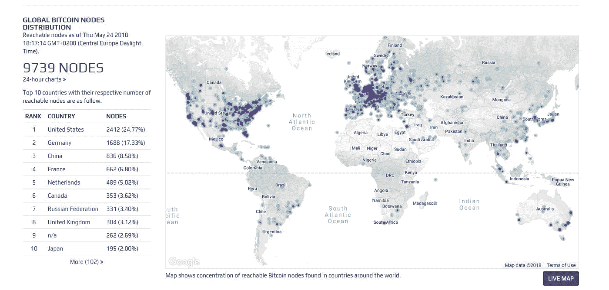
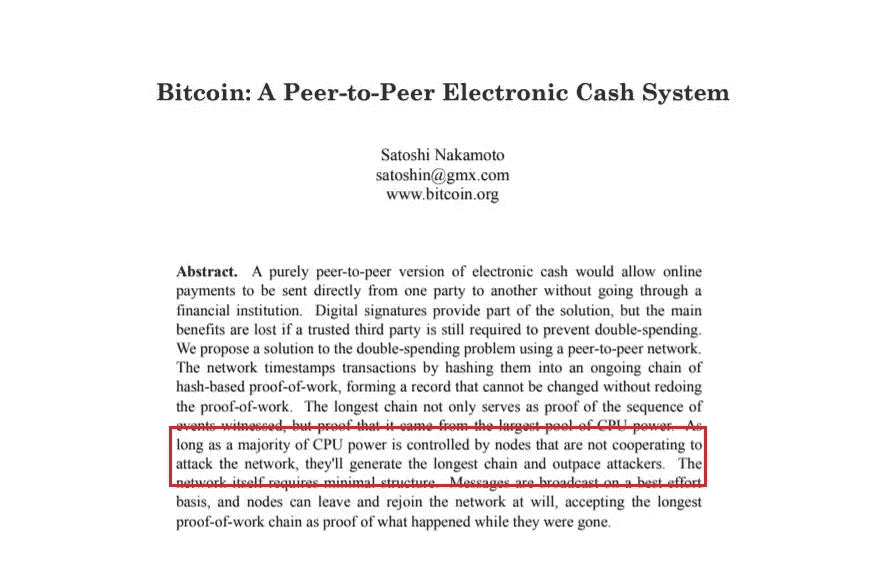
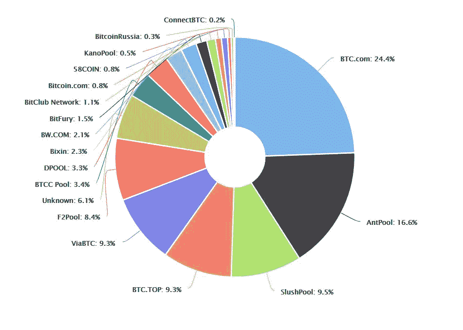

# 区块链入门:什么是比特币全节点？

> 原文：<https://medium.datadriveninvestor.com/blockchain-getting-started-what-is-bitcoin-full-node-40460f3acafa?source=collection_archive---------6----------------------->

**到底什么是全节点？**

所谓的完整节点是同步所有区块链数据的节点。这是分散式网络的自然要求。由于节点的存在，您不需要信任中介。这些分布式节点负责实时更新数据、广播和验证事务。

**1。运行完整节点需要什么？**

这是目前全球所有节点可用的比特币分布情况，共有 9739 个，24.77%分布在美国。

为什么会这样，因为运行完整节点并不简单，它需要:

1.最新版本的 Windows、Mac OS X 或 Linux

2.145 G 空白磁盘空间，至少 100MB/s 读写速度

3.2 G 内存

4.连接宽带，宽带速度至少 50KB/s

5.每个月大概上传 200 个 Gs，下载 20 个 Gs，第一次还需要额外的 140 个 Gs。

6 每天需要开始跑 6 个小时，最好是连续跑

7.注意关闭电脑的自动睡眠功能

很烦，所以跑全节点的门槛不低，欠发达地区的人无论是体力还是脑力都不具备参与全节点的条件。

**2。是不是每个人都需要跑完整个节点？**

有人曾经把整个节点比作“投票”权力。因为整个节点具有保障网络安全的重要意义。它可以验证交易，违反共识的交易将被节点拒绝。

中本聪在白皮书中指出“*只要大多数 CPU 能力被不合作攻击网络的节点所控制，它们就会产生最长的链并超过攻击者*”。最长的链很重要，因为比特币的一个共识是，它总是承认最长的链，在最长的链中交易的矿工会得到回报。

上面提到的攻击是众所周知的 51%攻击。

因为现在矿池中心化非常严重，有人担心大佬们控制了整个网络 51%以上的份额来发动攻击。其实不用太担心。如果真的受到 51%的攻击，比特币信仰必然会遭到毁灭性打击，加密货币价格会大幅下跌。矿业权贵也会因为这样做而受到社会的谴责甚至惩罚。他们没必要做不在自己手里的事情。

整个节点可以维护分布式账本的安全性。那么，需要每个人都参与进来吗？

**完全不是。**

因为专门的矿工可以做得更好，他们会更加努力地维护硬件性能，更好地维护网络的稳定性。过多的人试图运行满节点，会造成网络的沉重负担，反而是资源的浪费。

就像你平时用钱包一样，不一定要用 QT 全节点钱包。可以使用 SPV(简化支付验证)轻钱包或者 AnyBit 去中心化手机钱包，更加方便快捷。

## 作者:[马尔科·维德里](https://twitter.com/VidrihMarko)

## [@密码](https://steemit.com/@cryptomarks)

*图片来源:*

[*https://bitnodes.earn.com/*](https://bitnodes.earn.com/)

[*https://bitcoin.org/bitcoin.pdf*](https://bitcoin.org/bitcoin.pdf)

[*https://blockchain.info/pools*](https://blockchain.info/pools)